# Kamay · Manual de uso

> Guía paso a paso de cada función de la plataforma, pantalla por pantalla. Las capturas están en `docs/capturas/` y corresponden a la organización de ejemplo **Geeko Store** con datos de prueba.
>
> Documentos relacionados: [Manual de pruebas](manual-de-pruebas.md) · [Estado de la plataforma](estado-de-la-plataforma.md) · [Documento técnico](documento-tecnico.md).

## Índice

1. [Qué es Kamay](#1-qué-es-kamay)
2. [Entrar a la plataforma](#2-entrar-a-la-plataforma)
3. [Moverse por la aplicación](#3-moverse-por-la-aplicación) (incl. [3.4 Perfil de cuenta](#34-perfil-de-cuenta))
4. [Panel](#4-panel)
5. [Registro rápido](#5-registro-rápido)
6. [Pedidos](#6-pedidos)
7. [Cobros de un pedido](#7-cobros-de-un-pedido)
8. [Venta rápida (modo feria)](#8-venta-rápida-modo-feria)
9. [Tareas](#9-tareas)
10. [Mis pendientes](#10-mis-pendientes)
11. [Egresos: compras y gastos](#11-egresos-compras-y-gastos)
12. [Catálogo e inventario](#12-catálogo-e-inventario)
13. [Contactos](#13-contactos)
14. [Activos](#14-activos)
15. [Reportes](#15-reportes)
16. [Bitácora](#16-bitácora)
17. [Notificaciones](#17-notificaciones)
18. [Configuración](#18-configuración)
19. [Trabajar sin conexión](#19-trabajar-sin-conexión)
20. [Anexo: qué puede hacer cada rol](#20-anexo-qué-puede-hacer-cada-rol)

---

## 1. Qué es Kamay

Kamay es una herramienta de gestión operativa para talleres de producción propia (sublimación, impresión 3D, alfarería, etc.). Permite llevar **pedidos, ventas de feria, egresos, cobros y pagos, catálogo con inventario, tareas, activos y reportes**, con las cuentas separadas por **línea de negocio** y un historial completo de todo lo que pasa (la bitácora).

Conceptos que conviene tener claros desde el principio:

- **Organización**: el taller. Cada persona puede pertenecer a una o varias. Los datos de una organización nunca se mezclan con los de otra.
- **Línea de negocio**: cada actividad del taller (por ejemplo *Sublimación*, *Alfarería*). Toda organización tiene además una línea **General**, compartida, que no se puede archivar. El selector de línea filtra casi todas las pantallas.
- **Roles**: **Dueña o dueño** (ve y configura todo, incluido el dinero) y **Ayudante** (opera pedidos, tareas, catálogo y feria; no ve egresos, reportes, activos, bitácora ni configuración del taller).
- **Nada se borra**: todo se **archiva**. Lo archivado deja de aparecer en listas y buscadores, pero sigue en el historial y se puede restaurar.
- **Estados configurables**: los pedidos y las tareas pasan por estados que cada organización, y cada línea, define a su gusto.

---

## 2. Entrar a la plataforma

### 2.1 Iniciar sesión

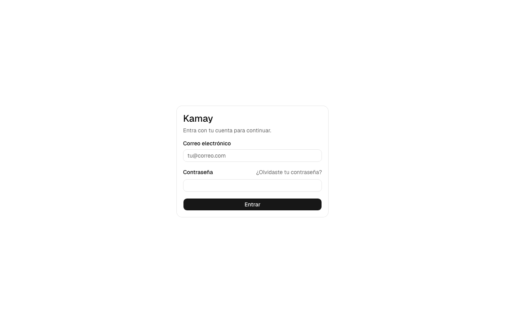

1. Abre la dirección de Kamay. Sin sesión, cualquier ruta te lleva a **Entrar**.
2. Escribe tu **Correo electrónico** y tu **Contraseña** (mínimo 6 caracteres).
3. Pulsa **Entrar**.
4. Aterrizas en el **Panel** si estás en computadora, o en **Registro rápido** si estás en celular. Si intentabas abrir una página concreta, vuelves a ella.

Mensajes posibles:

- *Correo o contraseña incorrectos.* — revisa los datos.
- *El enlace no es válido o ya expiró. Pide uno nuevo.* — llegaste con un enlace de recuperación o invitación vencido.

**No existe registro público.** Solo se puede crear una cuenta a través de una invitación (ver [2.4](#24-aceptar-una-invitación)).

### 2.2 Elegir organización

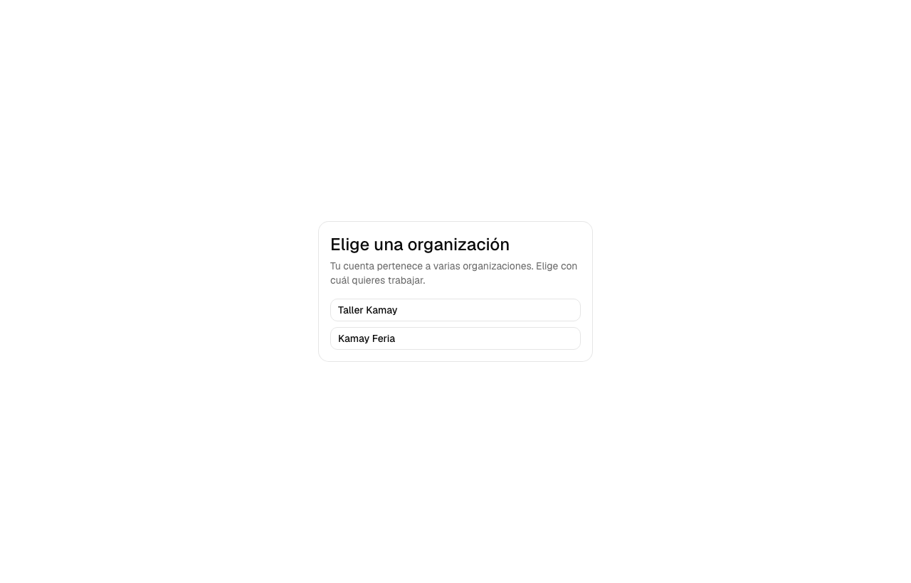

Si tu cuenta pertenece a **más de una** organización, después de entrar verás **Elige una organización**. Pulsa la que quieras usar. La elección se recuerda hasta que cambies (hoy solo se cambia volviendo a `/auth/select-org`).

Si tu cuenta no pertenece a ninguna organización verás el mensaje *Tu cuenta no pertenece a ninguna organización. Pide a la persona dueña que te invite.*

### 2.3 Recuperar la contraseña

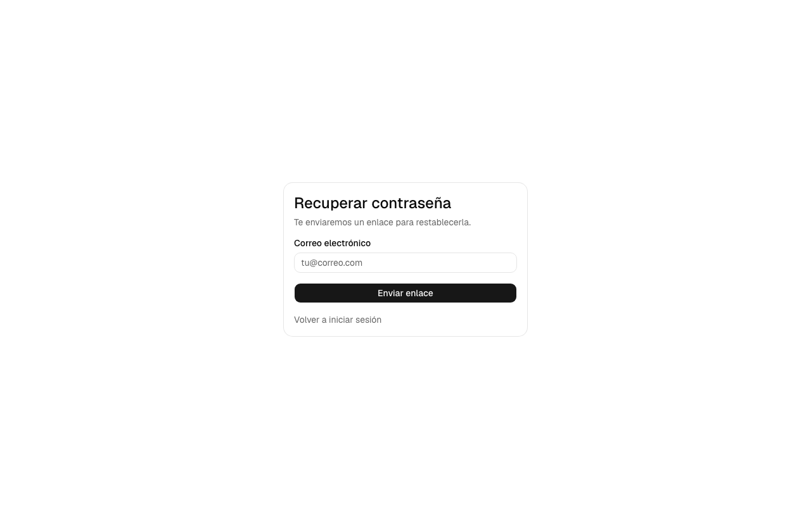

1. En **Entrar**, pulsa **¿Olvidaste tu contraseña?**
2. Escribe tu correo y pulsa **Enviar enlace**.
3. Verás siempre el mismo mensaje, exista o no el correo: *Si el correo está registrado, recibirás un enlace…*
4. Abre el enlace del correo. Llegas a **Nueva contraseña**: escribe la nueva dos veces y pulsa **Guardar contraseña**. Quedas dentro de la aplicación.

Si abres `/auth/reset-password` sin venir del enlace, vuelves a **Entrar** con el aviso de enlace no válido:

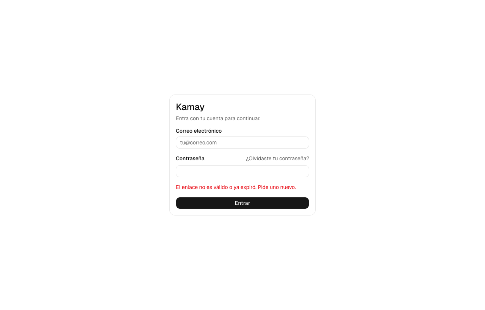

### 2.4 Aceptar una invitación

La persona dueña genera un enlace de invitación (ver [18.7](#187-usuarios-y-roles)) y te lo envía por el medio que prefiera. El enlace tiene la forma `https://<kamay>/auth/invite/<código>` y **vence a los 7 días**.

1. Abre el enlace.
2. **Si no tienes cuenta**: escribe el **Correo** al que llegó la invitación y una **Contraseña**, y pulsa **Crear cuenta y unirme**.
3. **Si ya tienes sesión**: pulsa **Aceptar invitación**.
4. Entras directamente al **Panel** de la organización que te invitó.

Si el enlace no sirve verás *La invitación no es válida o ya fue utilizada.*:

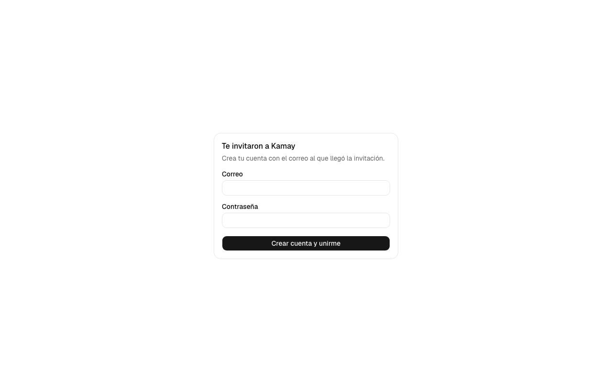

### 2.5 Cerrar sesión

1. Pulsa tu **avatar** (arriba a la derecha en computadora; dentro de **Más** en celular).
2. Elige **Cerrar sesión**.
3. Si no tienes registros pendientes de sincronizar, sales de inmediato y vuelves a **Entrar**.
4. Si tienes alguno, primero ves un aviso: *¿Cerrar sesión con registros pendientes?* Seguirán guardados en el dispositivo, pero no se subirán hasta que vuelvas a entrar con conexión. Pulsa **Cerrar sesión** para confirmar o **Volver** para quedarte.

Ver también [3.4 Perfil de cuenta](#34-perfil-de-cuenta) para cambiar tu nombre visible o tu contraseña.

---

## 3. Moverse por la aplicación

### 3.1 En computadora

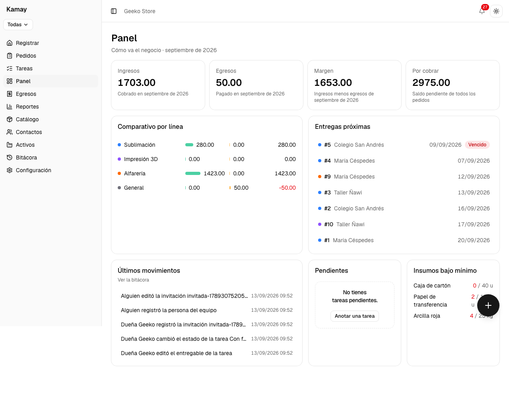

- **Menú lateral** (izquierda): Registrar, Pedidos, Tareas, Panel, Egresos, Reportes, Catálogo, Contactos, Activos, Bitácora, Configuración. El ayudante ve solo las que puede usar.
- **Selector de línea** (bajo el logo): filtra casi todas las pantallas. **Todas** muestra todo; una línea concreta muestra solo lo suyo. Se recuerda por organización, incluso al cerrar el navegador.

  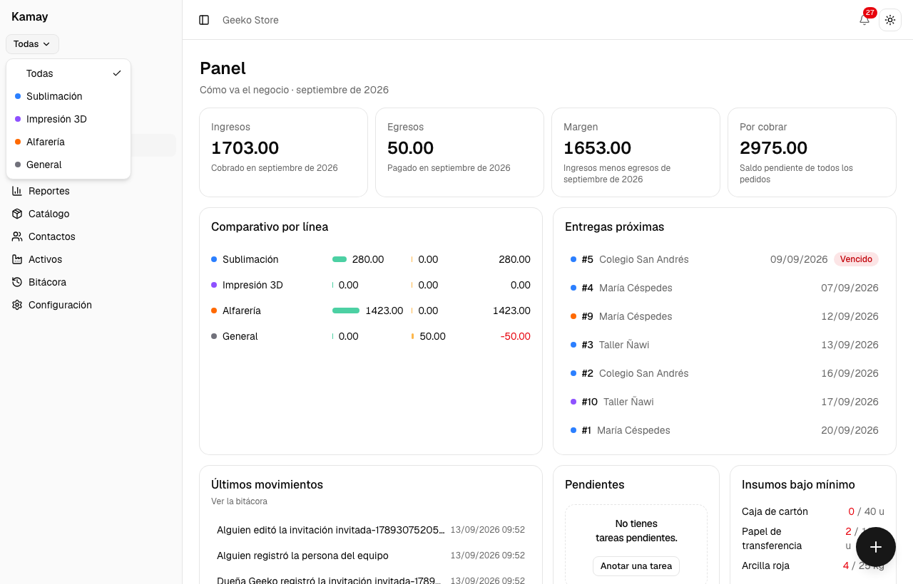

- **Barra superior**: nombre de la organización, indicador de registros por sincronizar (solo aparece si hay pendientes), **campana** de notificaciones, **conmutador de tema** (claro/oscuro) y tu **avatar** (menú de cuenta: Perfil y Cerrar sesión, ver [3.4](#34-perfil-de-cuenta)).
- **Botón + flotante** (abajo a la derecha): abre el menú **Registrar** con seis accesos directos (ver [5](#5-registro-rápido)). Desaparece en formularios de alta y edición para no tapar los botones de guardar.
- El icono junto al nombre de la organización pliega el menú lateral a solo iconos:

  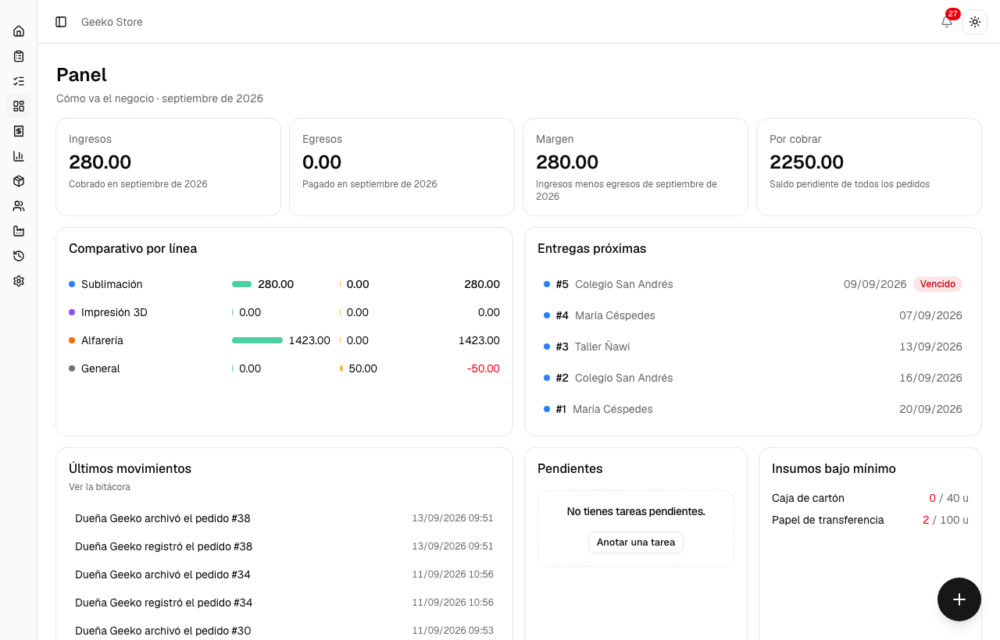

### 3.2 En celular

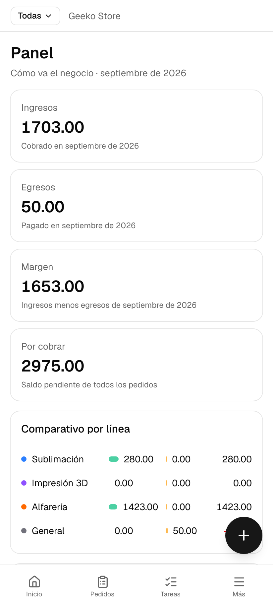

- **Barra inferior** con cuatro ranuras: **Inicio** (Registro rápido), **Pedidos**, **Tareas** (abre *Mis pendientes*) y **Más**.
- **Más** abre un panel con el resto de secciones de tu rol y, al pie, el bloque de cuenta con **Perfil** y **Cerrar sesión** (ver [3.4](#34-perfil-de-cuenta)):

  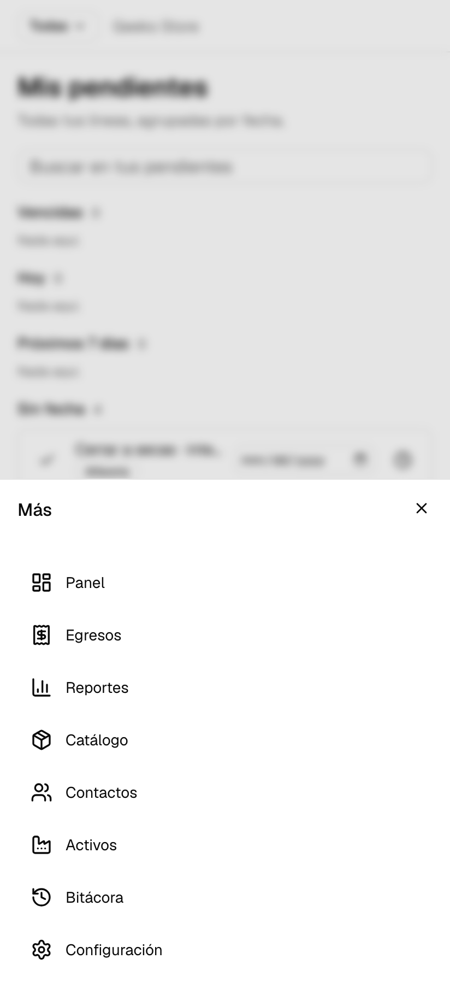

- **Tira superior** con el selector de línea, el nombre de la organización y el indicador de sincronización.
- La barra inferior y el botón + no aparecen en los formularios de captura (nuevo pedido, nueva compra, etc.).

### 3.3 Tema claro y oscuro

Pulsa el icono de sol/luna en la barra superior. La preferencia se guarda en el navegador.

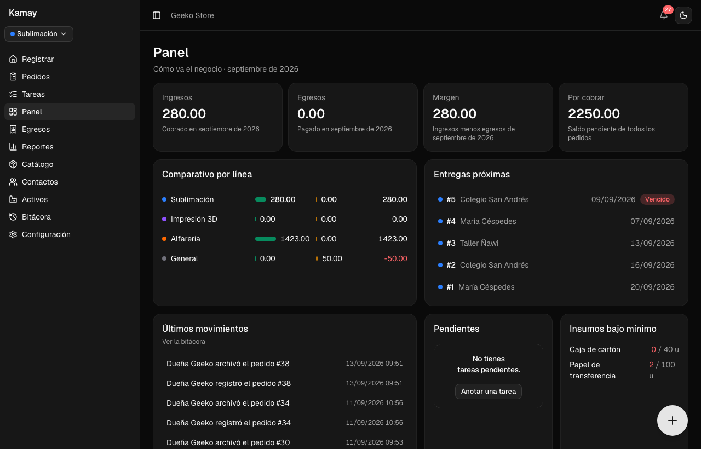

### 3.4 Perfil de cuenta

Ruta: `/profile`. Se abre desde tu avatar (computadora) o desde **Más → Perfil** (celular). Disponible para los dos roles; cada persona solo ve y cambia lo suyo.

- **Datos de cuenta** (solo lectura): tu correo, la organización activa y tu rol.
- **Nombre visible**: el nombre con el que apareces en el equipo, en las tareas asignadas y en la bitácora. Escribe el nuevo nombre y pulsa **Guardar nombre**.
- **Cambiar contraseña**: pulsa el botón para abrir el diálogo con tres campos —**Contraseña actual**, **Nueva contraseña** y **Confirmar nueva contraseña**— y pulsa **Cambiar contraseña**.
  - Si la actual no es correcta, el diálogo se queda abierto con el aviso *La contraseña actual no es correcta.*; tu sesión sigue intacta.
  - Si la nueva y su confirmación no coinciden, o la nueva tiene menos de 6 caracteres, el aviso aparece antes de llegar al servidor.
  - Con todo correcto, el diálogo se cierra; la próxima vez que entres usa la nueva contraseña.

---

## 4. Panel

Ruta: `/dashboard`. Resume cómo va el negocio en el **mes en curso** (según la zona horaria del taller) y respeta el selector de línea.

### 4.1 Vista de la persona dueña

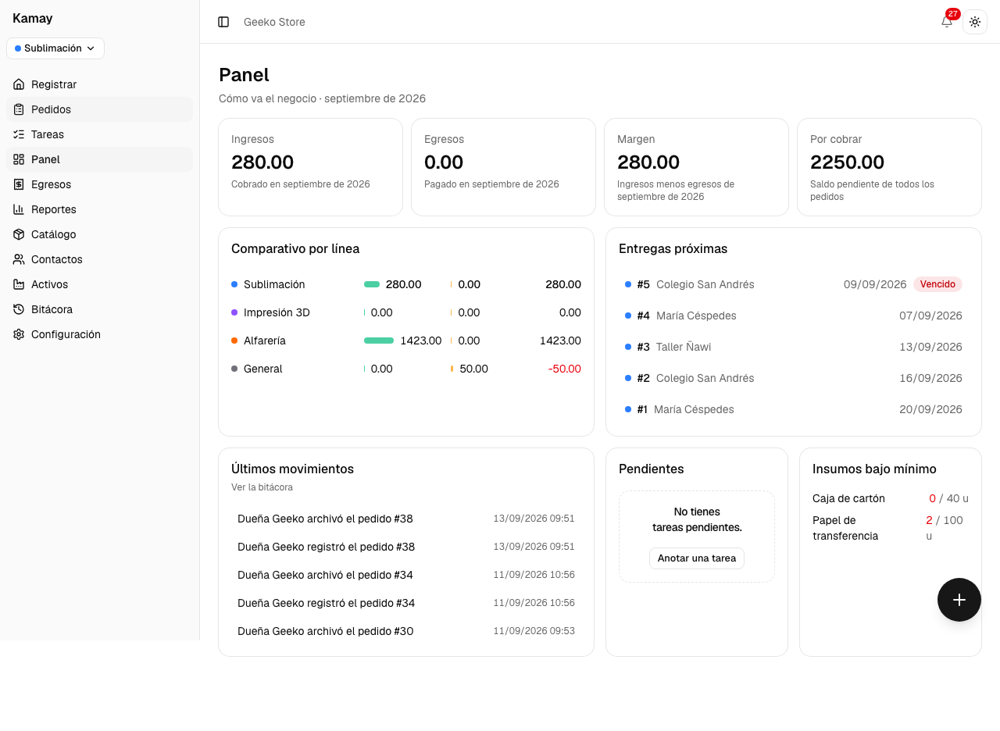

- **Ingresos**, **Egresos**, **Margen**: cobrado, pagado y diferencia del mes.
- **Por cobrar**: saldo pendiente de todos los pedidos (sin límite de periodo).
- **Comparativo por línea**: ingresos, egresos y margen de cada línea.
- **Entregas próximas**: pedidos con fecha comprometida, los vencidos marcados en rojo. Cada fila abre el pedido.
- **Últimos movimientos**: cinco entradas de la bitácora con enlace a **Ver la bitácora**.
- **Pendientes**: tus tareas vencidas, de hoy y de los próximos 7 días (ignora el selector de línea a propósito). Enlaza a *Mis pendientes*.
- **Insumos bajo mínimo**: saldo actual frente al mínimo. Cada fila abre el ítem.

### 4.2 Vista del ayudante

Sin montos: solo **Entregas próximas**, **Pendientes** e **Insumos bajo mínimo**.

---

## 5. Registro rápido

Ruta: `/quick`. Es la pantalla de aterrizaje en celular y el destino del botón **+**.

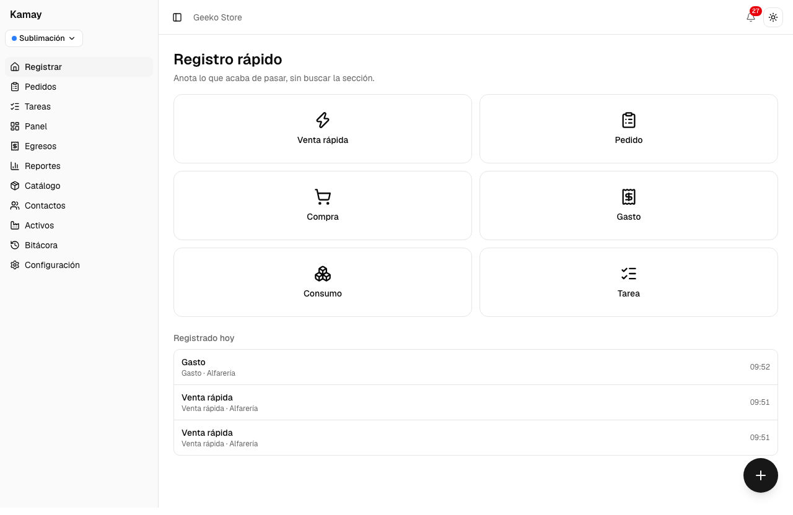

Seis accesos, cada uno lleva a la pantalla o diálogo correspondiente:

| Acceso | Qué hace | Quién lo ve |
| --- | --- | --- |
| **Venta rápida** | Abre el modo feria (`/fair`) | Todos |
| **Pedido** | Nuevo pedido | Todos |
| **Compra** | Nueva compra | Solo dueño |
| **Gasto** | Nuevo gasto | Solo dueño |
| **Consumo** | Diálogo para registrar consumo de un insumo | Todos |
| **Tarea** | Nueva tarea | Todos |

Debajo, **Registrado hoy** lista hasta 5 registros del día (pedidos, ventas, compras, gastos, consumos). Los que aún no llegaron al servidor llevan la marca **Sin enviar**.

El menú del botón **+** ofrece los mismos seis accesos:

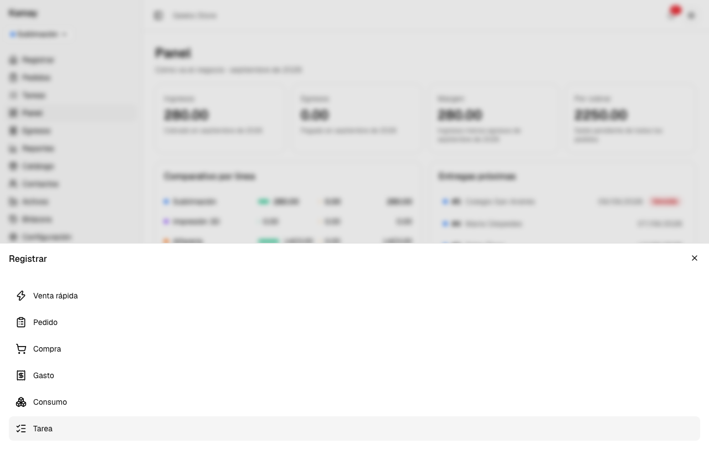

---

## 6. Pedidos

Ruta: `/orders`. Muestra el trabajo comprometido con clientes.

### 6.1 Vistas: tablero, lista y calendario

- Con el selector en **Todas**, el tablero pide elegir una línea (cada línea tiene sus propias columnas). Pulsa un chip de línea o usa el selector global.

  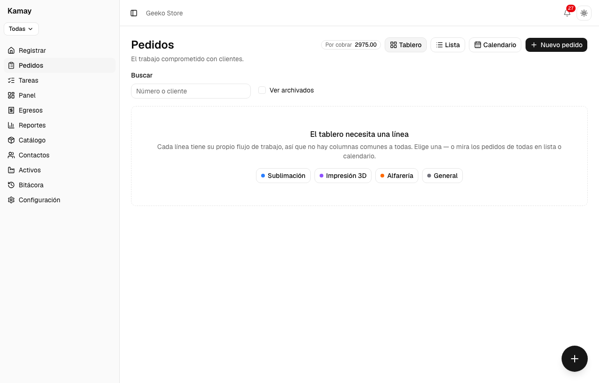

- Con una línea elegida, el **Tablero** muestra una columna por estado de esa línea:

  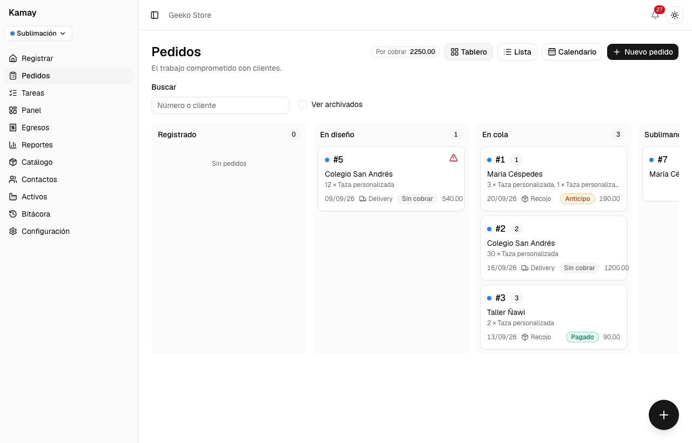

- **Lista** y **Calendario** funcionan también con *Todas*:

  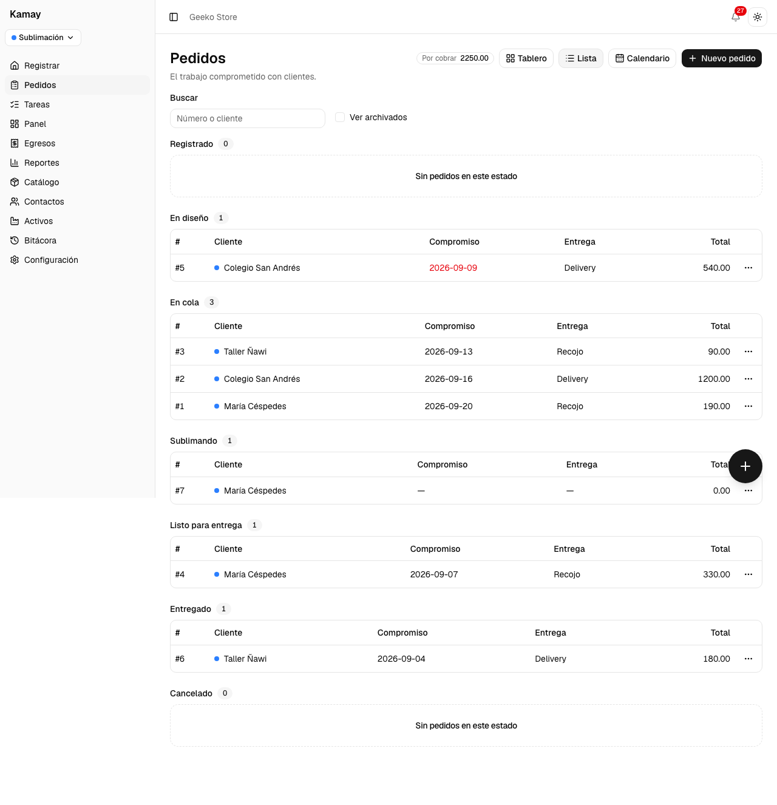

  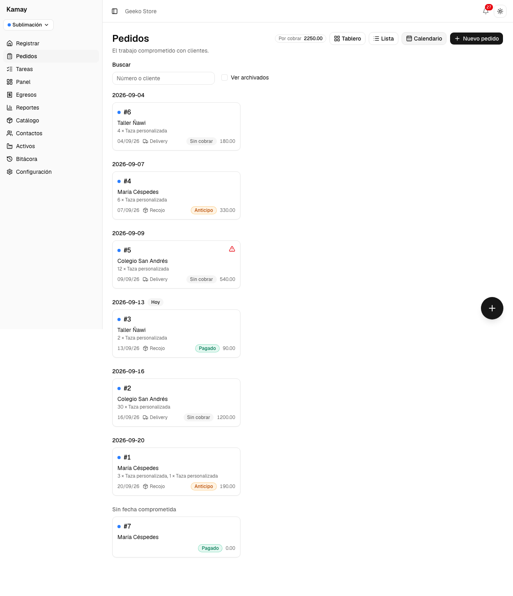

Elementos comunes:

- **Por cobrar**: saldo pendiente de la línea activa.
- **Buscar** por número o cliente (se aplica al salir del campo).
- **Ver archivados**: incluye los pedidos archivados, atenuados y con la marca **Archivado**.
- **Nuevo pedido**.
- Al pie: *Se muestran todos los pedidos abiertos y los 50 cerrados más recientes* con **Mostrar más**.

Cada tarjeta muestra: número, cliente, resumen de líneas, fecha comprometida, modo de entrega (Recojo/Delivery), estado de cobro (**Sin cobrar**, **Anticipo**, **Pagado**, **Cobrado de más**) y total. Un pedido con fecha vencida y aún en trabajo lleva el icono rojo **Retrasado**. En las columnas *en cola*, cada tarjeta muestra su posición (1, 2, 3…).

### 6.2 Mover un pedido de estado

- **Arrastra** la tarjeta a otra columna (en pantalla táctil, mantén y arrastra al menos 6 px; un toque simple abre el pedido).
- O usa el **menú de la tarjeta** (*Mover a…*) para hacerlo con teclado.
- Dentro de una columna en cola, arrastra hacia arriba o abajo para cambiar el orden de atención.

Si el cambio falla, la tarjeta vuelve a su sitio y aparece *No se pudo completar*.

### 6.3 Crear un pedido

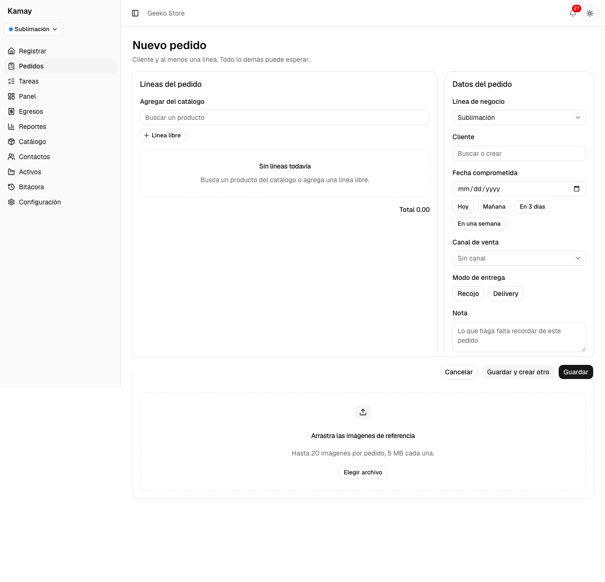

1. Pulsa **Nuevo pedido** (o **Pedido** en Registro rápido).
2. Elige la **Línea de negocio** (obligatoria).
3. Elige o crea el **Cliente**: escribe el nombre; si no existe aparece **Crear «nombre»**, pulsa, añade el teléfono opcional y **Crear**.
4. Agrega líneas:
   - **Agregar del catálogo**: escribe para buscar un producto; si tiene variantes, elige una. El precio se propone desde el catálogo y se puede cambiar.
   - **Línea libre**: para algo que no está en el catálogo; exige una descripción.
   - Ajusta **Cantidad**, **Precio** y, si aplica, **Personalización**.
5. Opcional: **Fecha comprometida** (con atajos *Hoy, Mañana, En 3 días, En una semana*), **Canal de venta**, **Modo de entrega** (Recojo / Delivery) y **Nota**.
6. Opcional: arrastra **imágenes de referencia** (hasta 20, 5 MB cada una). Sin conexión no se pueden subir; añádelas luego desde *Editar*.
7. Pulsa **Guardar** (te lleva al detalle) o **Guardar y crear otro** (conserva línea y canal para el siguiente).

Validaciones que verás si falta algo: *Elige una línea de negocio*, *Elige o crea un cliente*, *Agrega al menos una línea*, *La cantidad tiene que ser mayor que cero*, *Una línea sin producto necesita una descripción*.

Si pulsas **Cancelar** con cambios sin guardar aparece *¿Descartar los cambios?* con las opciones **Seguir editando** / **Descartar**.

El pedido nace en el **estado inicial** de su línea y recibe el **siguiente número** de la organización (#1, #2…).

### 6.4 Ver el detalle de un pedido

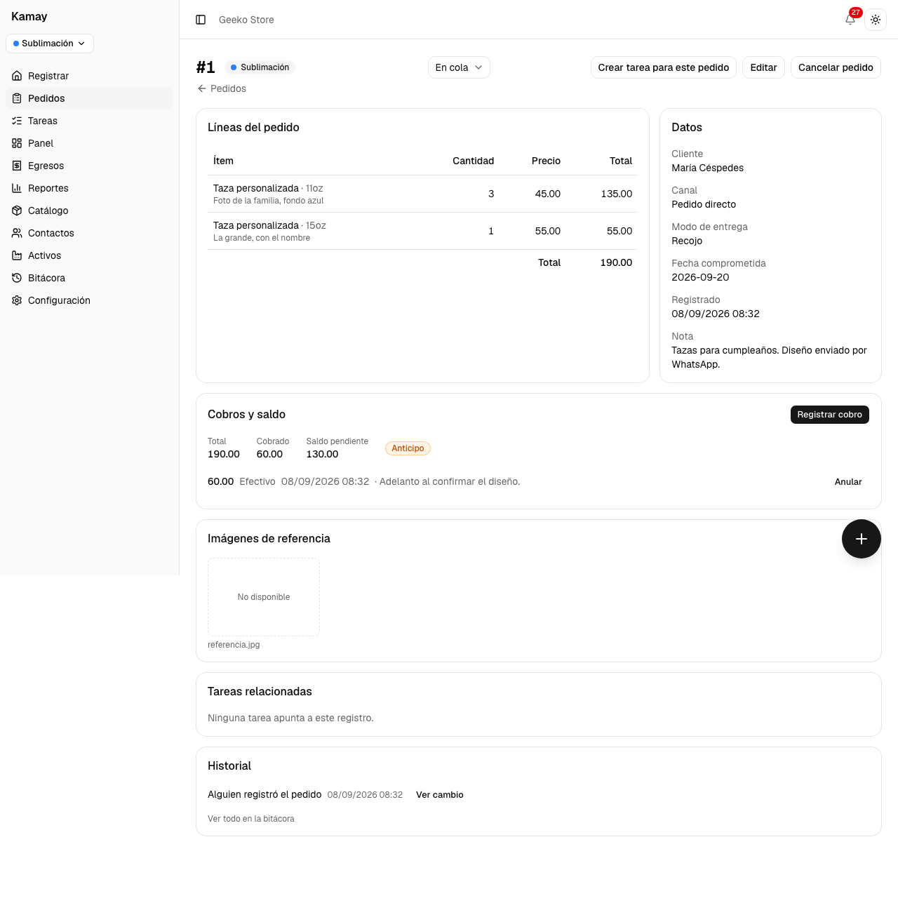

Secciones:

- **Cabecera**: número, línea, selector de **Estado**, **Crear tarea para este pedido**, **Editar**, **Cancelar pedido**.
- **Líneas del pedido** con el total.
- **Datos**: cliente, canal, modo de entrega, fecha comprometida, fecha de registro y nota.
- **Cobros y saldo** (ver [7](#7-cobros-de-un-pedido)).
- **Imágenes de referencia**.
- **Tareas relacionadas**: tareas vinculadas a este pedido.
- **Historial**: qué pasó con el pedido, con **Ver cambio** para ver el antes y después de cada edición.

  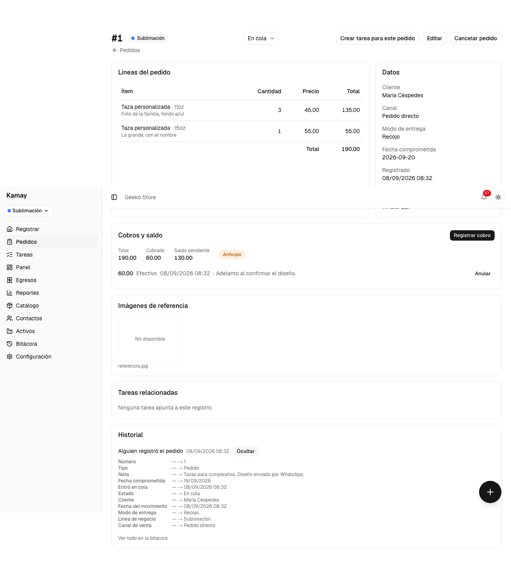

#### Cambiar el estado desde el detalle

Pulsa el selector de estado y elige uno del flujo de la línea:

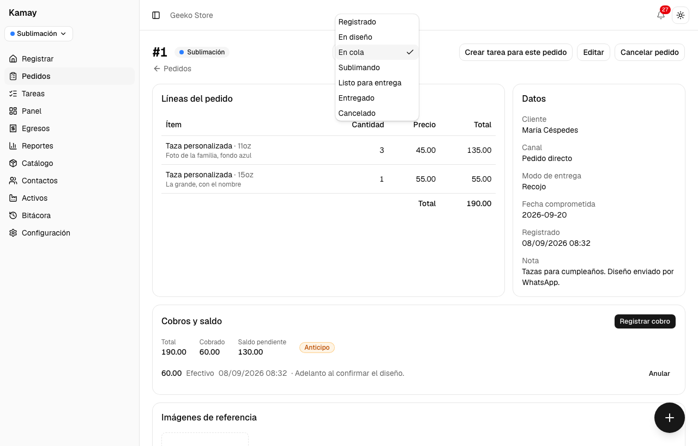

#### Cancelar un pedido

**Cancelar pedido** abre una confirmación. El pedido pasa al estado de tipo *cancelado* de su línea, sigue visible y conserva su historial. No se borra ni se archiva.

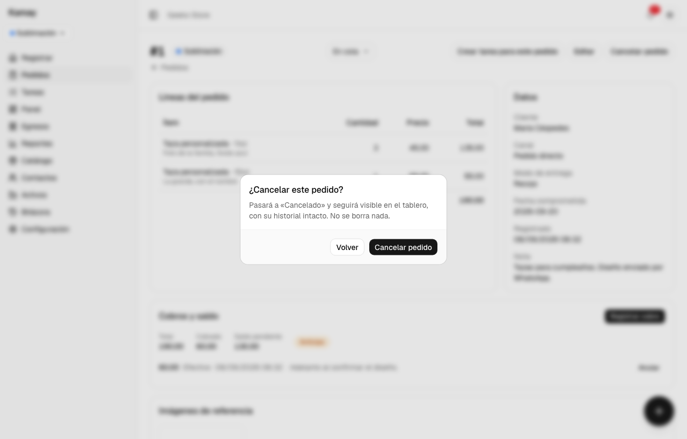

#### Crear una tarea desde el pedido

**Crear tarea para este pedido** abre el formulario de tarea con título, línea, fecha límite (3 días antes de la entrega) y vínculo al pedido propuestos. Todo se puede cambiar. Es la **única** forma en que un pedido origina una tarea: cambiar el estado de un pedido nunca crea ni mueve tareas.

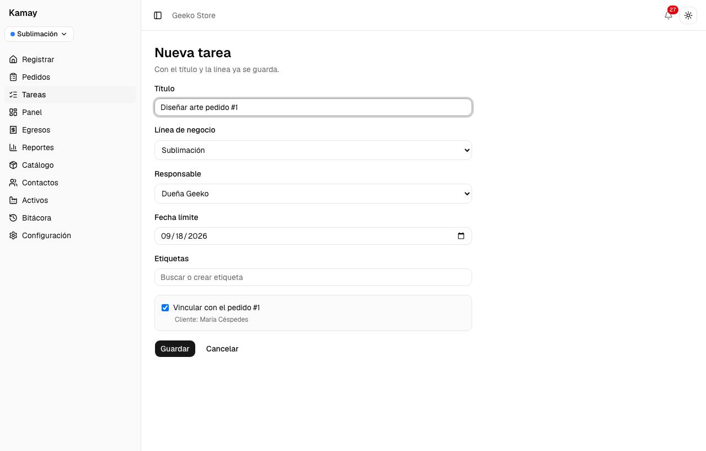

### 6.5 Editar un pedido

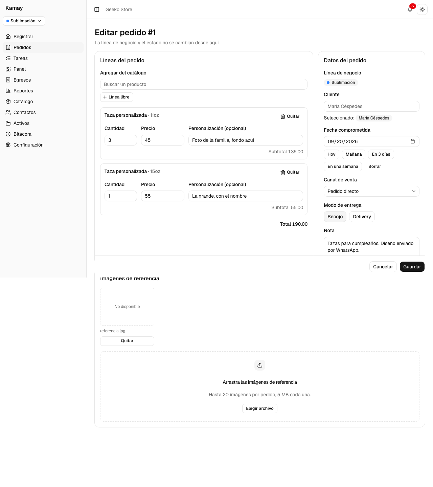

Desde el detalle, **Editar**. Se puede cambiar todo salvo la **línea de negocio** y el **estado**. Las líneas que quites quedan archivadas (no borradas). Un pedido archivado no se edita: hay que desarchivarlo antes.

### 6.6 Archivar y restaurar un pedido

Hoy no hay botón **Archivar** en el detalle del pedido. Un pedido archivado (por ejemplo, desde una acción interna) se ve con **Ver archivados** en `/orders` y se restaura desde la **Bitácora**, con el botón **Desarchivar** sobre el evento *archivó el pedido* (solo dueño). Ver [estado de la plataforma](estado-de-la-plataforma.md).

---

## 7. Cobros de un pedido

En el detalle del pedido, bloque **Cobros y saldo**: **Total**, **Cobrado**, **Saldo pendiente** y el estado de cobro.

### 7.1 Registrar un cobro

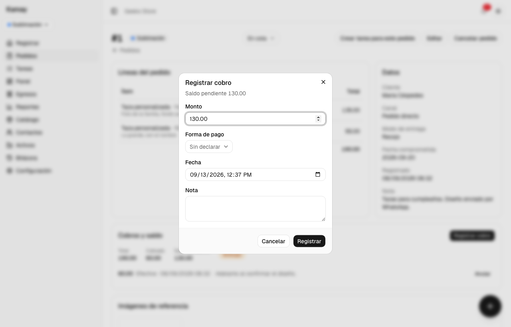

1. Pulsa **Registrar cobro**.
2. Ajusta el **Monto** (viene propuesto el saldo pendiente).
3. Elige la **Forma de pago**: Efectivo, Transferencia u Otro (opcional).
4. Ajusta la **Fecha** si el cobro fue en otro momento, y una **Nota** opcional.
5. Pulsa **Registrar**.

Si el monto supera el saldo, aparece un aviso pero **se permite**: el saldo queda a favor del cliente (*Cobrado de más*).

### 7.2 Anular un cobro

Solo la persona dueña. Pulsa **Anular** junto al movimiento y confirma. El movimiento queda tachado como **Anulado**, deja de contar en el saldo y ambos hechos quedan en la bitácora. Un cobro nunca se edita: se anula y se registra otro.

Los cobros no se guardan en la cola sin conexión: necesitan red.

---

## 8. Venta rápida (modo feria)

Ruta: `/fair`. Se entra desde **Venta rápida** en Registro rápido o en el menú **+**. Es una pantalla a página completa, sin menú, pensada para vender en un puesto con el celular.

### 8.1 Abrir la feria

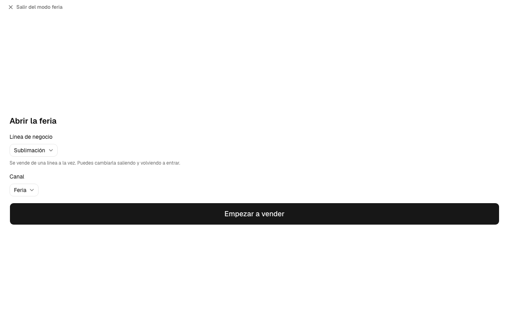

1. Si el selector global está en *Todas*, elige la **Línea de negocio** (se vende de una línea a la vez).
2. Elige el **Canal** (por ejemplo *Feria*).
3. Pulsa **Empezar a vender**.

Importante: **abre la feria al menos una vez con conexión**. Así el catálogo queda guardado en el dispositivo y podrás vender sin señal.

### 8.2 Vender

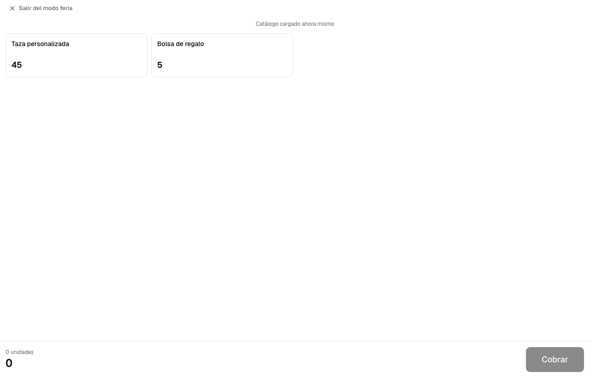

- La cuadrícula muestra los productos con precio de la línea (los más vendidos primero). Arriba se indica hace cuánto se cargó el catálogo.
- **Un toque** agrega el producto al carrito; otro toque suma una unidad más.
- La barra inferior muestra las líneas, las unidades, el total y el botón **Cobrar**. Con la **X** junto a una línea la quitas.

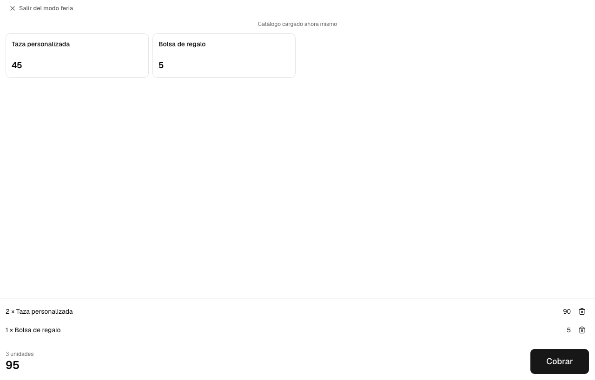

### 8.3 Cobrar

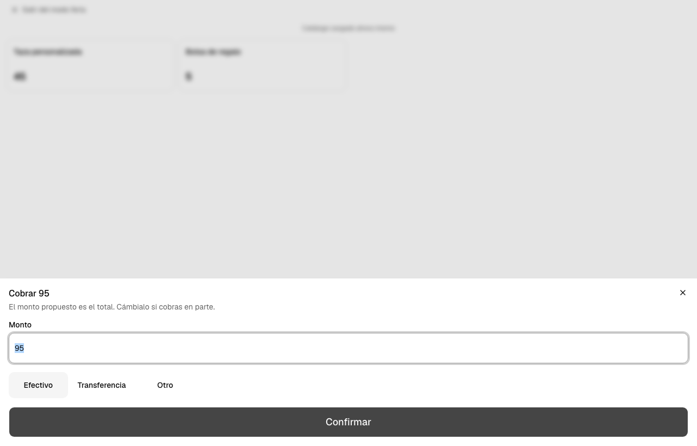

1. Pulsa **Cobrar**.
2. Ajusta el **Monto** si cobras solo una parte (0 registra la venta sin cobro).
3. Elige **Efectivo**, **Transferencia** u **Otro**.
4. Pulsa **Confirmar**. El carrito se vacía de inmediato y puedes seguir vendiendo.

En móvil:

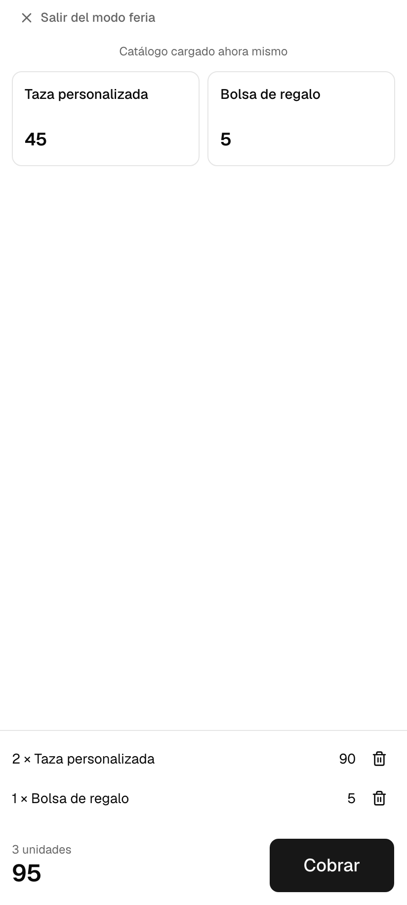

### 8.4 Sin señal y salida

- Sin conexión, las ventas se guardan en el dispositivo y se envían solas al volver la señal. Un indicador con el número de ventas pendientes aparece arriba y desaparece al llegar a cero.
- **Salir del modo feria** (arriba a la izquierda) vuelve a Registro rápido.
- No hay descuentos, impuestos ni cliente obligatorio: es una venta de mostrador. Las ventas de feria **no** aparecen en el tablero de pedidos, pero sí en ingresos, reportes y bitácora.

---

## 9. Tareas

Ruta: `/tasks`. Tablero de trabajo interno del taller, independiente de los pedidos.

### 9.1 Vistas y filtros

Igual que en pedidos: **Tablero** (exige línea), **Lista** y **Calendario**.

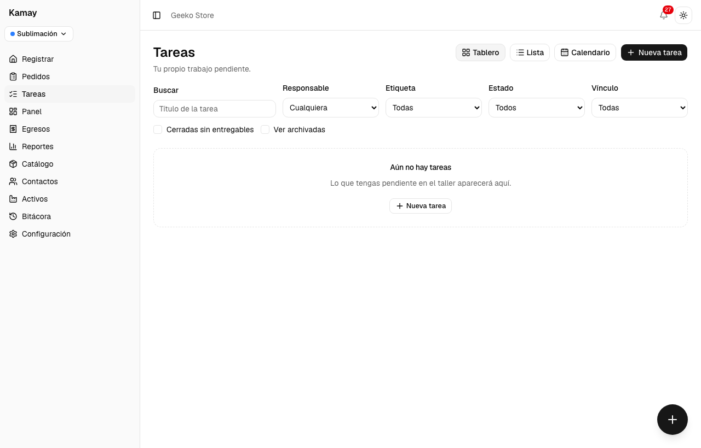

Filtros: **Buscar** por título (Enter), **Responsable**, **Etiqueta**, **Estado**, **Vínculo** (con o sin vínculos), **Cerradas sin entregables** y **Ver archivadas**.

Cada tarjeta muestra título, etiquetas, responsable, fecha (con marca **Vencida** o **Pronto**) e iconos si tiene vínculos o entregables.

### 9.2 Alta rápida

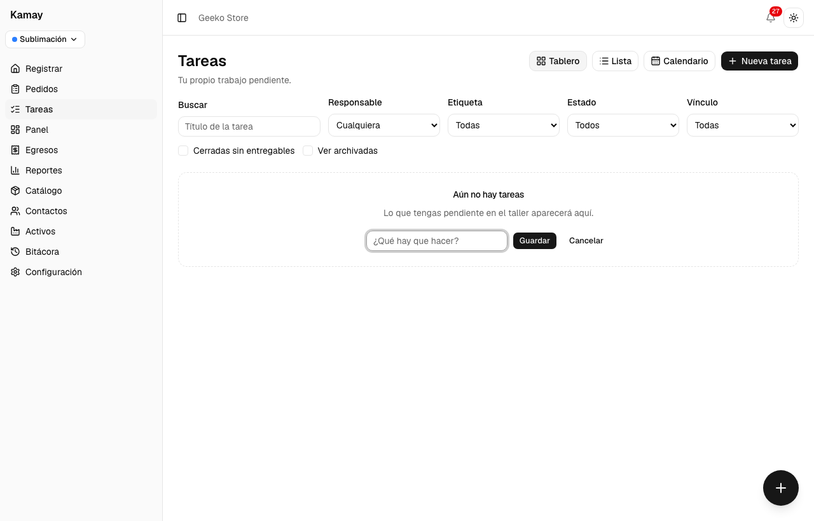

1. Pulsa **Nueva tarea** en el tablero.
2. Escribe el título en *¿Qué hay que hacer?*
3. Pulsa **Enter**. La tarea se crea en la línea activa (o en General) con el estado inicial y el campo queda listo para otra.

### 9.3 Crear una tarea completa

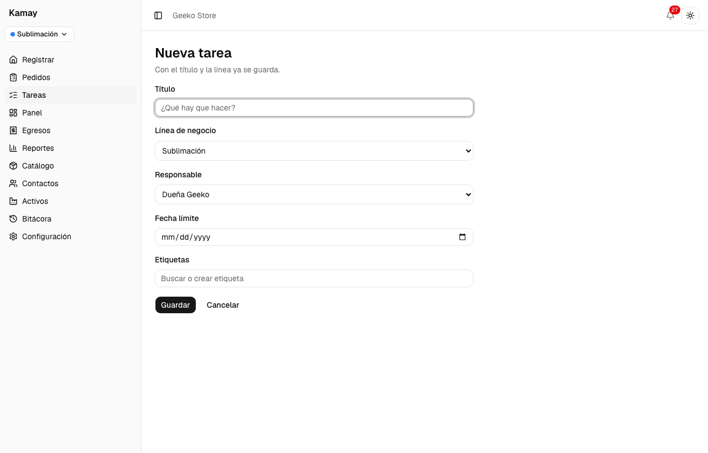

Ruta `/tasks/new` (o **Tarea** en Registro rápido): **Título**, **Línea de negocio**, **Responsable** (te propone a ti), **Fecha límite** y **Etiquetas** (busca o crea escribiendo). Pulsa **Guardar**.

### 9.4 Mover tareas

Arrastra entre columnas, en cualquier dirección (volver atrás es válido). Si mueves a un estado final una tarea con entregables pendientes, se abre el asistente de cierre (ver [9.6](#96-entregables-y-cierre)).

### 9.5 Detalle de una tarea

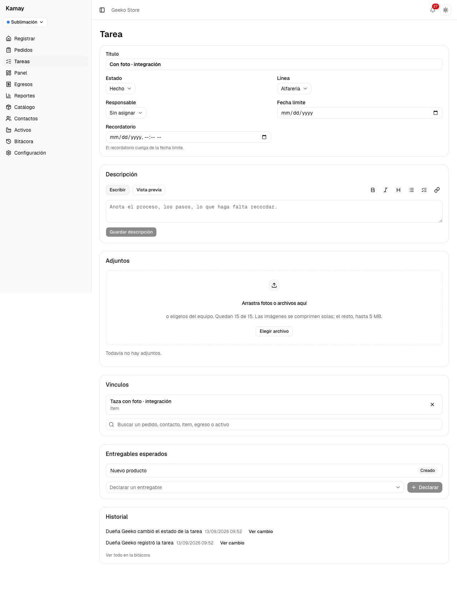

Cada campo guarda por sí solo, sin botón general:

- **Título** (guarda al salir del campo), **Estado**, **Línea**, **Responsable**, **Fecha límite** y **Recordatorio** (solo si hay fecha límite).
- **Descripción** en Markdown: pestañas **Escribir** / **Vista previa**, barra de formato (negrita, cursiva, encabezado, lista, lista de verificación, enlace) y botón **Guardar descripción**. Las casillas de la vista previa se pueden marcar una vez guardada.
- **Adjuntos**: arrastra fotos o archivos (hasta 15 por tarea, 5 MB cada uno; las imágenes se comprimen solas). Necesitan conexión.
- **Vínculos**: busca y enlaza un pedido, contacto, ítem, egreso o activo. Cada vínculo muestra el estado actual del registro enlazado.
- **Entregables esperados**: declara qué debería existir al cerrar la tarea (ver abajo).
- **Historial**: qué pasó con la tarea.

### 9.6 Entregables y cierre

Una tarea puede declarar que al terminarla debería existir algo nuevo: **Nuevo producto**, **Nuevo insumo**, **Nuevo proveedor**, **Compra registrada**, **Gastos registrados** o **Nuevo activo** (este último solo dueño).

1. En **Entregables esperados**, elige el tipo y pulsa **Declarar**.
2. Cuando muevas la tarea a un estado final, se abre **Cerrar la tarea** con una sección por entregable.
3. Marca los que quieras crear, completa sus campos (nombre, importe, categoría, proveedor…) y elige qué adjuntos se llevan.
4. Pulsa **Crear seleccionados y cerrar**, o **Cerrar sin crear nada** (no pide justificación; la tarea queda marcada como *cerrada sin entregables*).

Los entregables ya creados muestran la marca **Creado** y no se pueden retirar.

---

## 10. Mis pendientes

Ruta: `/my-tasks` (en móvil, la ranura **Tareas**). Tus tareas de **todas** las líneas, agrupadas por fecha: **Vencidas**, **Hoy**, **Próximos 7 días** y **Sin fecha**.

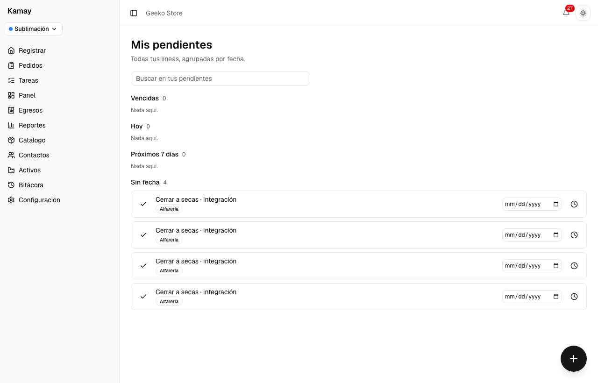

- **✓** marca la tarea como hecha (queda tachada en su sitio; se puede deshacer).
- El campo de fecha **reprograma**; el icono de reloj **pospone a mañana**. En móvil también puedes deslizar la fila hacia la izquierda para posponer.
- **Buscar en tus pendientes** filtra por título.

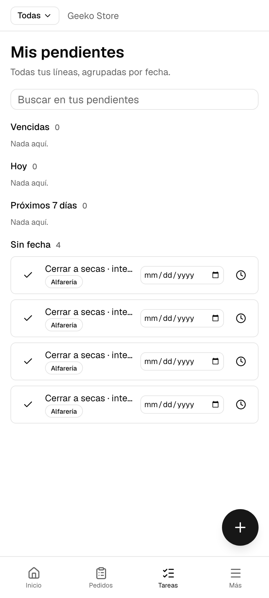

---

## 11. Egresos: compras y gastos

Ruta: `/expenses`. **Solo la persona dueña.** El ayudante no ve la sección ni puede entrar por URL.

### 11.1 Bandeja

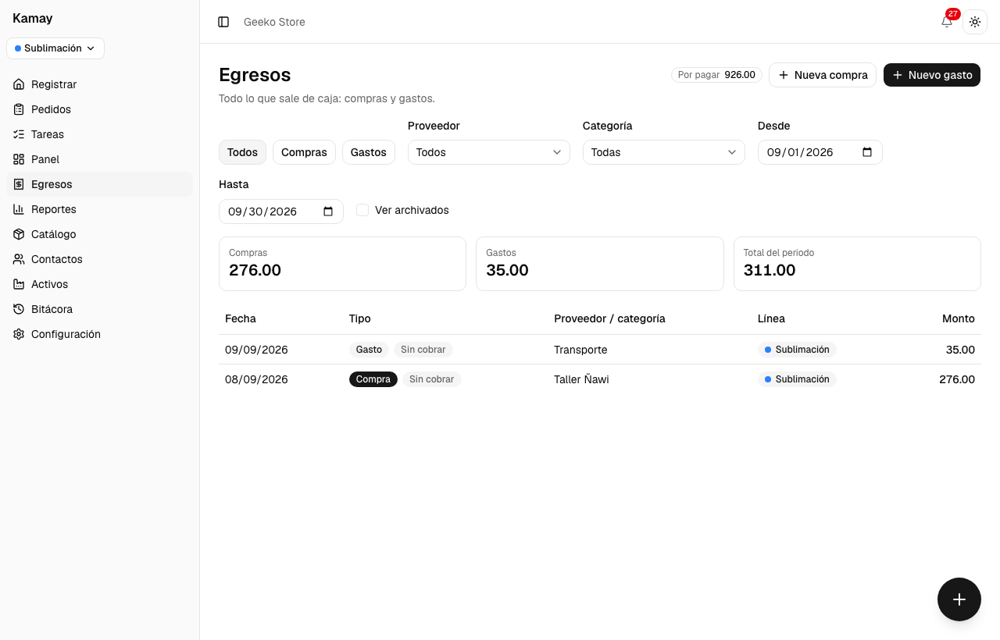

- **Por pagar**: saldo pendiente de pago de la línea activa.
- Filtros: **Todos / Compras / Gastos**, **Proveedor**, **Categoría**, **Desde / Hasta** (por defecto el mes actual) y **Ver archivados**.
- Totales de **Compras**, **Gastos** y **Total del periodo**.
- Pulsa una fila para abrir el detalle en un panel lateral, con **Abrir a página completa**.

### 11.2 Registrar una compra

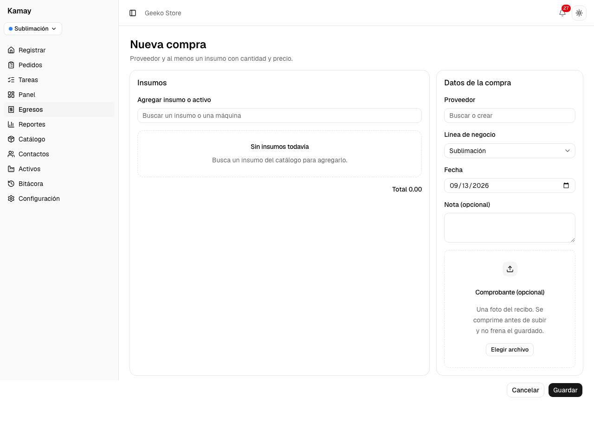

1. **Nueva compra** (o **Compra** en Registro rápido).
2. Elige o crea el **Proveedor**.
3. En **Insumos**, busca cada insumo o máquina del catálogo y fija **Cantidad** y **Precio unitario**. El total se calcula solo.
4. **Línea de negocio**, **Fecha** y **Nota** opcional.
5. Opcional: foto del **Comprobante**.
6. **Guardar**. Cada línea de insumo genera una **entrada de inventario** automáticamente.

Si la compra incluye una máquina, al guardar se ofrece **Declarar activo** con costo y fecha prellenados (ver [14](#14-activos)).

### 11.3 Registrar un gasto

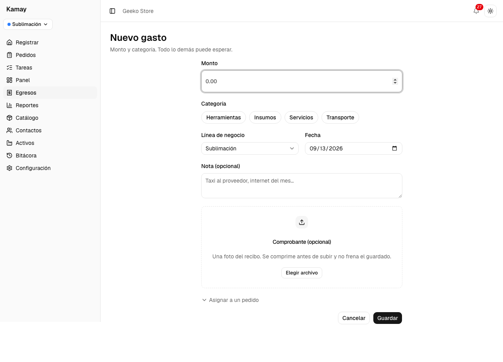

1. **Nuevo gasto** (o **Gasto** en Registro rápido).
2. **Monto** y **Categoría** (chips).
3. **Línea de negocio**: si el selector está en *Todas*, se propone **General**.
4. **Fecha**, **Nota** y, opcionalmente, **Asignar a un pedido** (para que el reporte de rentabilidad lo cuente como costo de ese pedido).
5. **Guardar**.

Un gasto pertenece a una sola línea. El reparto de los gastos de *General* entre líneas se configura en Configuración › General y se aplica en Reportes.

### 11.4 Detalle de un egreso

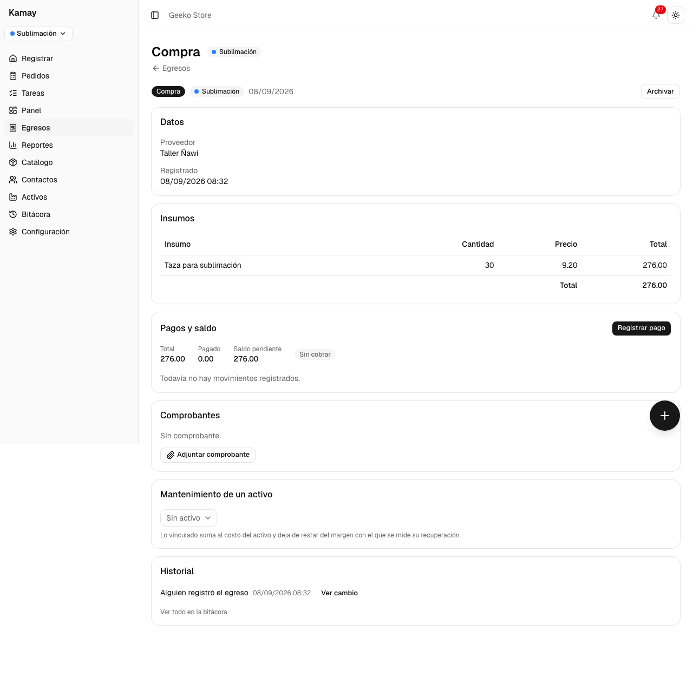

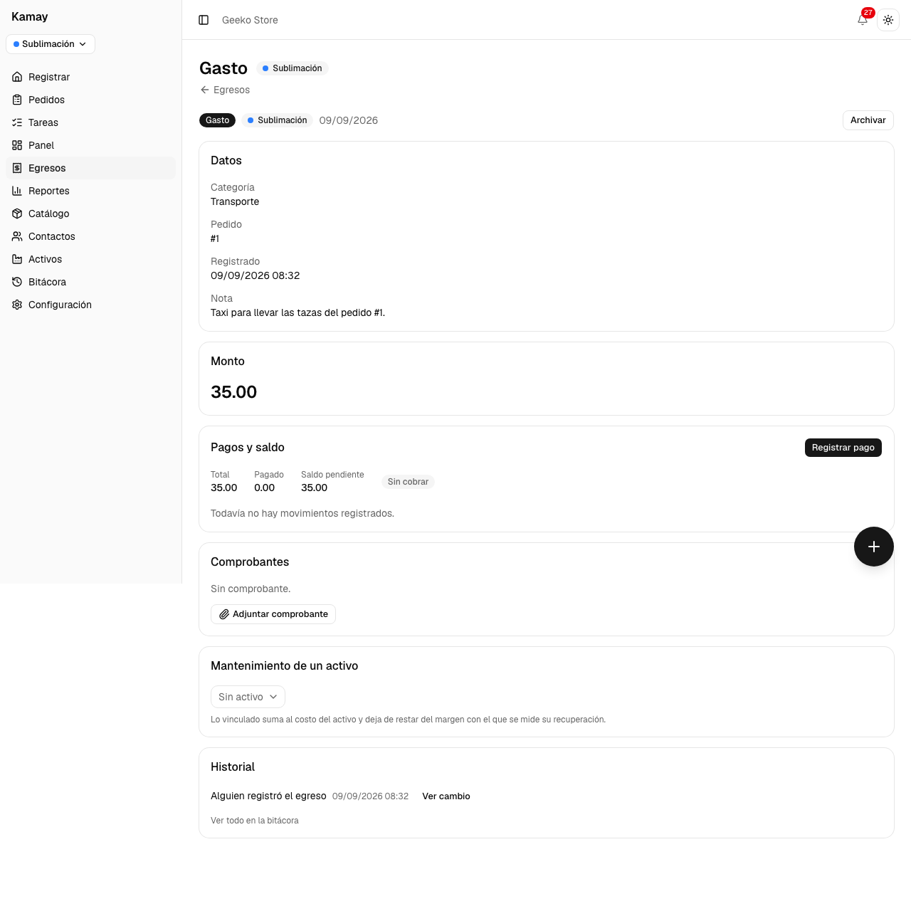

- **Datos**, **Insumos** (o **Monto**), **Pagos y saldo** con **Registrar pago** (igual que un cobro, pero en sentido contrario), **Comprobantes** (**Adjuntar comprobante**), **Mantenimiento de un activo** (vincula el gasto a una máquina) e **Historial**.
- **Archivar** / **Desarchivar** en la cabecera, con confirmación.

---

## 12. Catálogo e inventario

Ruta: `/catalog`. Lo que compras (**Insumos**), lo que vendes (**Productos**) y tus máquinas (**Activos**).

### 12.1 Lista

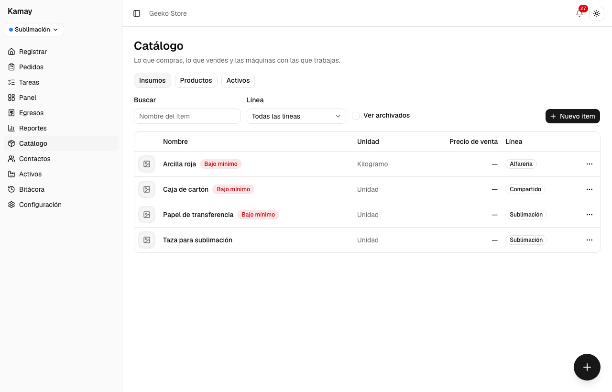

- Pestañas **Insumos / Productos / Activos**.
- **Buscar** por nombre (sin importar tildes), filtro de **Línea** (incluye *Compartido*) y **Ver archivados**.
- Los insumos por debajo del mínimo llevan la marca **Bajo mínimo**.
- Menú **Acciones** por fila: **Ver**, **Editar**, **Archivar** (solo dueño) o **Desarchivar**.
- Se muestran 50 por página con **Mostrar más**.

### 12.2 Crear o editar un ítem

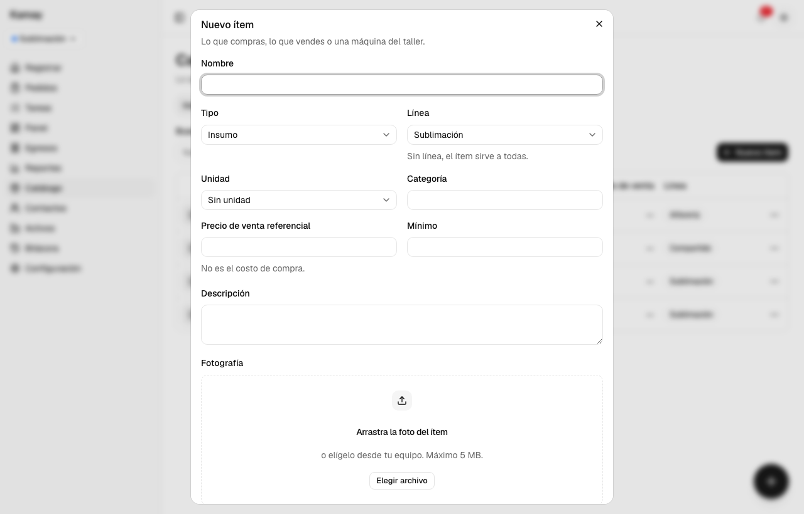

1. **Nuevo ítem**.
2. **Nombre**, **Tipo** (Insumo / Producto / Activo), **Línea** (o *Compartido*, para todas), **Unidad**, **Categoría**.
3. **Precio de venta referencial** (no es el costo de compra) y **Mínimo** (para las alertas de inventario).
4. **Descripción** y **Fotografía** opcionales.
5. **Crear ítem**.

### 12.3 Detalle de un ítem

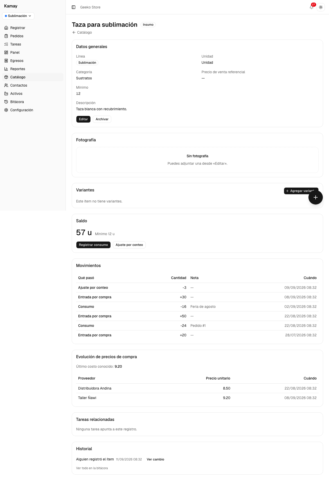

- **Datos generales** con **Editar** y **Archivar**.
- **Fotografía**.
- **Variantes** (tamaño, color…): **Agregar variante** con nombre y precio propio opcional.
- **Tareas relacionadas** e **Historial**.

Para un **insumo** aparecen además las secciones de inventario:

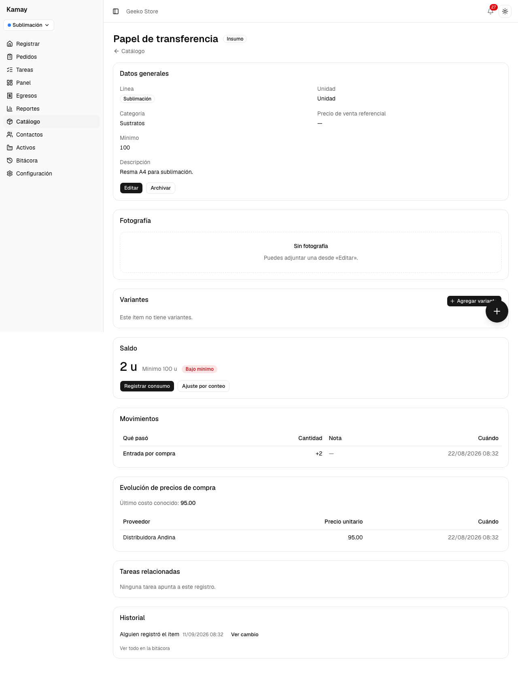

### 12.4 Inventario: saldo, consumo y conteo

El saldo de un insumo **no se escribe a mano**: es la suma de sus movimientos (entradas por compra, consumos y ajustes).

- **Registrar consumo** (también desde **Consumo** en Registro rápido): elige el insumo, la cantidad y una nota opcional; pulsa **Registrar**.

  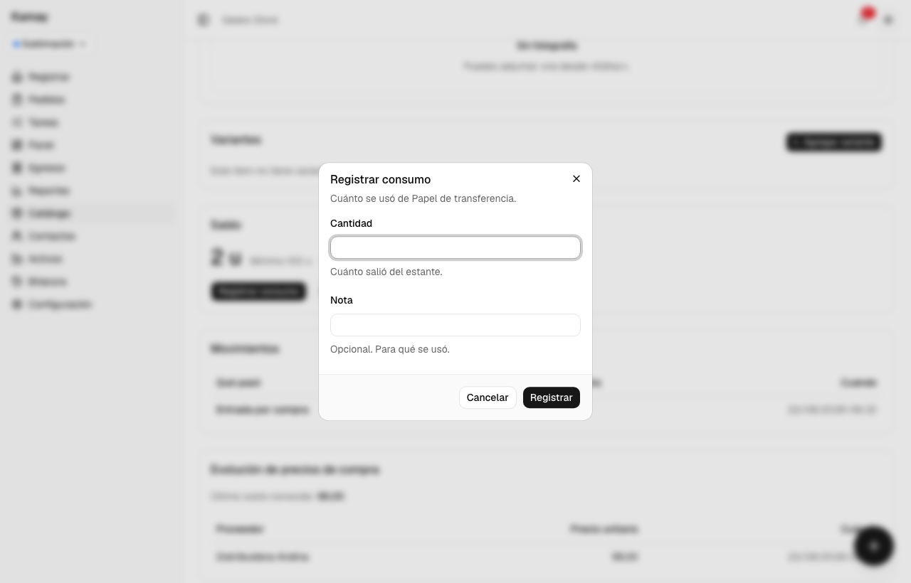

- **Ajuste por conteo**: escribe la **Cantidad contada** y pulsa **Guardar conteo**. Se registra la diferencia. Si coincide con el saldo, verás *Todo cuadra* y no se crea nada.

  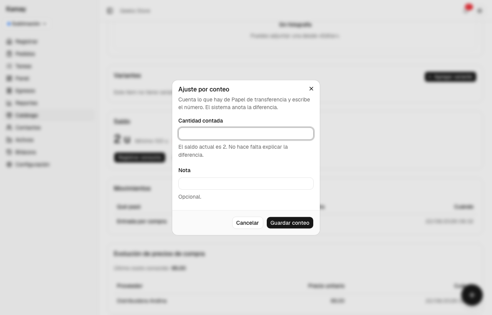

- **Movimientos**: historial del insumo.
- **Evolución de precios de compra** (solo dueño): último costo y precios por proveedor.

El ayudante puede registrar consumos y conteos, pero no ve precios de compra.

---

## 13. Contactos

Ruta: `/contacts`. Proveedores y clientes.

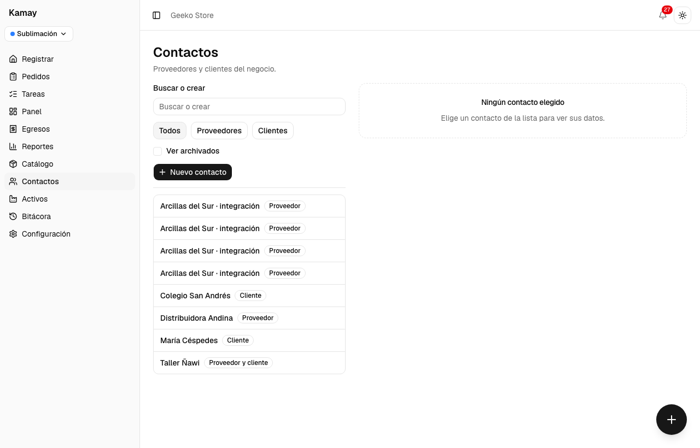

- Lista a la izquierda con **Buscar o crear**, filtro **Todos / Proveedores / Clientes** y **Ver archivados**.
- **Nuevo contacto**: nombre, teléfono, correo, dirección, notas y el rol (**Proveedor**, **Cliente** o ambos; al menos uno).

  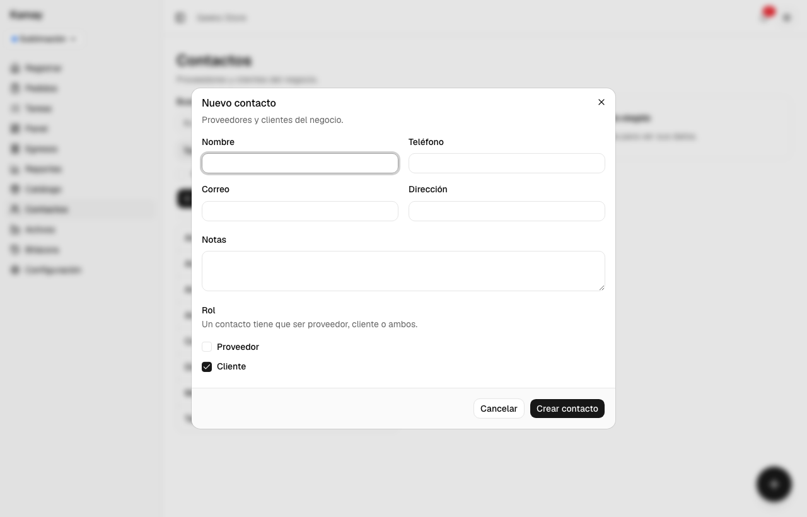

- Al elegir un contacto, el panel derecho muestra sus datos, **Editar**, **Archivar** (solo dueño), **Tareas relacionadas** e **Historial**.

  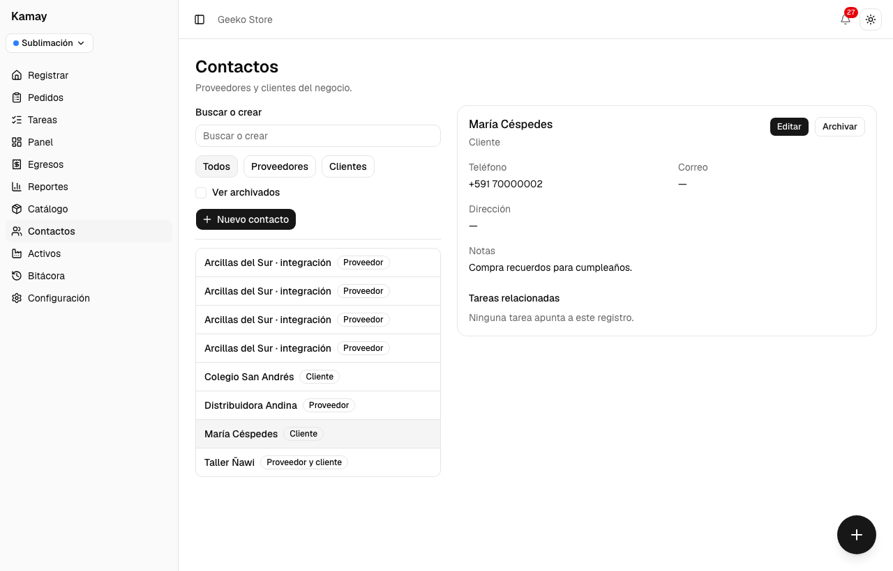

También puedes crear contactos al vuelo desde el formulario de pedido o de compra escribiendo un nombre nuevo y pulsando **Crear «nombre»**.

---

## 14. Activos

Ruta: `/assets`. **Solo dueño.** Muestra cuánto lleva devuelto cada máquina del margen de su línea desde que se compró.

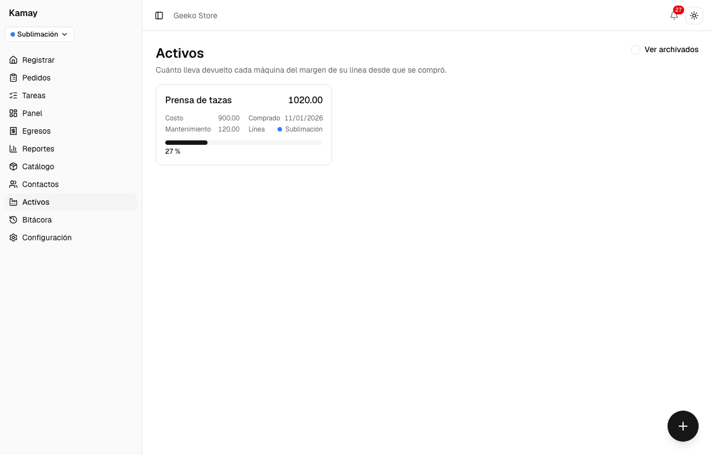

- Una tarjeta por máquina: costo, mantenimiento, fecha de compra, línea y **barra de recuperación** (margen de la línea desde la compra dividido entre costo + mantenimiento, de 0 % a 100 %).
- Pulsa una tarjeta para abrir el panel de detalle: **Costo total**, **Egresos del activo** (adquisición y mantenimientos, con **Desvincular**), formulario **Datos del activo** y tareas e historial.

  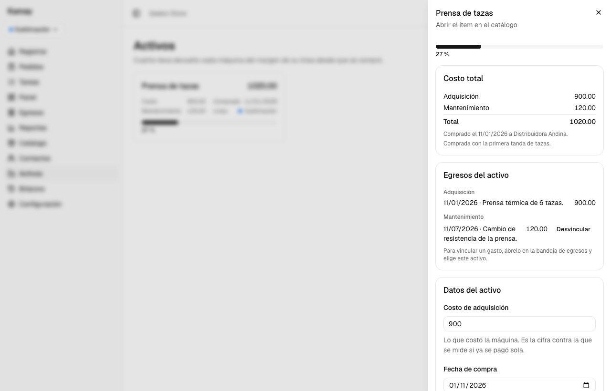

Cómo se declara un activo:

1. **Desde el catálogo**: un ítem de tipo *Activo* tiene en su detalle el bloque **Declarar como activo** (costo de adquisición, fecha de compra, proveedor, notas).
2. **Al registrar una compra** que incluya una máquina: diálogo **Declarar activo** al guardar.
3. **Como entregable** de una tarea (*Nuevo activo*).

Para sumar mantenimiento: abre el gasto en Egresos y elígelo en **Mantenimiento de un activo**.

---

## 15. Reportes

Ruta: `/reports`. **Solo dueño.** Cinco informes que comparten el mismo **Periodo** (Este mes, Mes anterior, Últimos 3 meses, Este año o rango libre) y **Línea**, para que sus cifras cuadren entre sí. Los filtros viven en la dirección: puedes compartir el enlace.

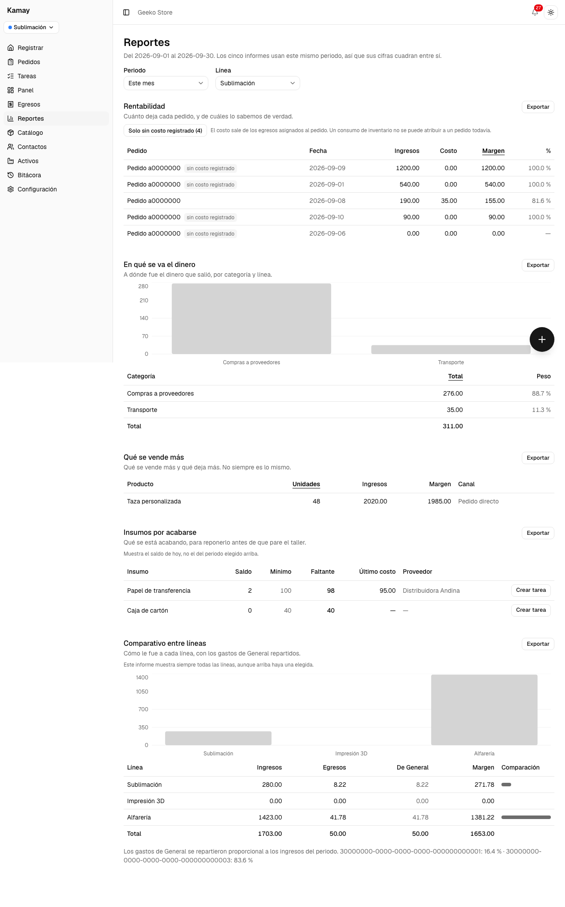

| Informe | Qué responde |
| --- | --- |
| **Rentabilidad** | Ingresos, costo y margen por pedido. La marca *sin costo registrado* indica que ningún egreso se asignó a ese pedido. |
| **En qué se va el dinero** | Egresos por categoría, con gráfico y peso porcentual. |
| **Qué se vende más** | Unidades, ingresos y margen por producto. |
| **Insumos por acabarse** | Insumos bajo mínimo con saldo de hoy, faltante, último costo y proveedor, y botón **Crear tarea** para reponer. |
| **Comparativo entre líneas** | Ingresos, egresos, la parte de *General* repartida y margen por línea. Siempre muestra todas las líneas. |

Cada informe tiene **Exportar** (CSV que abre en cualquier hoja de cálculo). En móvil se ve un informe por vez con pestañas.

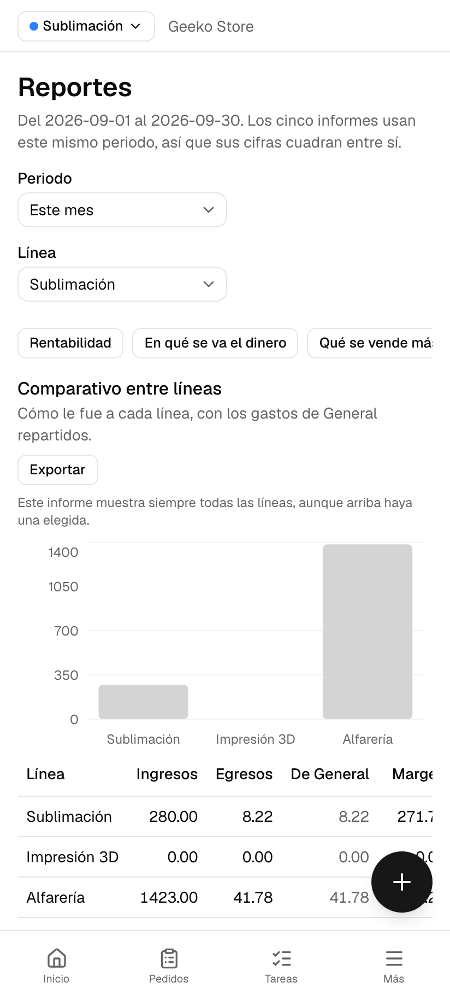

---

## 16. Bitácora

Ruta: `/activity`. **Solo dueño.** El historial completo de la organización: qué cambió, quién y cuándo. **No se puede editar ni borrar.**

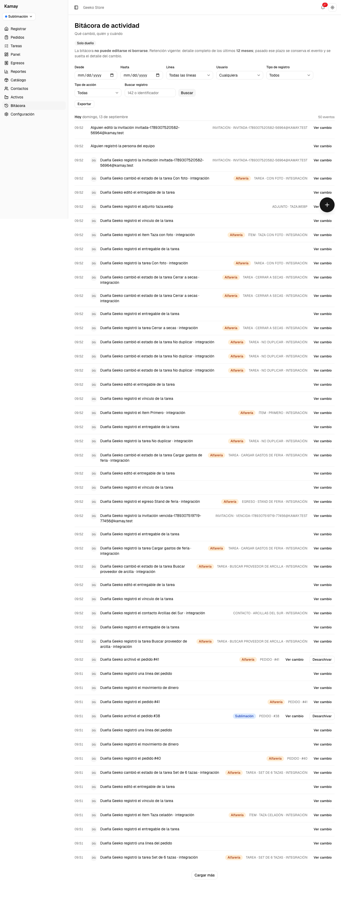

- Eventos agrupados por día, en lenguaje natural. **Ver cambio** muestra el antes y el después.
- Filtros: **Desde**, **Hasta**, **Línea**, **Usuario**, **Tipo de registro**, **Tipo de acción** (registró, editó, cambió de estado, archivó, desarchivó, exportó) y **Buscar registro** por número o identificador. Todos van en la dirección: el enlace filtrado se puede compartir.
- **Exportar** genera un CSV con los eventos filtrados. Si el rango es demasiado grande, pide acotarlo.
- Sobre un evento *archivó…* aparece **Desarchivar** para restaurar pedidos, egresos, contactos, ítems, líneas, canales, categorías y unidades.
- **Cargar más** al pie.

La cabecera indica la **retención** vigente (por defecto 12 meses): pasado ese plazo la bitácora conserva el evento pero suelta el detalle del cambio, después de guardarlo en una exportación automática.

---

## 17. Notificaciones

### 17.1 Campana

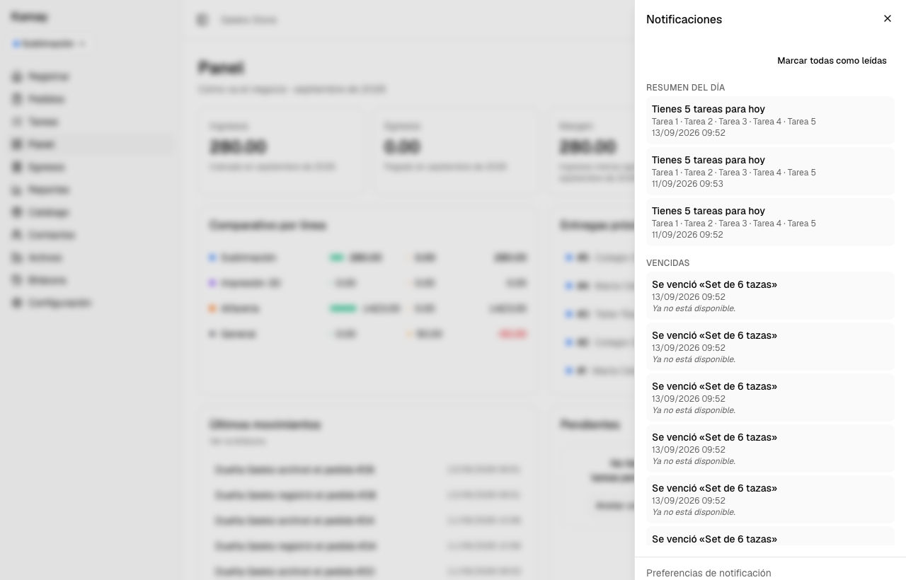

La campana de la barra superior muestra el número de avisos sin leer. Al abrirla:

- Avisos agrupados: **Resumen del día**, **Tareas asignadas**, **En revisión**, **Vencidas**, **Sin movimiento**, **Insumos bajo mínimo**.
- Pulsar un aviso lo marca como leído y abre la tarea o el ítem.
- **Marcar todas como leídas** y **Preferencias de notificación**.

### 17.2 Qué avisos existen

| Aviso | Cuándo llega |
| --- | --- |
| Resumen diario | Un solo aviso al día, a la hora que elijas, con lo vencido y lo de hoy |
| Tarea asignada | Cuando alguien te asigna una tarea (asignarte a ti mismo no avisa) |
| Tarea vencida | Cuando pasa la fecha límite de una tarea tuya |
| Tarea en revisión | Cuando una tarea tuya pasa a un estado de tipo *en espera* |
| Tarea sin movimiento | Más de 7 días en curso sin cambios |
| Insumo bajo mínimo | Anunciado en la interfaz; **todavía no se genera** |

Los avisos se generan cada hora en el servidor. **Hoy no se envían correos** aunque la preferencia esté activada (pendiente de conectar el proveedor de correo).

### 17.3 Preferencias

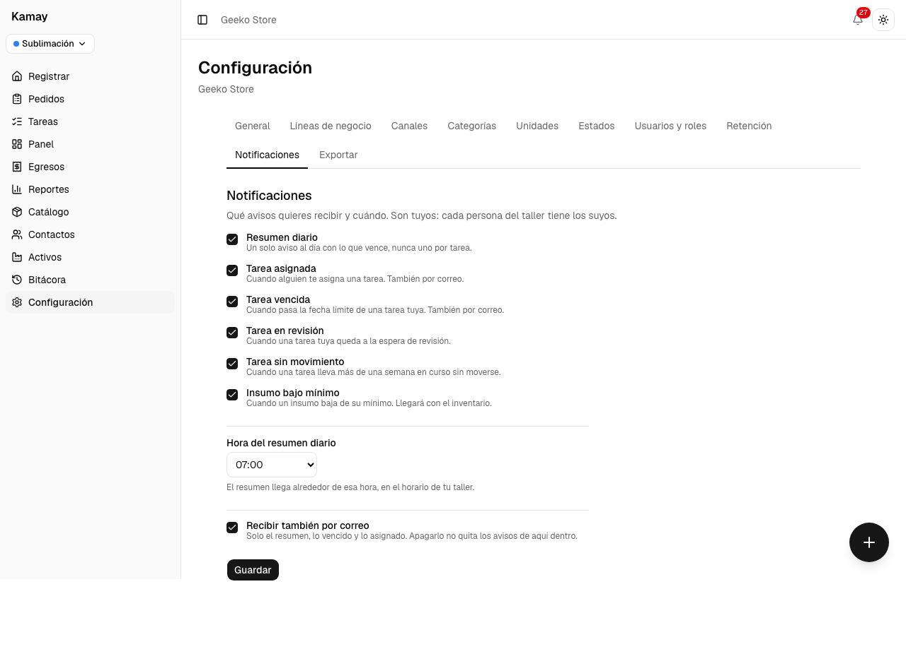

En **Configuración › Notificaciones** (disponible para los dos roles): activa o desactiva cada tipo, elige la **Hora del resumen diario** y si quieres **Recibir también por correo**. Pulsa **Guardar**.

---

## 18. Configuración

Ruta: `/settings`. Pestañas: **General**, **Líneas de negocio**, **Canales**, **Categorías**, **Unidades**, **Estados**, **Usuarios y roles**, **Retención**, **Notificaciones** y **Exportar**. El ayudante solo ve **Notificaciones** y **Exportar**.

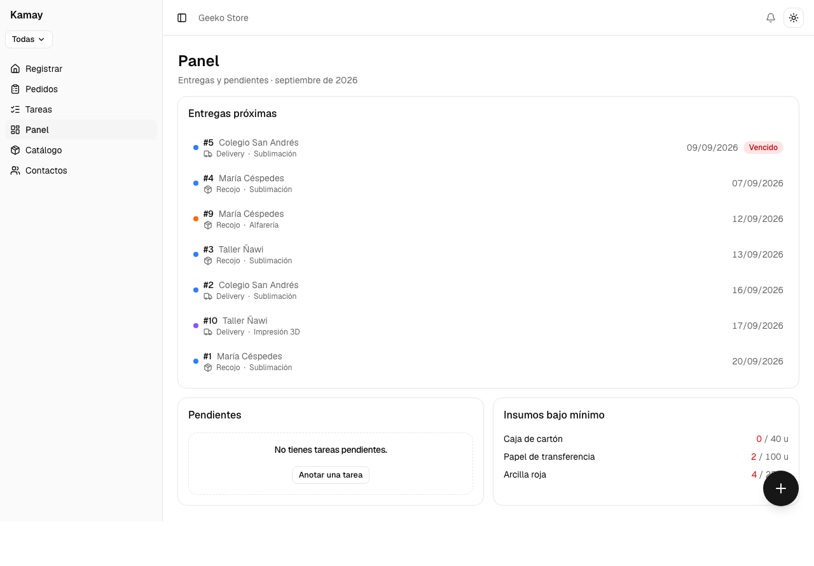

### 18.1 General

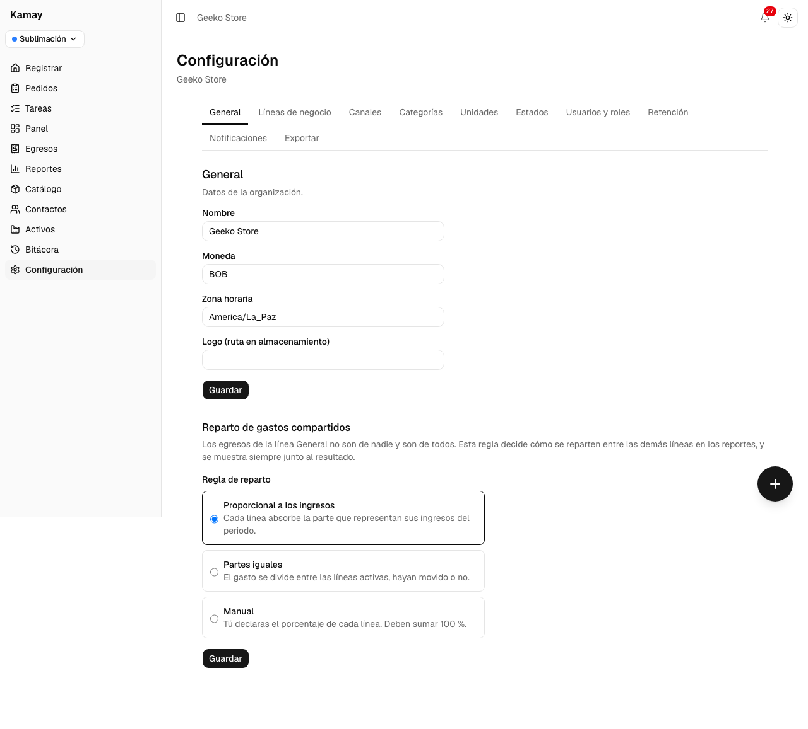

- **Datos de la organización**: nombre, moneda (tres letras, por ejemplo BOB), zona horaria y logo. **Guardar**.
- **Reparto de gastos compartidos**: cómo se reparten los egresos de la línea *General* en los reportes: **Proporcional a los ingresos**, **Partes iguales** o **Manual** (un porcentaje por línea, deben sumar 100 %).

### 18.2 Líneas de negocio

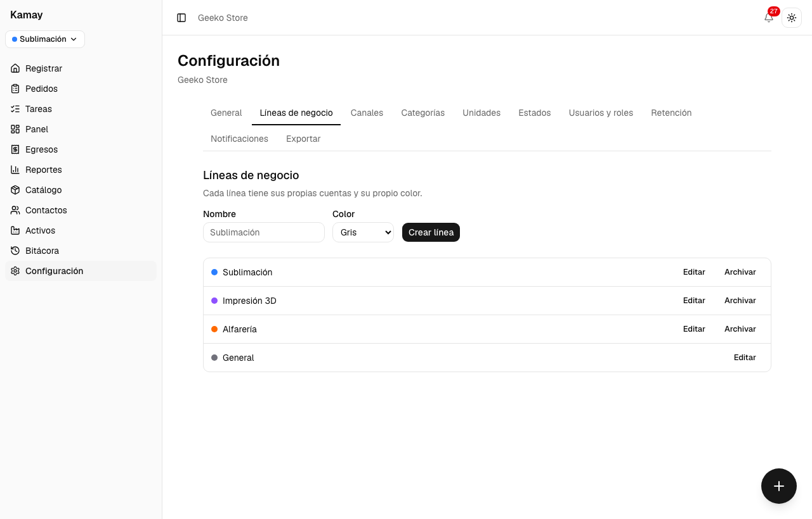

Escribe el **Nombre**, elige un **Color** y pulsa **Crear línea**. Cada fila tiene **Editar** y **Archivar**; la línea *General* no se puede archivar. El bloque **Archivados** permite **Restaurar**. Una línea nueva aparece de inmediato en el selector.

### 18.3 Canales, categorías y unidades

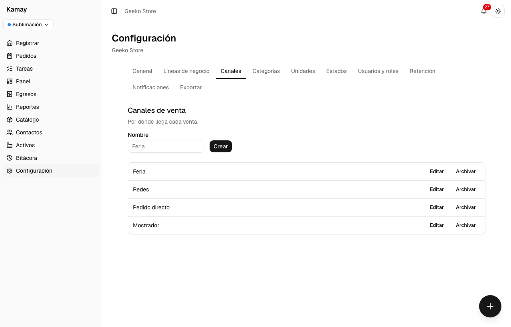

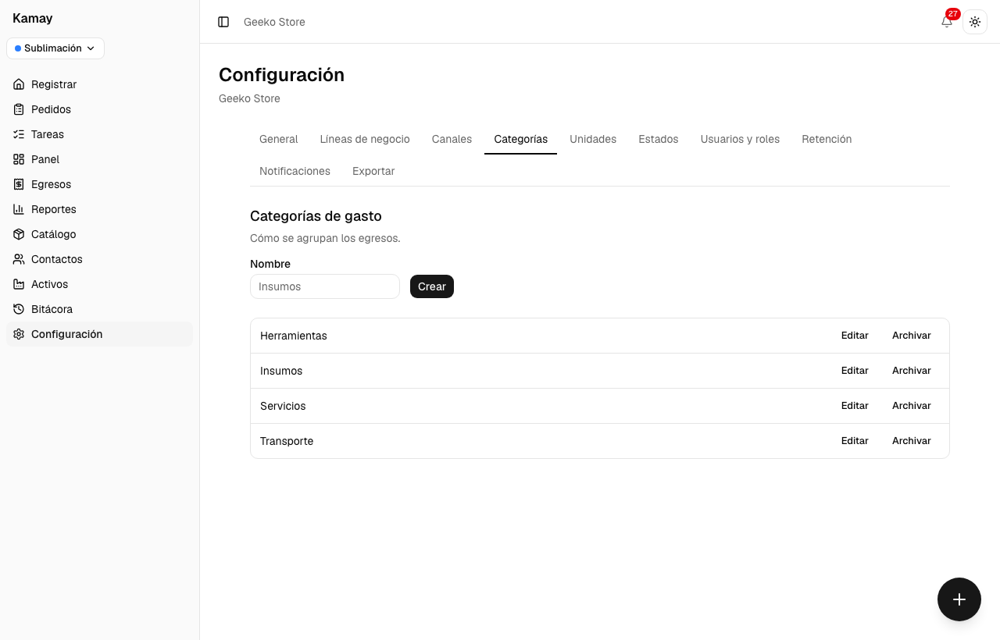

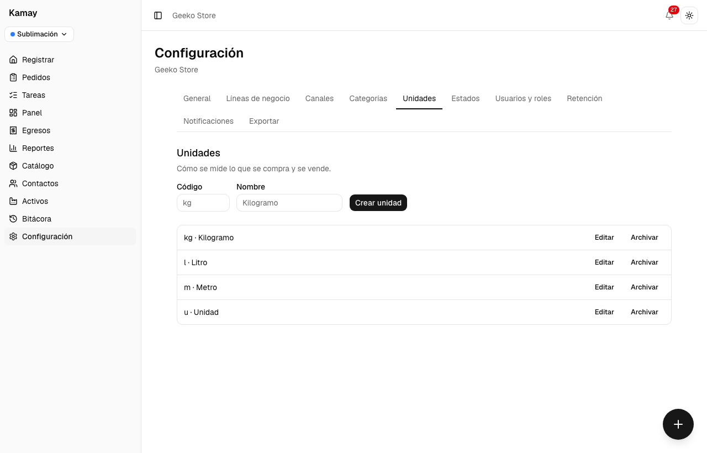

Mismo patrón: escribe, **Crear**, y luego **Editar** / **Archivar** / **Restaurar**. Las unidades llevan **Código** (por ejemplo `kg`) y **Nombre**.

### 18.4 Estados

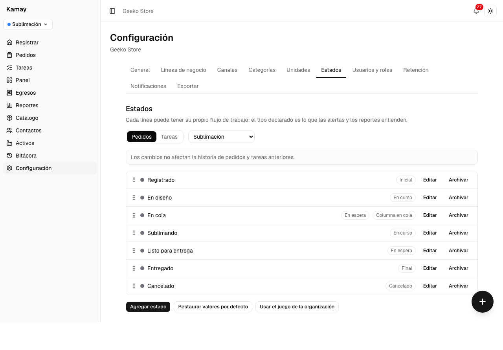

Cada organización, y cada línea si lo desea, define su flujo de **Pedidos** y de **Tareas**.

1. Elige el flujo (**Pedidos** / **Tareas**) y el alcance (**Toda la organización** o una línea).
2. Si la línea usa el juego de la organización, puedes pulsar **Crear juego propio para esta línea** (nace copiado).
3. **Agregar estado**: nombre, **Tipo** (Inicial, En curso, En espera, Final, Cancelado), color y, solo para *En espera*, la casilla **Columna en cola**.
4. **Reordenar** arrastrando el asa de cada fila; **Editar** o **Archivar** (si el estado está en uso, elige a qué estado mover sus registros).

   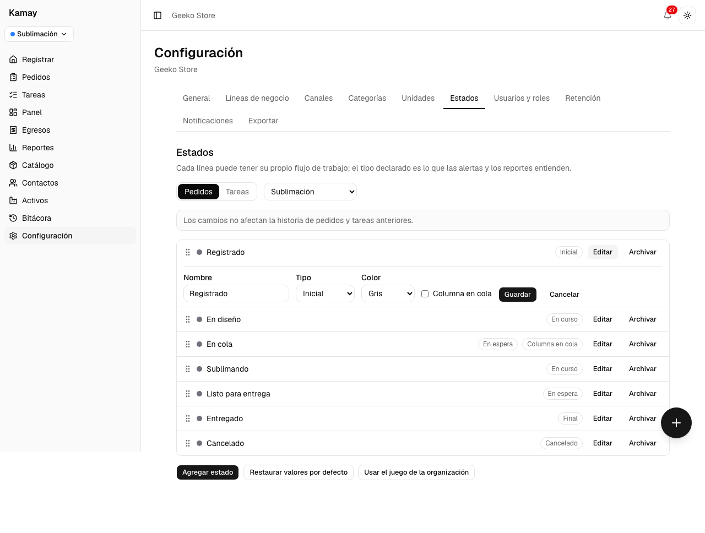

5. **Restaurar valores por defecto** o **Usar el juego de la organización** (descarta el juego propio de la línea).

Reglas: todo juego necesita al menos un estado **Inicial** y uno **Final**; los nombres no se repiten dentro del juego; los cambios no alteran la historia de pedidos y tareas anteriores. El **tipo** es lo que entienden las alertas (retraso, vencimiento) y los reportes; el nombre es libre.

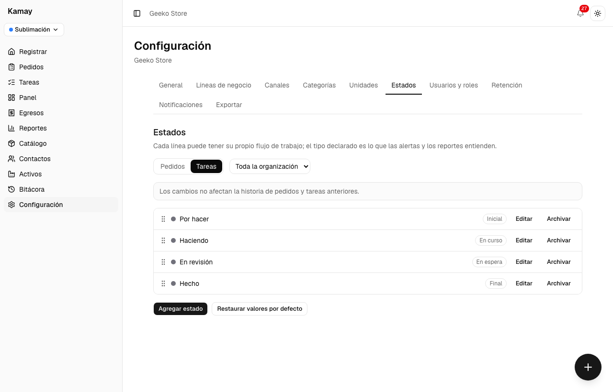

### 18.5 Retención

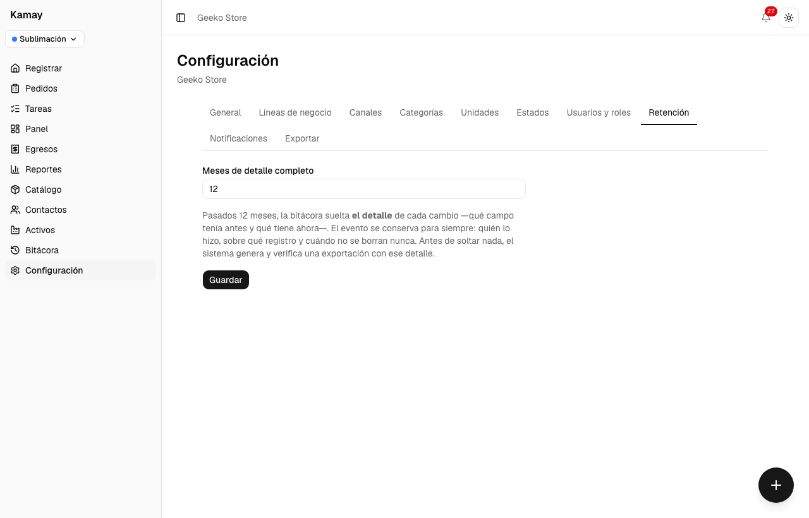

**Meses de detalle completo** de la bitácora (1 a 120, por defecto 12). Pasado el plazo se conserva el evento y se suelta el detalle, tras exportarlo automáticamente.

### 18.6 Exportar

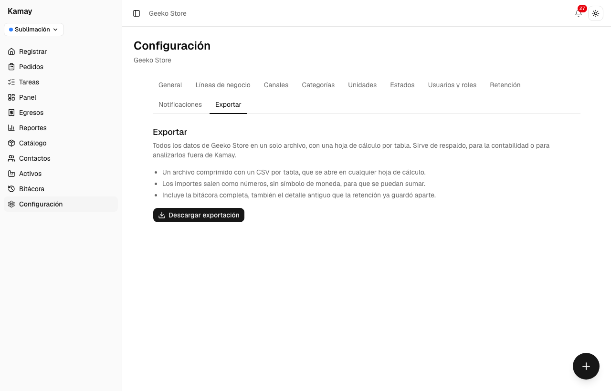

**Descargar exportación** genera un ZIP con un CSV por tabla (pedidos, líneas de pedido, cobros y pagos, egresos, ítems, contactos, tareas, bitácora, etc.). El ayudante obtiene solo lo que su rol puede ver (sin egresos, activos ni bitácora). Los importes salen como números para poder sumarlos.

### 18.7 Usuarios y roles

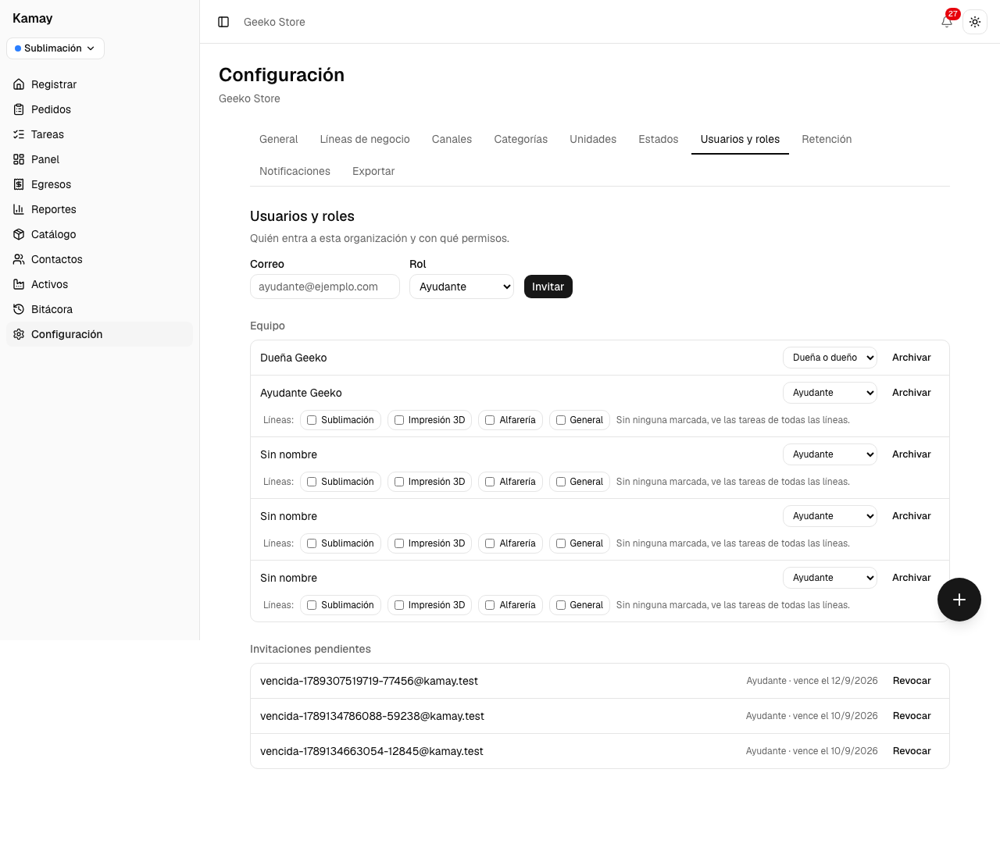

Invitar a alguien:

1. Escribe el **Correo**, elige el **Rol** y pulsa **Invitar**.
2. Aparece el enlace de invitación con el aviso *Copia este enlace y envíaselo. No se vuelve a mostrar.* Cópialo y envíalo por el medio que prefieras (la aplicación no manda ese correo).
3. La invitación queda en **Invitaciones pendientes** con su fecha de vencimiento (7 días) y el botón **Revocar**. Si el enlace se pierde, revoca e invita de nuevo.

Equipo:

- Cambia el **rol** de cada persona con el selector de su fila. La organización siempre conserva al menos una persona dueña.
- Para un ayudante, marca las **Líneas** que puede ver. Sin ninguna marcada ve las tareas de todas las líneas.
- **Archivar** quita el acceso; la persona pasa a **Sin acceso** (hoy sin restauración desde la interfaz).

---

## 19. Trabajar sin conexión

Kamay está pensada para seguir **registrando** aunque falle la señal. Lo que funciona sin red:

- **Ventas de feria**, **pedidos** (sin imágenes), **consumos** y **ajustes de conteo**.

Lo que necesita red: subir imágenes o comprobantes, cobros y pagos, egresos, y abrir pantallas que no hayas visitado. Si intentas abrir una pantalla sin red verás:

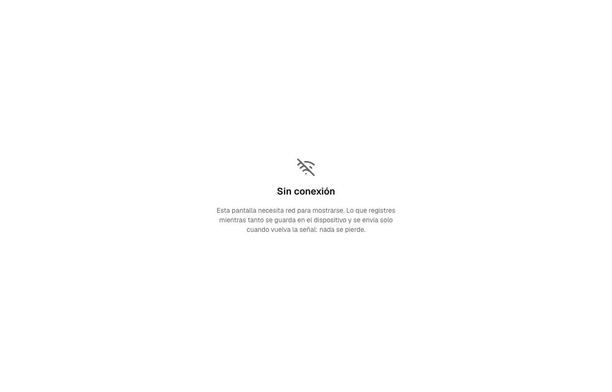

Cómo funciona:

1. Al guardar sin señal, verás un aviso del tipo *Pedido guardado · pendiente de sincronizar*. El registro se guarda en el dispositivo.
2. En la barra aparece un **indicador con el número de registros por sincronizar**. Pulsarlo abre la bandeja **Registros por sincronizar**, con el estado de cada uno: *Pendiente de sincronizar*, *En espera* (con el motivo) o *No se pudo enviar*.
3. Al volver la señal, se envían solos en orden (también cada 30 segundos mientras la aplicación esté abierta). Reenviar nunca duplica.
4. Solo lo que falló definitivamente ofrece **Reintentar** o **Descartar** (con confirmación).

La aplicación **no** envía nada mientras está cerrada: ábrela con señal para que vacíe la cola.

---

## 20. Anexo: qué puede hacer cada rol

| Función | Dueña o dueño | Ayudante |
| --- | --- | --- |
| Panel con montos (ingresos, egresos, margen, por cobrar) | Sí | No (solo entregas, pendientes e insumos) |
| Pedidos: crear, editar, mover, cancelar | Sí | Sí |
| Cobros de pedidos | Registrar y anular | Solo registrar |
| Archivar / desarchivar registros | Sí | No |
| Venta rápida (feria) | Sí | Sí |
| Tareas y Mis pendientes | Sí | Sí (solo sus líneas o las asignadas) |
| Vincular activos a tareas / entregable *Nuevo activo* | Sí | No |
| Egresos (compras, gastos, pagos) | Sí | No |
| Catálogo y contactos | Sí | Sí (sin archivar) |
| Inventario: consumo y conteo | Sí | Sí |
| Precios de compra y evolución de costos | Sí | No |
| Activos | Sí | No |
| Reportes | Sí | No |
| Bitácora | Sí | No (tampoco ve el historial de cada registro) |
| Configuración del taller y del equipo | Sí | No |
| Notificaciones (preferencias propias) | Sí | Sí |
| Exportar | Todo, bitácora incluida | Solo lo visible para su rol |

Los accesos que un rol no tiene **no aparecen** en los menús; si se entra por dirección directa, la aplicación redirige al panel sin mostrar error.
