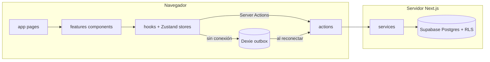

# Kamay — Arquitectura del Proyecto

Este documento describe la estructura y las convenciones del código de **Kamay**: una aplicación multi-organización para la gestión operativa de emprendimientos de producción propia — proveedores, compras, pedidos, ventas, inventario, tareas y reportes, con las cuentas separadas por línea de negocio (ver `constants/conf.ts` para nombre y descripción del producto).

**Documentos previos, en orden de autoridad:**

1. `docs/especificacion-producto.md` — especificación funcional (qué se construye y por qué). **Manda sobre todo lo demás.**
2. `docs/esquema-base-de-datos.md` — anexo técnico del esquema.
3. `docs/mapa-navegacion-ui.md` — vistas V1–V23 y transiciones.
4. Este archivo — cómo está organizado el código.

Para agregar un recurso o pantalla nueva, el flujo obligatorio es un cambio de OpenSpec (ver §11), no editar directamente.

---

## Stack tecnológico

| Capa | Elección |
| --- | --- |
| Framework | **Next.js 16** (App Router), **React 19** |
| Lenguaje | **TypeScript** (`strict`) |
| Backend / datos | **Supabase** (Postgres 15+, Auth, Storage, RLS para aislamiento por organización) |
| Supabase en Next.js | **`@supabase/ssr`** — clientes de servidor y navegador separados |
| Estado de cliente | **Zustand** (stores por feature + store global de usuario/organización) |
| UI | **Tailwind CSS 4**, **shadcn/ui** (primitivas Radix), iconos **Lucide** |
| Formularios / tablas | **react-hook-form** + **Zod**, **TanStack React Table** |
| Tableros (kanban) | **dnd-kit** |
| Gráficos | **Recharts** |
| Markdown (tareas) | **react-markdown** + `remark-gfm` + `rehype-sanitize` |
| Sin conexión | **Serwist** (service worker) + **Dexie** (IndexedDB, patrón outbox) |
| Temas | **next-themes** |
| Avisos | **Sonner** |
| Fechas | **date-fns** (`America/La_Paz`) |
| Pruebas | **Vitest**, **Testing Library**, **pgTAP**, **Playwright** |
| Especificaciones | **OpenSpec** (`openspec/`) |
| Grafo de conocimiento | **Graphify** (`graphifyy`, salida en `graphify-out/`) |

Alias de importación: `@/*` apunta a la raíz del repositorio (`tsconfig.json`).

**Idioma:** identificadores de código, rutas, tablas y mensajes para desarrolladores en **inglés**; texto visible por el usuario y documentación de producto en **español**.

---

## Estilo arquitectónico

Disposición **por capas + rebanadas verticales por feature**:

1. **`app/`** — enrutado, layouts y cascarones de página delgados. Las páginas componen módulos de feature y llaman server actions o pasan datos obtenidos en servidor como props.
2. **`actions/`** — **Server Actions** (`"use server"`). Verificación de sesión, resolución de organización y rol, `revalidatePath`, orquestación y delegación a servicios. Las lecturas usan `cache()` de React para deduplicar dentro de una misma petición.
3. **`services/`** — **acceso a datos y orquestación de dominio** contra Supabase. Clases de servicio que reciben un `SupabaseClient` por inyección desde la capa de acciones. Concentran los `select`, los joins y el mapeo de filas a DTOs.
4. **`features/`** — **rebanadas verticales** por área de negocio: pantallas, hooks de cliente y stores de Zustand co-ubicados (ej. `features/orders/board/`, `features/tasks/detail/`).
5. **`components/`** — presentación **compartida**: cascarón de layout, diálogos genéricos, widgets de dominio (`DataTable`, `LineSelector`, `StatusBadge`), primitivas shadcn en `components/ui/`.
6. **`types/`** — modelos y enums de TypeScript exportados vía barriles.
7. **`lib/`** — adaptadores de framework y utilidades (fábricas de Supabase, cola sin conexión, `cn`, formato de moneda).
8. **`constants/`** — configuración estática y datos de referencia.
9. **`configs/`** — listas de opciones orientadas a UI (colores de línea, tipos de estado, categorías por defecto).
10. **`hooks/`** — hooks de cliente transversales (`useOrganization`, `useBusinessLine`, `useOnlineStatus`).
11. **`stores/`** — estado de cliente transversal (`UserStore`, `OrganizationStore`, `LineStore`).
12. **`supabase/`** — migraciones, configuración local, semillas y **pruebas pgTAP**. Los cambios de esquema **solo** entran por archivos nuevos con marca de tiempo en `supabase/migrations/`.
13. **`tests/`** — pruebas de integración y end-to-end (ver §10).
14. **`openspec/`** — especificaciones vivas y cambios en curso (ver §11).
15. **`graphify-out/`** — grafo de conocimiento del repositorio, versionado en git (ver §12).



---

## Enrutado (`app/`)

- **Layout raíz** (`app/layout.tsx`): fuentes, CSS global, `ThemeProvider`, `Toaster`, registro del service worker.
- **Grupo `(app)`**: interfaz autenticada. `AuthCheck` usa `createClient()` de `@/lib/supabase/server`, redirige a `/auth/login`, carga `getCurrentUser()` y su membresía, y envuelve los hijos en `UserProvider` + `OrganizationProvider`.
- **Grupo `(fair)`**: modo feria. Layout propio **sin barra superior ni inferior** — es la única parte de la aplicación que rompe el cascarón, por decisión de producto.
- **`app/auth/*`**: inicio de sesión, recuperación de contraseña y manejadores `auth/callback` y `auth/confirm`.
- **`app/api/*`**: manejadores de ruta para trabajos programados (resumen diario, retención de bitácora) y exportaciones.

**Rutas implementadas:**

| Área | Rutas | Vistas |
| --- | --- | --- |
| Panel | `/dashboard` | V2 |
| Pedidos | `/orders`, `/orders/new`, `/orders/[id]`, `/orders/[id]/edit` | V3–V5 |
| Modo feria | `/fair` | V6 |
| Egresos | `/expenses`, `/expenses/purchases/new`, `/expenses/costs/new`, `/expenses/[id]` | V7–V9 |
| Catálogo | `/catalog`, `/catalog/new`, `/catalog/[id]`, `/catalog/[id]/edit` | V10–V11 |
| Activos | `/assets`, `/assets/new`, `/assets/[id]` | V12 |
| Contactos | `/contacts`, `/contacts/new`, `/contacts/[id]` | V13 |
| Reportes | `/reports/[tab]` — `profitability`, `spending`, `best-sellers`, `restock`, `lines` | V14 |
| Tareas | `/tasks`, `/tasks/[id]`, `/tasks/mine` | V17, V18, V20 |
| Bitácora | `/activity` | V23 |
| Configuración | `/settings/[section]` — `general`, `lines`, `channels`, `statuses`, `categories`, `users`, `notifications`, `data` | V15, V22 |
| Móvil | `/quick` | V16 |

**`middleware.ts`** refresca la cookie de sesión en cada petición vía `lib/supabase/proxy.ts` y bloquea rutas del grupo `(app)` sin sesión. La autorización fina (rol, organización) **no** vive en el middleware: vive en RLS y se verifica además en la capa de acciones.

---

## Integración con Supabase (`lib/supabase/`)

| Módulo | Rol |
| --- | --- |
| `server.ts` | `createServerClient` ligado a `cookies()` de Next.js — Server Components, Server Actions, route handlers |
| `client.ts` | `createBrowserClient` para componentes de cliente que necesitan acceso directo |
| `admin.ts` | Cliente con **service role** — solo servidor; jamás importar desde el bundle de cliente |
| `proxy.ts` | Refresco de sesión para el middleware |

Variables de entorno: `NEXT_PUBLIC_SUPABASE_URL`, `NEXT_PUBLIC_SUPABASE_ANON_KEY`, `SUPABASE_SERVICE_ROLE_KEY`.

> **Regla no negociable:** el cliente de service role **solo** se usa en trabajos programados y en la generación de notificaciones. Nunca en una acción disparada por el usuario. Saltarse RLS es saltarse el aislamiento entre organizaciones.

### Base de datos (migraciones)

El esquema canónico vive en `supabase/migrations/`, en el orden documentado en `docs/esquema-base-de-datos.md`. Principios que el código debe respetar:

- **Multi-organización** vía `organization_id` en toda tabla; **RLS activo en todas, sin excepción**.
- **UUID** como llave primaria, generables en el cliente (requisito del modo sin conexión).
- **Archivado** vía `archived_at`; **no existen políticas `DELETE`**.
- **Auditoría** vía `activity_log` y trigger genérico `log_activity()` en todas las tablas auditables.
- **Nada derivado se almacena**: saldos, totales, costos y márgenes viven en vistas con `security_invoker = true`.

**Dominios principales en Postgres:**

| Dominio | Tablas |
| --- | --- |
| Organización | `organizations`, `memberships` |
| Configuración | `business_lines`, `sales_channels`, `statuses`, `expense_categories`, `units` |
| Directorio | `contacts` |
| Catálogo | `items`, `item_variants`, `asset_details` |
| Ventas | `orders`, `order_items`, `payments` |
| Egresos | `expenses`, `expense_items` |
| Inventario | `inventory_movements` + vistas de saldo |
| Tareas | `tasks`, `task_links`, `task_deliverables`, `tags`, `task_tags` |
| Adjuntos | `attachments` + buckets de Storage |
| Bitácora | `activity_log` |
| Avisos | `notifications` |

**No editar migraciones existentes.** Todo cambio de esquema entra como `YYYYMMDDHHMMSS_<nombre>.sql` nuevo, acompañado de su prueba pgTAP.

---

## Server Actions (`actions/`)

Organizadas por dominio con barriles `index.ts`:

| Carpeta | Propósito |
| --- | --- |
| `organization` | Organización, membresías, `getCurrentUser`, cambio de organización |
| `business-line` | Líneas de negocio y su configuración |
| `status` | Juegos de estados por organización y por línea, resolución del juego aplicable |
| `order` | Pedidos y ventas directas, cambio de estado, cola |
| `payment` | Cobros y pagos |
| `expense` | Compras y gastos |
| `item` | Catálogo, variantes, activos |
| `inventory` | Movimientos, consumo, ajuste por conteo |
| `contact` | Proveedores y clientes |
| `task` | Tareas, vínculos, entregables, cierre |
| `report` | Lecturas agregadas sobre vistas |
| `activity` | Bitácora (solo dueño) |
| `notification` | Bandeja y preferencias |

Responsabilidades típicas:

- Verificar sesión (`supabase.auth.getUser()`).
- Resolver **organización** y **rol** desde `memberships`.
- Instanciar el servicio con **el mismo cliente Supabase que RLS ve**.
- Validar la entrada con el esquema Zod compartido con el formulario.
- Llamar `revalidatePath` tras mutaciones.

> RLS es la última línea de defensa, no la única. Una acción que no verifica el rol antes de mutar es un error de revisión, aunque la política lo bloquee después.

---

## Servicios (`services/`)

Cada carpeta de dominio exporta una clase que:

- Recibe `SupabaseClient` en el constructor.
- Centraliza las formas de `.from(...).select(...)`, los joins y el mapeo de filas crudas a DTOs de `types/`.

**Servicios exportados** (`services/index.ts`): `OrganizationServices`, `BusinessLineServices`, `StatusServices`, `OrderServices`, `PaymentServices`, `ExpenseServices`, `ItemServices`, `InventoryServices`, `ContactServices`, `TaskServices`, `ReportServices`, `ActivityServices`, `NotificationServices`.

No pertenecen a los servicios: `revalidatePath`, `cookies()`, verificaciones de autenticación ni lógica de presentación.

---

## Features (`features/`)

| Feature | Estructura típica | Vistas |
| --- | --- | --- |
| `dashboard` | `owner`, `assistant`, hooks, store | V2 |
| `orders` | `board`, `list`, `detail`, `create`, `shared`, hooks, stores | V3–V5 |
| `fair` | `grid`, `cart`, `checkout`, `sync`, store | V6 |
| `expenses` | `list`, `purchase-form`, `cost-form`, hooks, stores | V7–V9 |
| `catalog` | `list`, `detail`, `create`, `variants`, hooks, stores | V10–V11 |
| `assets` | `list`, `detail`, `recovery`, store | V12 |
| `contacts` | `list`, `detail`, hooks, store | V13 |
| `reports` | un módulo por informe + `shared/filters` | V14 |
| `tasks` | `board`, `detail`, `editor`, `deliverables`, `mine`, hooks, stores | V17–V20 |
| `activity` | `feed`, `filters`, `diff-view` | V23 |
| `settings` | `general`, `lines`, `statuses`, `users`, `data` | V15, V22 |

### Tareas (`features/tasks/`)

La rebanada más grande, y la que concentra las reglas más delicadas:

- `board/` — kanban con dnd-kit; columnas resueltas dinámicamente desde `resolve_statuses()`. **Permite mover hacia atrás** (una revisión que vuelve a *Por hacer* es un caso válido).
- `editor/` — editor Markdown con barra de herramientas mínima y vista previa saneada.
- `deliverables/` — asistente de cierre (V19). Las tres salidas —crear todo, crear algunos, **no crear nada**— tienen la misma jerarquía visual y ninguna bloquea el cierre.
- `links/` — buscador único que resuelve pedidos, contactos, ítems, egresos y activos.

> **Regla de producto grabada en el código:** un pedido **nunca** genera una tarea automáticamente. La única vía es la acción explícita *Crear tarea para este pedido*, que prellena el formulario. Cualquier propuesta de sincronizar ambos tableros debe rechazarse en revisión.

### Modo sin conexión (`features/fair/sync/` + `lib/offline/`)

- Los identificadores `uuid` se generan **en el cliente**: un registro nace con su llave definitiva.
- `occurred_at` lo fija el cliente (hora real del hecho); `created_at` lo fija el servidor.
- Cola outbox en Dexie; al reconectar se envía en orden padre → hijo, con `on conflict do nothing` como red de seguridad.
- Un indicador persistente muestra cuántos registros faltan sincronizar.

---

## UI compartida (`components/`)

- **`layout/`** — `Header`, `Sidebar`, `MobileNav`, `MainContainer`, `LineSelector` (contexto global persistente).
- **`ui/`** — primitivas generadas por shadcn.
- **`DataTable/`** — tabla de listados (búsqueda, paginación, acciones por fila, "ver archivados").
- **`Board/`** — piezas compartidas entre el tablero de pedidos y el de tareas.
- **`Dialog/`** — `ConfirmDialog`, `Modal`, `Sheet` envueltos.
- **`StatusBadge/`**, **`LineBadge/`**, **`DueDate/`** — semáforo de fechas y colores de línea en un solo lugar.
- **`OwnerOnly.tsx`** — render condicionado por rol. **No sustituye a RLS**: es cosmética.
- **`providers/`** — `UserProvider`, `OrganizationProvider`.

---

## Tipos (`types/`)

Agregados en `types/index.ts`:

- **Organización:** `Organization`, `Membership`, `Role`, `CurrentUser`
- **Configuración:** `BusinessLine`, `SalesChannel`, `Status`, `StatusKind`, `ExpenseCategory`, `Unit`
- **Ventas:** `Order`, `OrderKind`, `OrderItem`, `Payment`, `DeliveryMode`
- **Egresos:** `Expense`, `ExpenseKind`, `ExpenseItem`
- **Catálogo:** `Item`, `ItemKind`, `ItemVariant`, `AssetDetails`, `InventoryMovement`
- **Tareas:** `Task`, `TaskLink`, `TaskDeliverable`, `DeliverableType`, `Tag`
- **Bitácora:** `ActivityEvent`, `ActivityAction`

`StatusKind` (`initial | in_progress | waiting | final | cancelled`) es el tipo que sostiene toda la flexibilidad de flujos. Ninguna lógica debe comparar estados por nombre; siempre por `kind`.

---

## Pruebas

Tres niveles, cada uno con un propósito distinto. La regla que los ordena: **una prueba debe fallar por una razón, y esa razón debe ser obvia.**

### Unitarias — `vitest` + Testing Library

**Qué cubren:** lógica pura y componentes aislados. Sin red, sin base de datos.

| Objetivo | Ejemplos |
| --- | --- |
| Cálculos | Total de pedido, saldo pendiente, saldo de inventario, porcentaje de recuperación de activo |
| Reglas de estado | Resolución del juego aplicable, `kind` que suprime alertas de retraso, validación de inicial/final |
| Formato | Moneda en Bs, fechas relativas, semáforo de vencimiento |
| Cola sin conexión | Orden de envío, deduplicación por uuid, reintentos |
| Esquemas Zod | Campos obligatorios mínimos (cliente + una línea), rechazos esperados |
| Componentes | `StatusBadge`, `DueDate`, `LineBadge`, tarjetas de tablero |

Ubicación: junto al archivo probado, como `*.test.ts` / `*.test.tsx`.
Comando: `npm run test:unit`.

### Integración — `vitest` + Supabase local + **pgTAP**

**Qué cubren:** todo lo que ocurre dentro de Postgres. Es el nivel más importante del proyecto, porque las garantías críticas de Kamay viven en la base de datos, no en la aplicación.

**Pruebas pgTAP** (`supabase/tests/`), ejecutadas con `supabase test db`:

| Archivo | Verifica |
| --- | --- |
| `rls_isolation.test.sql` | Un usuario de la organización A obtiene **cero filas** de la B, en toda tabla y toda vista |
| `rls_roles.test.sql` | El ayudante obtiene cero filas de `expenses`, `expense_items`, `asset_details`, `activity_log` y de las vistas de costo |
| `no_delete.test.sql` | Ninguna tabla permite `DELETE`, ni siquiera al dueño |
| `audit_trigger.test.sql` | Toda mutación genera un evento; solo se guardan campos cambiados; archivar produce `archived`; ediciones seguidas se fusionan dentro de 5 minutos |
| `activity_immutable.test.sql` | `UPDATE` y `DELETE` sobre `activity_log` fallan para `authenticated` |
| `views_security.test.sql` | Toda vista declara `security_invoker` |
| `status_integrity.test.sql` | Un juego de estados sin `initial` o sin `final` es rechazado; `is_queue` solo en `waiting` |
| `inventory_idempotency.test.sql` | Una línea de compra no puede generar dos movimientos |
| `derived_values.test.sql` | Las vistas de saldo y total coinciden con el cálculo manual sobre datos sembrados |

**Pruebas de integración de la aplicación** (`tests/integration/`): acciones y servicios contra la base local sembrada, verificando que una acción llamada como ayudante falle y como dueño funcione.

Comando: `npm run test:integration` (levanta `supabase start`, aplica migraciones y semillas).

> **Criterio de aceptación de cualquier migración:** ninguna se fusiona sin su prueba pgTAP correspondiente. Una política de RLS sin prueba es una política que nadie ha verificado.

### End-to-end — **Playwright**

**Qué cubren:** los recorridos completos de `docs/mapa-navegacion-ui.md`, en navegador real contra Supabase local.

| Suite | Recorrido |
| --- | --- |
| `auth.spec.ts` | Inicio de sesión, selección de organización, expiración de sesión |
| `order-lifecycle.spec.ts` | Flujo A completo: pedido → tarea de diseño con idas y vueltas → cola → entrega |
| `fair-offline.spec.ts` | **Crítico.** Modo feria con red desconectada: vender 3 veces, reconectar, verificar 3 ventas con su hora real y ninguna duplicada |
| `task-deliverables.spec.ts` | Cierre con entregables: crear todos, crear algunos, y **cerrar sin crear nada** |
| `assistant-permissions.spec.ts` | El ayudante no ve montos, no encuentra las rutas en el menú y, al entrar por URL directa, es redirigido |
| `status-config.spec.ts` | Personalizar estados de una línea y comprobar que las otras y el historial no cambian |
| `archive-restore.spec.ts` | Archivar y desarchivar conservando historial |

Comandos: `npm run test:e2e`, `npm run test:e2e:ui`.

### Datos de prueba

`tests/factories/` genera organizaciones, líneas, estados, ítems y usuarios con roles. **Toda prueba crea su propia organización** y opera dentro de ella: es la única forma de que las pruebas de aislamiento sean honestas y de poder ejecutarlas en paralelo.

### Integración continua

`.github/workflows/ci.yml`, en este orden:

```
lint → typecheck → test:unit → supabase start → test:integration (pgTAP) → build → test:e2e
```

Cobertura mínima exigida: **90 % en `lib/` y `services/`**, sin umbral en componentes de presentación. Perseguir cobertura en la UI produce pruebas frágiles que nadie mantiene.

---

## OpenSpec (`openspec/`)

Kamay usa **OpenSpec** para que ningún cambio entre al código sin estar especificado antes. Es la respuesta directa al problema que hundió la versión anterior del sistema: <cite index="9-1">requisitos que vivían solo en el historial del chat</cite>.

```
openspec/
├── project.md              # constitución: stack, convenciones, restricciones
├── specs/                  # fuente de verdad consolidada, por capacidad
│   ├── tenancy/
│   ├── orders/
│   ├── expenses/
│   ├── inventory/
│   ├── tasks/
│   ├── activity-log/
│   └── reporting/
└── changes/
    ├── add-asset-recovery/
    │   ├── proposal.md     # qué, por qué, dentro y fuera de alcance
    │   ├── design.md       # enfoque técnico
    │   ├── specs/          # delta: solo los requisitos que cambian
    │   └── tasks.md        # descomposición ejecutable
    └── archive/            # cambios completados
```

**Relación con los documentos de producto** — importante, para que no haya dos fuentes de verdad compitiendo:

| Documento | Autoridad sobre |
| --- | --- |
| `docs/especificacion-producto.md` | **Qué** se construye y por qué. En español, orientado al negocio. |
| `openspec/specs/` | **Cómo se verifica** que se construyó. Requisitos con `MUST`/`SHALL` y escenarios. |
| Código | Implementación. No es fuente de verdad de nada. |

Cada requisito de `openspec/specs/` cita la sección del documento funcional de la que proviene. Si ambos se contradicen, manda el documento funcional y el spec se corrige.

**Flujo de trabajo obligatorio:**

1. `openspec propose <nombre>` — se genera la carpeta del cambio.
2. Revisión humana de `proposal.md`, con la sección **fuera de alcance** completada. Es la que impide que un asistente agregue funcionalidad que nadie pidió.
3. Implementación siguiendo `tasks.md`.
4. **Cada escenario del delta spec debe tener al menos una prueba** que lo verifique, referenciada por nombre en `tasks.md`.
5. `openspec archive <nombre>` — los requisitos se consolidan en `openspec/specs/`.

`AGENTS.md` en la raíz apunta a `openspec/specs/`, a este archivo y a `graphify-out/`, para que cualquier asistente empiece con el contexto correcto.

---

## Graphify (`graphify-out/`)

**Graphify** mantiene un grafo de conocimiento consultable del repositorio. Es especialmente útil aquí porque el sistema no vive solo en TypeScript: <cite index="24-1">el grafo cubre también el esquema de base de datos y la configuración de infraestructura junto al código de aplicación</cite>, que es exactamente donde están las reglas críticas de Kamay (RLS, triggers, vistas).

**Instalación y uso:**

```bash
pipx install graphifyy          # o: uv tool install graphifyy
graphify install                # instala la skill /graphify en el asistente
graphify .                      # construye el grafo inicial
graphify hook install           # actualización incremental en cada commit
```

**Convenciones del proyecto:**

- `graphify-out/` **se versiona en git**: todo el equipo y todos los asistentes parten del mismo mapa.
- El grafo se regenera obligatoriamente tras **cualquier migración de base de datos**, porque el esquema es parte del grafo y un mapa desactualizado del esquema es peor que no tener mapa.
- Modo MCP (`graphify . --mcp`) para que el asistente consulte el grafo en lugar de releer archivos.
- Antes de tocar `services/`, `lib/supabase/` o cualquier política de RLS, consultar el **radio de impacto** en el grafo. Son los módulos con más aristas entrantes del repositorio.

**Límite explícito:** Graphify es una capa de navegación y recuperación, **no una fuente de verdad**. Si el grafo y el código difieren, manda el código; si el código y `openspec/specs/` difieren, manda el spec.

---

## Convenciones que conviene preservar

- **Ninguna consulta a Supabase fuera de `services/`.** Ni en acciones, ni en componentes.
- **`"use server"` solo en `actions/`.** El cliente de service role jamás cruza al bundle de cliente.
- **Nada derivado se guarda.** Si un valor puede calcularse desde los hechos registrados, no se escribe en una columna ni en un store. Esta regla, más que ninguna otra, es la que evita repetir la historia del sistema anterior.
- **Comparar estados por `kind`, nunca por nombre.** Los nombres son configurables por organización y por línea.
- **`organization_id` en toda consulta**, aunque RLS ya lo filtre: hace el intento explícito y las pruebas más claras.
- **Tareas y pedidos no se sincronizan.** Son dos tableros con propósitos distintos.
- **Un solo historial.** Todo lo que muestre "qué pasó aquí" lee de `activity_log`.
- **No editar migraciones existentes.** Siempre un archivo nuevo con marca de tiempo y su prueba pgTAP.
- **Toda vista nueva declara `security_invoker = true`.** Sin excepción.
- **Inglés** para identificadores; **español** para el texto visible al usuario.
- **Ningún concepto nuevo** que no esté en la tabla del modelo conceptual de la especificación funcional. Si hace falta uno, primero se escribe allí.

### Definición de terminado

Un cambio está listo cuando:

- [ ] Existe su cambio de OpenSpec, revisado y con alcance cerrado.
- [ ] Cada escenario del delta spec tiene al menos una prueba que lo verifica.
- [ ] Las pruebas unitarias, de integración y e2e pasan en CI.
- [ ] Si tocó el esquema: migración nueva + prueba pgTAP + grafo regenerado.
- [ ] Si tocó permisos: prueba explícita de aislamiento entre organizaciones y de rol.
- [ ] El cambio de OpenSpec está archivado y sus requisitos consolidados.

---

## Ejecutar el proyecto

```bash
npm run dev              # desarrollo (puerto 3010)
npm run build            # compilación de producción
npm run start
npm run lint
npm run typecheck

supabase start           # Postgres, Auth y Storage locales
supabase db reset        # migraciones + semillas de Geeko Store
supabase test db         # pruebas pgTAP

npm run test:unit
npm run test:integration
npm run test:e2e

graphify .               # reconstruir el grafo tras cambios de esquema
openspec view            # estado de los cambios en curso
```

---

_Actualizar este archivo al introducir nuevos dominios, límites de autenticación, áreas de base de datos o topología de despliegue._
