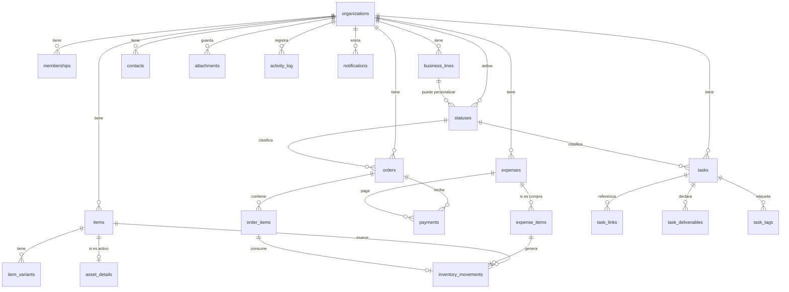

# Kamay — Esquema de Base de Datos (Supabase / PostgreSQL)

> **Anexo técnico** de la especificación funcional v6.0
> A diferencia del documento principal, este sí contiene decisiones de implementación
> Destino: Supabase (PostgreSQL 15+, Auth, Storage, RLS)

---

## 1. Alcance y advertencia

Este documento traduce el modelo conceptual de la Sección 6.1 de la especificación a un esquema relacional concreto. Cubre las **Fases 0 a 4**: organizaciones, líneas, catálogo, contactos, egresos, pedidos, ventas, inventario, activos, tareas y bitácora.

**No cubre** (Fases 5 y 6): recetas de producto, lotes de producción con merma, cotizaciones, seguimiento público y conexión con plataformas externas. Cada una tiene una nota al final indicando cómo encajará sin romper lo existente.

> **Regla que se mantiene por encima del esquema:** si algo aquí contradice una regla de la especificación, manda la especificación. El esquema existe para servir al modelo conceptual, no al revés.

---

## 2. Cómo se traducen los principios

| Principio de la especificación | Traducción técnica |
|---|---|
| **Todo pertenece a una organización** | `organization_id` obligatorio en toda tabla + RLS en todas, sin excepción |
| **Lo derivado nunca se guarda** | Saldos, totales, márgenes y estados de pago viven en **vistas**, no en columnas |
| **Nada se elimina, todo se archiva** | Columna `archived_at` y **ausencia deliberada de políticas DELETE** |
| **Todo deja rastro** | Trigger genérico de auditoría en cada tabla; nadie puede escribir en la bitácora a mano |
| **Los precios históricos no se reescriben** | El precio vive en la línea del documento (`expense_items`, `order_items`), nunca solo en el catálogo |
| **Los estados históricos no se reescriben** | Los estados son filas, no valores; archivar un estado no toca los registros pasados |
| **El ayudante no ve costos** | Los datos sensibles viven en tablas con política propia de solo-dueño, no en columnas del mismo registro |
| **Registrar sin conexión** | Identificadores generados en el cliente + `occurred_at` separado de `created_at` |

---

## 3. Convenciones

| Aspecto | Decisión | Razón |
|---|---|---|
| Nombres | `snake_case`, tablas en plural, en inglés | Consistencia con Supabase y sus herramientas |
| Llave primaria | `uuid` con `gen_random_uuid()` | El cliente puede generarlos sin conexión, sin colisiones |
| Fechas | `timestamptz` siempre; `date` cuando la hora no importa | Evita ambigüedad de zona horaria |
| `occurred_at` vs `created_at` | `occurred_at` = cuándo pasó en la realidad; `created_at` = cuándo llegó al sistema | Una venta de feria sin señal ocurrió a las 15:40, aunque se sincronice a las 21:00 |
| Dinero | `numeric(14,2)` | Nunca `float`: los redondeos binarios corrompen totales |
| Cantidades | `numeric(14,3)` | Permite 0,5 kg de arcilla o 1,25 m de vinilo |
| Valores cerrados | `text` + `check` | Los `enum` de Postgres son dolorosos de modificar en producción |
| Archivado | `archived_at timestamptz null` | `null` = activo |
| Auditoría | Trigger genérico, no código de aplicación | Lo que depende de que alguien lo recuerde, se olvida |

---

## 4. Mapa de entidades



---

## 5. Identidad y multi-tenant

Supabase Auth provee `auth.users`. Kamay agrega la organización y la membresía.

```sql
-- Organizaciones (tenants)
create table organizations (
  id            uuid primary key default gen_random_uuid(),
  name          text not null,
  logo_path     text,
  currency      text not null default 'BOB',
  timezone      text not null default 'America/La_Paz',
  settings      jsonb not null default '{}'::jsonb,   -- preferencias, retención, reparto
  created_at    timestamptz not null default now(),
  updated_at    timestamptz not null default now(),
  archived_at   timestamptz
);

-- Membresía: qué usuario pertenece a qué organización y con qué rol
create table memberships (
  id              uuid primary key default gen_random_uuid(),
  organization_id uuid not null references organizations(id),
  user_id         uuid not null references auth.users(id),
  role            text not null check (role in ('owner','assistant')),
  display_name    text,
  created_at      timestamptz not null default now(),
  archived_at     timestamptz,
  unique (organization_id, user_id)
);

create index on memberships (user_id) where archived_at is null;
```

### Funciones auxiliares de seguridad

Son la base de **todas** las políticas del sistema. Se escriben una vez y se usan en todas partes.

```sql
create or replace function is_member(org uuid)
returns boolean
language sql stable security definer set search_path = public as $$
  select exists (
    select 1 from memberships m
    where m.organization_id = org
      and m.user_id = auth.uid()
      and m.archived_at is null
  );
$$;

create or replace function is_owner(org uuid)
returns boolean
language sql stable security definer set search_path = public as $$
  select exists (
    select 1 from memberships m
    where m.organization_id = org
      and m.user_id = auth.uid()
      and m.role = 'owner'
      and m.archived_at is null
  );
$$;
```

---

## 6. Configuración

```sql
-- Líneas de negocio: Sublimación, Impresión 3D, Alfarería, General
create table business_lines (
  id              uuid primary key default gen_random_uuid(),
  organization_id uuid not null references organizations(id),
  name            text not null,
  color           text not null default 'zinc',
  icon            text,
  is_shared       boolean not null default false,  -- true solo para General/Compartido
  position        int not null default 0,
  created_at      timestamptz not null default now(),
  updated_at      timestamptz not null default now(),
  archived_at     timestamptz,
  unique (organization_id, name)
);

-- Canales de venta: Feria, Redes, Pedido directo, Mostrador
create table sales_channels (
  id              uuid primary key default gen_random_uuid(),
  organization_id uuid not null references organizations(id),
  name            text not null,
  position        int not null default 0,
  archived_at     timestamptz,
  unique (organization_id, name)
);

-- Categorías de gasto
create table expense_categories (
  id              uuid primary key default gen_random_uuid(),
  organization_id uuid not null references organizations(id),
  name            text not null,
  archived_at     timestamptz,
  unique (organization_id, name)
);

-- Unidades de medida
create table units (
  id              uuid primary key default gen_random_uuid(),
  organization_id uuid not null references organizations(id),
  code            text not null,      -- 'u', 'kg', 'm', 'l'
  name            text not null,
  archived_at     timestamptz,
  unique (organization_id, code)
);
```

### Invitaciones — cómo entra alguien al equipo

No hay registro público: las cuentas se crean por invitación. El dueño genera un enlace de un solo uso y lo entrega por su medio habitual; quien lo abre crea su cuenta y queda con la membresía que el dueño le asignó.

```sql
create table invitations (
  id              uuid primary key default gen_random_uuid(),
  organization_id uuid not null references organizations(id),
  email           text not null,
  role            text not null check (role in ('owner','assistant')),
  token_hash      bytea not null,           -- sha256 del token; el token en claro nunca se guarda
  expires_at      timestamptz not null,
  accepted_at     timestamptz,
  invited_by      uuid references auth.users(id),
  created_at      timestamptz not null default now(),
  archived_at     timestamptz               -- revocar es archivar
);

-- Una sola invitación pendiente por correo y organización.
create unique index on invitations (organization_id, lower(email))
  where accepted_at is null and archived_at is null;
```

La aceptación es una función `security definer`, no una política: quien acepta todavía no es miembro, así que ninguna política de `memberships` podría dejarlo insertarse a sí mismo.

```sql
-- Valida token, caducidad y correo; crea la membresía y marca la invitación.
-- Todos los fallos devuelven el mismo error: la ruta no debe delatar
-- qué invitaciones existen.
create function accept_invitation(p_token text) returns uuid
  language plpgsql security definer set search_path = public as $$ … $$;
```

### Estados — la tabla que sostiene la flexibilidad

```sql
create table statuses (
  id               uuid primary key default gen_random_uuid(),
  organization_id  uuid not null references organizations(id),
  business_line_id uuid references business_lines(id),  -- null = juego de la organización
  flow             text not null check (flow in ('order','task')),
  name             text not null,
  kind             text not null check (kind in ('initial','in_progress','waiting','final','cancelled')),
  color            text not null default 'zinc',
  position         int not null default 0,
  is_queue         boolean not null default false,
  created_at       timestamptz not null default now(),
  updated_at       timestamptz not null default now(),
  archived_at      timestamptz,

  -- Solo un estado de espera puede ser cola (En cola de sublimación)
  constraint queue_only_when_waiting
    check (not is_queue or kind = 'waiting'),

  -- PostgreSQL 15+: trata los null como iguales para la unicidad
  unique nulls not distinct (organization_id, business_line_id, flow, name)
);

create index on statuses (organization_id, flow, business_line_id) where archived_at is null;
```

**Cómo se resuelve qué juego aplica:** si existen estados con `business_line_id = <línea>`, se usan esos; si no, los de `business_line_id is null`. La resolución vive en una función, no repartida por la aplicación:

```sql
create or replace function resolve_statuses(org uuid, line uuid, p_flow text)
returns setof statuses
language sql stable as $$
  select * from statuses s
  where s.organization_id = org and s.flow = p_flow and s.archived_at is null
    and s.business_line_id = case
      when exists (
        select 1 from statuses x
        where x.organization_id = org and x.flow = p_flow
          and x.business_line_id = line and x.archived_at is null
      ) then line else null end
  order by s.position;
$$;
```

**Validación de integridad del flujo** (al menos un `initial` y un `final`): se implementa como trigger `after insert or update or delete` sobre `statuses`, que verifica el juego completo y lanza excepción si queda inválido. La interfaz (V22) ya avisa antes, pero la base de datos no debe confiar en eso.

---

## 7. Directorio y catálogo

```sql
-- Contactos: proveedores, clientes, o ambos
create table contacts (
  id              uuid primary key default gen_random_uuid(),
  organization_id uuid not null references organizations(id),
  name            text not null,
  phone           text,
  email           text,
  address         text,
  is_supplier     boolean not null default false,
  is_customer     boolean not null default false,
  notes           text,
  created_by      uuid references auth.users(id),
  created_at      timestamptz not null default now(),
  updated_at      timestamptz not null default now(),
  archived_at     timestamptz,
  constraint has_a_role check (is_supplier or is_customer)
);

create index on contacts (organization_id) where archived_at is null;
create index on contacts using gin (to_tsvector('simple', name));
```

```sql
-- Ítems: insumos, productos y activos en una sola tabla, distinguidos por kind
create table items (
  id               uuid primary key default gen_random_uuid(),
  organization_id  uuid not null references organizations(id),
  business_line_id uuid references business_lines(id),  -- null = compartido entre líneas
  kind             text not null check (kind in ('supply','product','asset')),
  name             text not null,
  description      text,
  unit_id          uuid references units(id),
  category         text,
  sale_price       numeric(14,2),      -- precio de venta referencial (no es costo)
  min_stock        numeric(14,3),      -- solo aplica a insumos
  created_by       uuid references auth.users(id),
  created_at       timestamptz not null default now(),
  updated_at       timestamptz not null default now(),
  archived_at      timestamptz
);

create index on items (organization_id, kind) where archived_at is null;
create index on items (organization_id, business_line_id) where archived_at is null;

create table item_variants (
  id          uuid primary key default gen_random_uuid(),
  item_id     uuid not null references items(id),
  name        text not null,          -- '11oz', 'Negro', 'XL'
  attributes  jsonb not null default '{}'::jsonb,
  sale_price  numeric(14,2),          -- si difiere del ítem base
  archived_at timestamptz,
  unique (item_id, name)
);

-- Datos propios de la maquinaria (kind = 'asset')
create table asset_details (
  item_id           uuid primary key references items(id),
  acquisition_cost  numeric(14,2) not null,
  acquired_on       date not null,
  supplier_id       uuid references contacts(id),
  notes             text
);
```

> **Nota deliberada:** `items` **no tiene** columna `last_cost` ni `current_stock`. Ambos son datos derivados y viven en vistas (Sección 11). Guardarlos aquí sería exactamente el error que hizo inmantenible la versión anterior.

---

## 8. Egresos

```sql
-- Una sola bandeja: compras (traen material) y gastos (no traen nada)
create table expenses (
  id                   uuid primary key default gen_random_uuid(),
  organization_id      uuid not null references organizations(id),
  business_line_id     uuid not null references business_lines(id),
  kind                 text not null check (kind in ('purchase','expense')),
  contact_id           uuid references contacts(id),            -- proveedor
  expense_category_id  uuid references expense_categories(id),
  order_id             uuid references orders(id),              -- gasto asignado a un pedido
  amount               numeric(14,2),                           -- solo gastos; las compras suman sus líneas
  occurred_at          timestamptz not null default now(),
  note                 text,
  created_by           uuid references auth.users(id),
  created_at           timestamptz not null default now(),
  updated_at           timestamptz not null default now(),
  archived_at          timestamptz,

  constraint purchase_needs_supplier
    check (kind <> 'purchase' or contact_id is not null),
  constraint expense_needs_category_and_amount
    check (kind <> 'expense' or (expense_category_id is not null and amount is not null)),
  constraint purchase_has_no_own_amount
    check (kind <> 'purchase' or amount is null)
);

create index on expenses (organization_id, occurred_at desc) where archived_at is null;
create index on expenses (organization_id, business_line_id, occurred_at desc);

create table expense_items (
  id          uuid primary key default gen_random_uuid(),
  expense_id  uuid not null references expenses(id),
  item_id     uuid not null references items(id),
  variant_id  uuid references item_variants(id),
  quantity    numeric(14,3) not null check (quantity > 0),
  unit_price  numeric(14,2) not null check (unit_price >= 0),
  created_at  timestamptz not null default now()
);

create index on expense_items (expense_id);
create index on expense_items (item_id);
```

**Por qué el total de una compra no se guarda:** es la suma de sus líneas. Si se guardara, tarde o temprano una línea cambia y el total queda mintiendo. La vista `expense_totals` (Sección 11) lo resuelve.

---

## 9. Pedidos y ventas

### Una decisión que conviene revisar

La especificación define *Pedido* y *Venta directa* como conceptos distintos, y lo son **en el flujo de trabajo**: uno atraviesa estados durante días, el otro se cobra en 15 segundos. Pero en almacenamiento comparten todo: cliente, líneas, ítems, precios, cobros e ingresos.

**Decisión:** una sola tabla `orders` con una columna `kind` que distingue `'order'` de `'direct_sale'`. La interfaz mantiene los dos flujos completamente separados (V5 y V6 no se parecen en nada); la base de datos evita duplicar seis tablas y, sobre todo, evita que todo reporte de ingresos tenga que unir dos fuentes distintas y mantenerse sincronizado.

Si prefieres separarlas, es viable, pero implica duplicar `order_items`, `payments` y toda la lógica de reportes. Vale la pena decidirlo antes de la primera migración.

```sql
create table orders (
  id                uuid primary key default gen_random_uuid(),
  organization_id   uuid not null references organizations(id),
  business_line_id  uuid not null references business_lines(id),
  kind              text not null check (kind in ('order','direct_sale')),
  code              int not null,                       -- número visible: #142
  contact_id        uuid references contacts(id),       -- opcional en venta de feria
  status_id         uuid not null references statuses(id),
  sales_channel_id  uuid references sales_channels(id),
  delivery_mode     text check (delivery_mode in ('pickup','delivery')),
  due_date          date,
  occurred_at       timestamptz not null default now(), -- hora real del hecho
  queued_at         timestamptz,                        -- entrada a la columna de cola
  notes             text,
  created_by        uuid references auth.users(id),
  created_at        timestamptz not null default now(),
  updated_at        timestamptz not null default now(),
  archived_at       timestamptz,

  constraint order_needs_customer
    check (kind <> 'order' or contact_id is not null),
  unique (organization_id, code)
);

create index on orders (organization_id, status_id) where archived_at is null;
create index on orders (organization_id, business_line_id, occurred_at desc);
create index on orders (organization_id, due_date) where archived_at is null;

create table order_items (
  id          uuid primary key default gen_random_uuid(),
  order_id    uuid not null references orders(id),
  item_id     uuid references items(id),
  variant_id  uuid references item_variants(id),
  description text,                                     -- personalización libre
  quantity    numeric(14,3) not null check (quantity > 0),
  unit_price  numeric(14,2) not null check (unit_price >= 0),
  created_at  timestamptz not null default now()
);

create index on order_items (order_id);
create index on order_items (item_id);
```

**Numeración por organización:** `code` se asigna con un trigger `before insert` que toma `max(code)+1` dentro de la organización, con bloqueo por fila para evitar duplicados en inserciones simultáneas. Una secuencia global no sirve porque cada organización necesita su propia numeración desde #1.

**`queued_at`** guarda el momento de entrada a la columna de cola. Es lo que permite ordenar por llegada y mostrar la posición en V3, sin depender de `updated_at`, que cambia con cualquier edición.

### Cobros y pagos

```sql
create table payments (
  id              uuid primary key default gen_random_uuid(),
  organization_id uuid not null references organizations(id),
  direction       text not null check (direction in ('in','out')),
  order_id        uuid references orders(id),
  expense_id      uuid references expenses(id),
  amount          numeric(14,2) not null check (amount > 0),
  method          text check (method in ('cash','transfer','other')),
  occurred_at     timestamptz not null default now(),
  note            text,
  created_by      uuid references auth.users(id),
  created_at      timestamptz not null default now(),
  archived_at     timestamptz,

  constraint exactly_one_target check (
    (order_id is not null)::int + (expense_id is not null)::int = 1
  ),
  constraint direction_matches_target check (
    (order_id is not null and direction = 'in') or
    (expense_id is not null and direction = 'out')
  )
);

create index on payments (order_id);
create index on payments (expense_id);
```

---

## 10. Inventario

```sql
create table inventory_movements (
  id              uuid primary key default gen_random_uuid(),
  organization_id uuid not null references organizations(id),
  item_id         uuid not null references items(id),
  variant_id      uuid references item_variants(id),
  kind            text not null check (kind in ('in','out','adjustment')),
  quantity        numeric(14,3) not null check (quantity <> 0),  -- con signo
  source_type     text check (source_type in ('expense_item','order_item','manual','count')),
  source_id       uuid,
  occurred_at     timestamptz not null default now(),
  note            text,
  created_by      uuid references auth.users(id),
  created_at      timestamptz not null default now(),

  constraint sign_matches_kind check (
    (kind = 'in' and quantity > 0) or
    (kind = 'out' and quantity < 0) or
    (kind = 'adjustment')
  )
);

create index on inventory_movements (item_id, occurred_at desc);
create index on inventory_movements (organization_id, occurred_at desc);
create unique index on inventory_movements (source_type, source_id)
  where source_type in ('expense_item','order_item');
```

Ese índice único final es importante: garantiza que una línea de compra **no pueda generar dos entradas de inventario**, aunque la sincronización sin conexión reintente la operación.

**Los movimientos no se editan ni se archivan.** Un error se corrige con un movimiento de ajuste, igual que en contabilidad. Esto mantiene el saldo siempre reconstruible y hace que la corrección sea tan visible como el error.

---

## 11. Vistas derivadas

> **Detalle crítico de Supabase:** las vistas se ejecutan por defecto con los permisos de su creador y **saltan las políticas RLS**. Toda vista debe declarar `security_invoker = true`. Omitirlo es la forma más común de filtrar datos entre organizaciones sin darse cuenta.

```sql
-- Saldo actual por ítem
create view item_balances with (security_invoker = true) as
select
  i.id                                   as item_id,
  i.organization_id,
  coalesce(sum(m.quantity), 0)           as balance,
  i.min_stock,
  (i.min_stock is not null and coalesce(sum(m.quantity), 0) < i.min_stock) as below_min
from items i
left join inventory_movements m on m.item_id = i.id
where i.kind = 'supply'
group by i.id;

-- Último costo conocido y evolución de precios
create view item_last_cost with (security_invoker = true) as
select distinct on (ei.item_id)
  ei.item_id, e.organization_id, ei.unit_price as last_cost,
  e.occurred_at as last_purchase_at, e.contact_id as last_supplier_id
from expense_items ei
join expenses e on e.id = ei.expense_id
where e.archived_at is null
order by ei.item_id, e.occurred_at desc;

-- Total real de cada egreso
create view expense_totals with (security_invoker = true) as
select
  e.id as expense_id, e.organization_id, e.business_line_id, e.kind, e.occurred_at,
  coalesce(e.amount, (select sum(ei.quantity * ei.unit_price)
                      from expense_items ei where ei.expense_id = e.id), 0) as total,
  coalesce((select sum(p.amount) from payments p
            where p.expense_id = e.id and p.archived_at is null), 0)        as paid
from expenses e
where e.archived_at is null;

-- Total y saldo de cada pedido
create view order_totals with (security_invoker = true) as
select
  o.id as order_id, o.organization_id, o.business_line_id, o.kind, o.occurred_at,
  coalesce((select sum(oi.quantity * oi.unit_price)
            from order_items oi where oi.order_id = o.id), 0) as total,
  coalesce((select sum(p.amount) from payments p
            where p.order_id = o.id and p.archived_at is null), 0) as paid
from orders o
where o.archived_at is null;

-- Recuperación de inversión de la maquinaria
create view asset_recovery with (security_invoker = true) as
select
  a.item_id, i.organization_id, i.business_line_id, i.name,
  a.acquisition_cost, a.acquired_on,
  coalesce((select sum(ot.total - ot.paid * 0)   -- ingresos de la línea desde la compra
            from order_totals ot
            where ot.business_line_id = i.business_line_id
              and ot.occurred_at >= a.acquired_on), 0) as line_revenue_since,
  coalesce((select sum(et.total) from expense_totals et
            where et.business_line_id = i.business_line_id
              and et.occurred_at >= a.acquired_on), 0) as line_expenses_since
from asset_details a
join items i on i.id = a.item_id;
```

El margen recuperado se calcula sobre esas dos columnas en la aplicación o en una vista adicional, para que la fórmula quede en un solo lugar y sea fácil de ajustar.

---

## 12. Tareas

```sql
create table tasks (
  id                uuid primary key default gen_random_uuid(),
  organization_id   uuid not null references organizations(id),
  business_line_id  uuid not null references business_lines(id),
  status_id         uuid not null references statuses(id),
  title             text not null,
  body_markdown     text,
  assignee_id       uuid references auth.users(id),
  due_at            timestamptz,
  remind_at         timestamptz,
  closed_at         timestamptz,
  closed_without_deliverables boolean not null default false,
  created_by        uuid references auth.users(id),
  created_at        timestamptz not null default now(),
  updated_at        timestamptz not null default now(),
  archived_at       timestamptz,
  constraint reminder_needs_due_date check (remind_at is null or due_at is not null)
);

create index on tasks (organization_id, status_id) where archived_at is null;
create index on tasks (organization_id, due_at) where archived_at is null and closed_at is null;
create index on tasks (assignee_id) where archived_at is null and closed_at is null;

-- Vínculos con otros registros. Referencia polimórfica.
create table task_links (
  id           uuid primary key default gen_random_uuid(),
  task_id      uuid not null references tasks(id),
  entity_type  text not null check (entity_type in ('order','contact','item','expense','asset')),
  entity_id    uuid not null,
  created_at   timestamptz not null default now(),
  unique (task_id, entity_type, entity_id)
);

create index on task_links (entity_type, entity_id);

-- Entregables declarados y su cumplimiento
create table task_deliverables (
  id                uuid primary key default gen_random_uuid(),
  task_id           uuid not null references tasks(id),
  deliverable_type  text not null check (deliverable_type in
                      ('product','supply','supplier','purchase','expenses','asset')),
  fulfilled_type    text,
  fulfilled_id      uuid,
  fulfilled_at      timestamptz,
  unique (task_id, deliverable_type)
);

create table tags (
  id              uuid primary key default gen_random_uuid(),
  organization_id uuid not null references organizations(id),
  name            text not null,
  unique (organization_id, name)
);

create table task_tags (
  task_id uuid not null references tasks(id),
  tag_id  uuid not null references tags(id),
  primary key (task_id, tag_id)
);
```

**Sobre la referencia polimórfica de `task_links`:** no puede tener llave foránea, porque apunta a cinco tablas distintas. Es una concesión consciente. Se mitiga con un trigger que valida la existencia del registro al insertar, y con el hecho de que **nada se elimina** en Kamay: un vínculo nunca queda apuntando al vacío. La alternativa —cinco columnas nullable con cinco llaves foráneas— es más estricta pero obliga a cambiar el esquema cada vez que se agrega un tipo vinculable.

---

## 13. Adjuntos

```sql
create table attachments (
  id              uuid primary key default gen_random_uuid(),
  organization_id uuid not null references organizations(id),
  entity_type     text not null check (entity_type in ('task','order','expense','item','contact')),
  entity_id       uuid not null,
  bucket          text not null,
  storage_path    text not null,      -- {organization_id}/{entity_type}/{entity_id}/{uuid}.ext
  file_name       text not null,
  mime_type       text,
  size_bytes      bigint,
  uploaded_by     uuid references auth.users(id),
  created_at      timestamptz not null default now(),
  archived_at     timestamptz,
  unique (bucket, storage_path)
);

create index on attachments (entity_type, entity_id);
```

### Storage

| Bucket | Contenido | Público |
|---|---|---|
| `attachments` | Referencias de tareas, diseños | No |
| `receipts` | Comprobantes de gasto y compra | No |
| `item-photos` | Fotos de productos e insumos | No |
| `org-logos` | Logos de organización | No |

**La ruta empieza siempre con el `organization_id`.** Es lo que permite escribir una política de acceso simple y verificable:

```sql
create policy "storage: solo la propia organización"
on storage.objects for select to authenticated
using (
  bucket_id in ('attachments','receipts','item-photos','org-logos')
  and is_member((storage.foldername(name))[1]::uuid)
);
```

**Política de crecimiento** (regla de la especificación): comprimir imágenes en el cliente antes de subir, máximo 5 MB por archivo y 20 adjuntos por registro, validado en el cliente y en una función de borde.

---

## 14. Bitácora de actividad

```sql
create table activity_log (
  id               bigint generated always as identity primary key,
  organization_id  uuid not null references organizations(id),
  business_line_id uuid,
  actor_id         uuid references auth.users(id),
  actor_label      text,                    -- 'sistema' o nombre de plataforma externa
  table_name       text not null,
  record_id        uuid not null,
  action           text not null check (action in
                     ('created','updated','status_changed','archived','unarchived')),
  changes          jsonb,                   -- solo los campos que cambiaron
  origin           text,                    -- 'mobile' | 'desktop' | 'external'
  occurred_at      timestamptz not null default now()
);

create index on activity_log (organization_id, occurred_at desc);
create index on activity_log (table_name, record_id, occurred_at desc);
create index on activity_log (organization_id, business_line_id, occurred_at desc);
create index on activity_log using gin (changes);
```

### El trigger genérico

```sql
create or replace function log_activity()
returns trigger
language plpgsql security definer set search_path = public as $$
declare
  v_old jsonb; v_new jsonb; v_changes jsonb;
  v_action text; v_org uuid; v_line uuid;
  v_ignored text[] := array['updated_at','created_at'];
begin
  if tg_op = 'INSERT' then
    v_new := to_jsonb(new); v_action := 'created'; v_changes := v_new;
  else
    v_old := to_jsonb(old); v_new := to_jsonb(new);

    if v_old->>'archived_at' is null and v_new->>'archived_at' is not null then
      v_action := 'archived';
    elsif v_old->>'archived_at' is not null and v_new->>'archived_at' is null then
      v_action := 'unarchived';
    elsif v_old->>'status_id' is distinct from v_new->>'status_id' then
      v_action := 'status_changed';
    else
      v_action := 'updated';
    end if;

    -- solo los campos que realmente cambiaron
    select jsonb_object_agg(e.key, jsonb_build_object('antes', v_old->e.key,
                                                      'despues', v_new->e.key))
    into v_changes
    from jsonb_each(v_new) e
    where v_new->e.key is distinct from v_old->e.key
      and not (e.key = any(v_ignored));

    if v_changes is null then return new; end if;   -- nada relevante cambió
  end if;

  v_org  := (v_new->>'organization_id')::uuid;
  v_line := nullif(v_new->>'business_line_id','')::uuid;

  insert into activity_log (organization_id, business_line_id, actor_id,
                            table_name, record_id, action, changes, origin)
  values (v_org, v_line, auth.uid(), tg_table_name,
          (v_new->>'id')::uuid, v_action, v_changes,
          current_setting('request.headers', true)::json->>'x-client-origin');

  return new;
end $$;
```

Se aplica a cada tabla auditable:

```sql
create trigger audit after insert or update on orders
  for each row execute function log_activity();
-- repetir en: expenses, expense_items, order_items, payments, contacts, items,
-- item_variants, tasks, statuses, business_lines, memberships, asset_details
```

### Agrupación de ruido

La especificación pide consolidar ediciones sucesivas del mismo usuario sobre el mismo registro dentro de 5 minutos. Se implementa en el trigger: antes de insertar, busca un evento propio del mismo actor, tabla y registro con `occurred_at > now() - interval '5 minutes'` y acción `updated`; si existe, **fusiona los cambios** en ese evento en lugar de crear uno nuevo. Los eventos de creación, archivado y cambio de estado nunca se fusionan.

### Retención

```sql
-- Tarea programada mensual (pg_cron): exportar y luego resumir lo anterior a 12 meses
select cron.schedule('kamay-log-retention', '0 3 1 * *', $$
  update activity_log set changes = null
  where occurred_at < now() - interval '12 months' and changes is not null;
$$);
```

**La exportación debe ocurrir antes del resumen**, como exige la especificación: una función de borde vuelca a un archivo en Storage y solo si eso termina bien se ejecuta el vaciado del detalle.

---

## 15. Notificaciones

```sql
create table notifications (
  id              uuid primary key default gen_random_uuid(),
  organization_id uuid not null references organizations(id),
  user_id         uuid not null references auth.users(id),
  type            text not null check (type in
                    ('due_summary','task_assigned','task_review','task_overdue',
                     'task_stalled','stock_below_min')),
  title           text not null,
  body            text,
  entity_type     text,
  entity_id       uuid,
  read_at         timestamptz,
  created_at      timestamptz not null default now()
);

create index on notifications (user_id, read_at, created_at desc);
```

**La agrupación es responsabilidad de quien genera la notificación, no de quien la muestra.** Una tarea programada diaria arma un único `due_summary` por usuario con el conteo de vencimientos, en lugar de insertar una notificación por tarea. Es la traducción directa de la regla anti-ruido.

---

## 16. Seguridad a nivel de fila (RLS)

### Patrón general

Todas las tablas siguen la misma estructura de políticas. Se muestra con `orders`; el resto es idéntico cambiando el nombre.

```sql
alter table orders enable row level security;

create policy "orders: leer si es miembro"
  on orders for select to authenticated
  using (is_member(organization_id));

create policy "orders: crear si es miembro"
  on orders for insert to authenticated
  with check (is_member(organization_id));

create policy "orders: editar si es miembro"
  on orders for update to authenticated
  using (is_member(organization_id))
  with check (is_member(organization_id));

-- Sin política DELETE: nada se elimina en Kamay.
```

**La ausencia de política `DELETE` no es un olvido.** Con RLS activo, lo que no tiene política está prohibido. Es la forma más limpia de implementar "nada se elimina, todo se archiva".

### Matriz de acceso

| Tabla | Ayudante | Dueño |
|---|---|---|
| `organizations`, `business_lines`, `sales_channels`, `units` | Leer | Todo |
| `statuses`, `expense_categories` | Leer | Todo |
| `contacts`, `items`, `item_variants` | Leer, crear, editar | Todo |
| `orders`, `order_items` | Leer, crear, editar | Todo |
| `payments` | Crear cobros (`direction = 'in'`) | Todo |
| `inventory_movements` | Leer, crear | Todo |
| `expenses`, `expense_items` | **Sin acceso** | Todo |
| `asset_details` | **Sin acceso** | Todo |
| `tasks` | Solo de su línea o asignadas a él | Todo |
| `task_links`, `task_deliverables`, `tags` | Según la tarea | Todo |
| `attachments` | Según el registro padre | Todo |
| `activity_log` | **Sin acceso** | Solo lectura |
| `memberships` | Leer solo su propia fila | Todo |
| `invitations` | **Sin acceso** | Todo |

### Cómo se ocultan los costos al ayudante

RLS filtra filas, no columnas. La solución no es esconder columnas: es que **los datos sensibles vivan en tablas a las que el ayudante simplemente no tiene política de lectura**.

- Los costos de compra viven en `expenses` y `expense_items` → sin acceso para el ayudante.
- El costo de adquisición de la maquinaria vive en `asset_details` → sin acceso.
- El último costo conocido de un ítem es una **vista** sobre `expense_items` → al ejecutarse con `security_invoker`, el ayudante obtiene cero filas de forma natural, sin lógica adicional.
- El margen de un pedido se calcula desde esas mismas fuentes → tampoco lo obtiene.

El resultado: el ayudante ve `orders` completos y `items` completos, pero cualquier consulta que toque costos devuelve vacío. **Sin código de aplicación involucrado**, que es justamente donde estos permisos suelen filtrarse.

### Ejemplo de política más fina — tareas del ayudante

```sql
create policy "tasks: ayudante ve su línea o lo asignado"
  on tasks for select to authenticated
  using (
    is_owner(organization_id)
    or (is_member(organization_id) and (
          assignee_id = auth.uid()
          or business_line_id in (
               select business_line_id from memberships_lines
               where user_id = auth.uid()
             )
       ))
  );
```

*(Requiere una tabla auxiliar `memberships_lines` si se decide restringir ayudantes por línea. Si todos los ayudantes ven todas las líneas, la condición se reduce a `is_member(organization_id)`.)*

### Bitácora: inalterable de verdad

```sql
alter table activity_log enable row level security;

create policy "activity_log: solo el dueño lee"
  on activity_log for select to authenticated
  using (is_owner(organization_id));

-- Sin políticas de INSERT, UPDATE ni DELETE para usuarios.
-- Las inserciones ocurren solo a través del trigger SECURITY DEFINER.
revoke insert, update, delete on activity_log from authenticated, anon;
```

Ni siquiera el dueño puede modificarla, tal como exige el Principio 4.

---

## 17. Sincronización sin conexión

| Requisito | Solución |
|---|---|
| Registrar sin señal | Identificadores `uuid` generados en el cliente: el registro nace con su llave definitiva y no necesita renumerarse al sincronizar |
| Hora real del hecho | `occurred_at` lo fija el cliente; `created_at` lo fija el servidor. Una venta de feria conserva su hora real |
| Reintentos duplicados | Los `uuid` del cliente hacen que un reintento sea un conflicto de llave primaria, no una fila duplicada. Usar `insert ... on conflict (id) do nothing` |
| Doble entrada de inventario | El índice único sobre `(source_type, source_id)` lo impide a nivel de base de datos |
| Orden de sincronización | Primero los padres (`orders`), luego los hijos (`order_items`, `payments`). La cola local respeta ese orden |
| Conflictos de edición | Última escritura gana, como define la especificación. La bitácora deja constancia de ambas versiones |

---

## 18. Orden de migraciones

```
001_extensions_and_helpers    -- pgcrypto, is_member(), is_owner()
002_organizations             -- organizations, memberships
003_configuration             -- business_lines, sales_channels, expense_categories,
                              -- units, statuses + validación de flujo
004_directory_catalog         -- contacts, items, item_variants, asset_details
005_orders                    -- orders (+ trigger de numeración), order_items
006_expenses                  -- expenses, expense_items
007_payments                  -- payments
008_inventory                 -- inventory_movements
009_views                     -- todas las vistas derivadas (security_invoker)
010_tasks                     -- tasks, task_links, task_deliverables, tags, task_tags
011_attachments_storage       -- attachments + buckets + políticas de storage
012_activity_log              -- tabla, función log_activity(), triggers en todas las tablas
013_notifications             -- notifications + tareas programadas
014_rls_policies              -- RLS de todas las tablas, al final y de una sola vez
015_seed_geeko_store          -- organización, líneas, estados, canales, categorías
```

**Dos decisiones sobre el orden:**

- **La bitácora se instala en la migración 012, antes de que exista un solo dato real.** La especificación es explícita: un historial no se reconstruye hacia atrás. Ninguna fila de producción debe entrar antes de que los triggers estén activos.
- **RLS va al final y completo.** Activarla tabla por tabla mientras se construye lleva a olvidar alguna. Una sola migración que la aplica a todo permite verificar de un vistazo que no falta ninguna.

### Semilla de Geeko Store

```sql
-- Líneas
insert into business_lines (organization_id, name, color, is_shared, position) values
  (:org, 'Sublimación',    'blue',   false, 1),
  (:org, 'Impresión 3D',   'violet', false, 2),
  (:org, 'Alfarería',      'orange', false, 3),
  (:org, 'General',        'zinc',   true,  4);

-- Estados de tarea (juego de la organización, sirve a las tres líneas)
insert into statuses (organization_id, business_line_id, flow, name, kind, position) values
  (:org, null, 'task', 'Por hacer',   'initial',     1),
  (:org, null, 'task', 'Haciendo',    'in_progress', 2),
  (:org, null, 'task', 'En revisión', 'waiting',     3),
  (:org, null, 'task', 'Hecho',       'final',       4);

-- Estados de pedido para Sublimación (los 6 definidos)
insert into statuses (organization_id, business_line_id, flow, name, kind, is_queue, position) values
  (:org, :sublimacion, 'order', 'Registrado',         'initial',     false, 1),
  (:org, :sublimacion, 'order', 'En diseño',          'in_progress', false, 2),
  (:org, :sublimacion, 'order', 'En cola',            'waiting',     true,  3),
  (:org, :sublimacion, 'order', 'Sublimando',         'in_progress', false, 4),
  (:org, :sublimacion, 'order', 'Listo para entrega', 'waiting',     false, 5),
  (:org, :sublimacion, 'order', 'Entregado',          'final',       false, 6),
  (:org, :sublimacion, 'order', 'Cancelado',          'cancelled',   false, 7);

-- Alfarería: juego mínimo, porque casi todo se vende como venta directa
insert into statuses (organization_id, business_line_id, flow, name, kind, position) values
  (:org, :alfareria, 'order', 'Reservado',          'initial',   1),
  (:org, :alfareria, 'order', 'Listo para entrega', 'waiting',   2),
  (:org, :alfareria, 'order', 'Entregado',          'final',     3),
  (:org, :alfareria, 'order', 'Cancelado',          'cancelled', 4);
```

---

## 19. Lo que este esquema aún no incluye

| Funcionalidad | Fase | Cómo encajará |
|---|---|---|
| Recetas de producto | 5 | Tabla `item_recipes (product_item_id, supply_item_id, quantity)`. No altera nada existente. |
| Lotes de producción con merma | 5 | `production_batches` + `batch_outputs`, con movimientos de inventario como cualquier otra fuente (`source_type = 'batch'`). |
| Reparto configurable de gastos compartidos | 5 | Regla en `organizations.settings`; se aplica en vistas de reporte, sin tocar los datos. |
| Cotizaciones | 6 | `orders` con un estado inicial propio, o tabla aparte si necesitan versionado. Decidir entonces. |
| Seguimiento público del pedido | 6 | Tabla `order_share_tokens` con caducidad + política que permita lectura anónima solo del token vigente. |
| Conexión con plataformas externas | 6 | Llaves de servicio con alcance por organización; el `actor_label` de la bitácora ya está previsto para identificarlas. |

---

## 20. Lista de verificación antes de producción

- [ ] Toda tabla tiene `organization_id` y RLS activo.
- [ ] Ninguna tabla tiene política `DELETE`.
- [ ] Toda vista declara `security_invoker = true`.
- [ ] `activity_log` tiene los permisos revocados para `authenticated` y `anon`.
- [ ] Los triggers de auditoría están en **todas** las tablas auditables, no en algunas.
- [ ] Ninguna columna guarda un valor que pueda calcularse (`current_stock`, `total`, `last_cost`, `margin`).
- [ ] Los montos son `numeric`, nunca `float` ni `real`.
- [ ] Las rutas de Storage empiezan con el `organization_id` y sus políticas lo verifican.
- [ ] Prueba explícita: un usuario de la organización A no obtiene ni una fila de la organización B, en ninguna tabla ni vista.
- [ ] Prueba explícita: un ayudante consulta `expenses`, `asset_details` y `item_last_cost` y obtiene cero filas.
- [ ] Prueba explícita: reenviar dos veces la misma venta de feria produce una sola fila.
- [ ] Los índices cubren los filtros reales de la interfaz: línea, estado, fecha de vencimiento, cola.

---

*Anexo técnico de la especificación funcional v6.0. Las decisiones de producto viven en el documento principal; este documento solo las implementa.*
