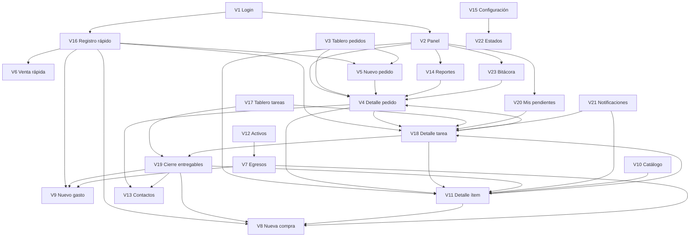

# Kamay — Mapa de Interfaz y Navegación

> Complemento de la Sección 7 del documento de especificación v6.0
> Define **cómo se conectan las 23 vistas entre sí**, no cómo se ven por dentro
> Agnóstico de tecnología

---

## 1. Para qué sirve este documento

La Sección 7 de la especificación describe **qué contiene cada pantalla**. Este documento describe **cómo se llega a cada una y a dónde se sale desde ella**.

Es la parte que más se descuida y la que más problemas causa después: un sistema puede tener 23 pantallas perfectas y aun así ser insoportable si para registrar un gasto hay que atravesar cuatro niveles, o si al volver de un detalle se pierden los filtros que costó aplicar.

**Cómo usarlo:**
- Quien diseñe la interfaz lo usa junto con la Sección 7.
- Quien construya lo usa para saber qué debe abrirse como página, como panel o como diálogo.
- Al agregar una vista nueva en el futuro, primero se ubica en este mapa. Si no encuentra lugar, probablemente no debía existir.

---

## 2. Principios de navegación

### 2.1 El dispositivo define el punto de partida

| Dispositivo | Pantalla de inicio | Por qué |
|---|---|---|
| **Móvil** | **V16 · Registro rápido** | En el celular se captura: taller, feria, calle. Lo primero que se ve son seis botones grandes para anotar algo en segundos. |
| **Escritorio** | **V2 · Panel principal** | En la computadora se analiza y se decide. Lo primero que se ve es el estado del negocio. |

*Es la misma aplicación con dos puertas de entrada distintas, no dos productos.*

### 2.2 El selector de línea es contexto, no un filtro más

El selector (Todas · Sublimación · Impresión 3D · Alfarería) vive en la barra superior y **acompaña al usuario por todo el sistema**: si entra a Pedidos con "Alfarería" activo y luego va a Egresos, sigue en Alfarería.

- Persiste entre sesiones: al volver al día siguiente sigue donde estaba.
- Preselecciona la línea en todos los formularios de creación.
- Solo hay dos vistas que lo ignoran deliberadamente: **V20 · Mis pendientes** y **V14 · Reportes** en su informe comparativo, porque ahí el valor está justamente en ver todo junto.

### 2.3 Página, panel o diálogo

> **Regla:** si al terminar la acción el usuario debe volver exactamente a donde estaba, use diálogo o panel. Si la acción es un trabajo en sí mismo, use página.

| Formato | Cuándo | Vistas |
|---|---|---|
| **Página completa** | Listas, tableros y detalles densos. Cambia la dirección; se puede compartir el enlace. | V2, V3, V4, V7, V10, V11, V12, V13, V14, V15, V16, V17, V20, V22, V23 |
| **Panel lateral** (Sheet) | Contenido secundario que no debe hacer perder el contexto de fondo. | V21 (notificaciones), V18 en escritorio (opcional), filtros en móvil |
| **Diálogo** | Acción puntual con principio y fin claros. | V19 (cierre con entregables), registrar cobro, cambiar estado, ajuste por conteo, archivar, confirmar cobro en feria |
| **Pantalla completa móvil** | Formularios de captura en el celular. | V5, V8, V9, V18, V19 |

### 2.4 Profundidad máxima: tres niveles

`Sección → Detalle → Acción`

Ejemplo: Pedidos (V3) → Detalle del pedido (V4) → Registrar cobro (diálogo). Nunca más profundo. Si algo requiere un cuarto nivel, está mal ubicado.

### 2.5 Volver siempre devuelve el estado

Al regresar de un detalle a su lista, se conservan: filtros aplicados, posición del desplazamiento, pestaña activa y línea seleccionada. Perder los filtros al volver es una de las formas más rápidas de que una herramienta interna se sienta hostil.

### 2.6 Toda acción de registro está a un toque

En cualquier pantalla, el botón **+ Registrar** (flotante en escritorio, en la barra inferior en móvil) abre el menú de creación completo: Venta rápida · Pedido · Compra · Gasto · Consumo · Tarea. Nunca hace falta navegar a una sección para crear algo de otra.

---

## 3. Inventario de vistas

| Código | Vista | Formato | Dispositivo principal | Rol | Fase |
|---|---|---|---|---|---|
| V1 | Inicio de sesión | Página | Ambos | Todos | 0 |
| V2 | Panel principal | Página | Escritorio | Ambos (variante ayudante) | 1 |
| V3 | Tablero de pedidos | Página | Escritorio | Ambos | 1 |
| V4 | Detalle de pedido | Página | Ambos | Ambos (rentabilidad solo dueño) | 1 |
| V5 | Nuevo pedido | Página / completa móvil | Móvil | Ambos | 1 |
| V6 | Venta rápida (feria) | Página completa | Móvil | Ambos | 1 |
| V7 | Egresos | Página | Escritorio | Dueño | 1 |
| V8 | Nueva compra | Página / completa móvil | Ambos | Ambos | 1 |
| V9 | Nuevo gasto | Completa móvil | Móvil | Ambos | 1 |
| V10 | Catálogo | Página | Escritorio | Ambos | 0 |
| V11 | Detalle de ítem | Página | Escritorio | Ambos (costos solo dueño) | 0 |
| V12 | Activos | Página | Escritorio | Dueño | 3 |
| V13 | Contactos | Página | Escritorio | Ambos | 0 |
| V14 | Reportes | Página | Escritorio | **Solo dueño** | 3 |
| V15 | Configuración | Página | Escritorio | **Solo dueño** | 0 |
| V16 | Registro rápido | Página | **Móvil** | Ambos | 1 |
| V17 | Tablero de tareas | Página | Escritorio | Ambos | 2 |
| V18 | Detalle de tarea | Página o panel | Ambos | Ambos | 2 |
| V19 | Cierre con entregables | Diálogo | Ambos | Ambos | 2 |
| V20 | Mis pendientes | Página | **Móvil** | Ambos | 2 |
| V21 | Notificaciones | Panel lateral | Ambos | Ambos | 2 |
| V22 | Configuración de estados | Página | Escritorio | **Solo dueño** | 0 |
| V23 | Bitácora de actividad | Página | Escritorio | **Solo dueño** | 4 |

---

## 4. Estructura de navegación

### 4.1 Escritorio — barra superior persistente

Presente en todas las pantallas salvo V1 y V6.

```
┌──────────────────────────────────────────────────────────────────────┐
│ Geeko Store │ [Todas ▾ Sublimación · 3D · Alfarería] │ 🔍 │ 🔔 │ 👤 │
├──────────────────────────────────────────────────────────────────────┤
│ Panel · Pedidos · Tareas · Egresos · Catálogo · Contactos · Más ▾    │
└──────────────────────────────────────────────────────────────────────┘
```

**Menú principal, agrupado:**

| Grupo | Entradas | Visible para |
|---|---|---|
| Inicio | Panel (V2) | Ambos |
| Trabajo | Pedidos (V3) · Tareas (V17) | Ambos |
| Dinero | Egresos (V7) · Reportes (V14) | Dueño |
| Base | Catálogo (V10) · Contactos (V13) · Activos (V12) | Catálogo y Contactos ambos; Activos solo dueño |
| Sistema (bajo "Más") | Bitácora (V23) · Configuración (V15) | Solo dueño |

**Elementos siempre disponibles:** selector de línea · buscador global · campana → V21 · avatar (perfil, cambiar organización, cerrar sesión) · botón flotante **+ Registrar**.

### 4.2 Móvil — barra inferior

```
┌──────────────────────────────────────────┐
│  Inicio  │  Pedidos  │  Tareas  │  Más   │
│   V16    │    V3     │   V20    │        │
└──────────────────────────────────────────┘
```

- **Inicio → V16** (registro rápido). Es la puerta de entrada del celular.
- **Pedidos → V3** en formato lista, no kanban: un tablero horizontal no funciona en 390px. El kanban se ofrece como alternativa opcional con desplazamiento por columnas.
- **Tareas → V20** (Mis pendientes), no el tablero. En el celular interesa "qué hago hoy", no la vista de gestión.
- **Más →** Egresos, Catálogo, Contactos, Activos, Reportes, Bitácora, Configuración, según el rol.
- **Venta rápida (V6)** no está en la barra: se entra desde V16 y, una vez dentro, la barra desaparece. Es un modo, no una sección.

### 4.3 El modo feria

**V6** es la única vista que rompe la estructura: sin barra superior, sin barra inferior, sin menús. Solo productos, carrito y "Cobrar". Se entra explícitamente desde V16 y se sale con un control claro en la esquina superior.

*Razón:* cada elemento de navegación visible en un puesto de feria es un toque accidental esperando ocurrir.

---

## 5. Mapa jerárquico

```
V1 · Inicio de sesión
 └── (si el usuario tiene varias organizaciones) → Selección de organización
      │
      ├── ESCRITORIO → V2 · Panel principal
      └── MÓVIL      → V16 · Registro rápido

V2 · Panel principal
 ├── Tarjetas de indicadores ────────→ V14 · Reportes
 ├── Comparativo por línea ──────────→ V14 · Reportes (informe comparativo)
 ├── Tarjeta Pendientes ─────────────→ V20 · Mis pendientes → V18
 ├── Entregas próximas ──────────────→ V4 · Detalle de pedido
 ├── Insumos bajo mínimo ────────────→ V11 · Detalle de ítem
 ├── Últimos movimientos ────────────→ V23 · Bitácora
 └── + Registrar ───────────────────→ V5 · V6 · V8 · V9 · V18 · (consumo)

V3 · Tablero de pedidos
 ├── Tarjeta ────────────────────────→ V4 · Detalle de pedido
 ├── "+" en columna ─────────────────→ V5 · Nuevo pedido
 └── Ver archivados (mismo lugar, filtro)

V4 · Detalle de pedido
 ├── Cambiar estado ─────────────────→ diálogo
 ├── Registrar cobro ────────────────→ diálogo
 ├── Cliente ────────────────────────→ V13 · Contacto
 ├── Línea del pedido ───────────────→ V11 · Detalle de ítem
 ├── + Crear tarea para este pedido ─→ V18 (prellenada)
 ├── Tarea relacionada ──────────────→ V18
 └── Historial ─────────────────────→ V23 (filtrada por este pedido)

V16 · Registro rápido (móvil)
 ├── Venta rápida ───→ V6      ├── Compra ──→ V8      ├── Consumo → diálogo
 ├── Pedido ─────────→ V5      ├── Gasto ───→ V9      └── Tarea ──→ V18
 └── Registrado hoy ─→ detalle correspondiente

V17 · Tablero de tareas
 ├── Tarjeta ────────────────────────→ V18 · Detalle de tarea
 ├── Soltar en estado final ─────────→ V19 · Cierre con entregables
 └── + Nueva tarea ─────────────────→ V18 (vacía)

V18 · Detalle de tarea
 ├── Vínculo ─────────────────────→ V4 · V11 · V13 · egreso · V12
 ├── Cambiar a estado final ──────→ V19
 └── Historial ───────────────────→ V23 (filtrada por esta tarea)

V19 · Cierre con entregables
 ├── Crear seleccionados ─────────→ crea registros y vuelve a V17/V18
 └── Cerrar sin crear nada ───────→ vuelve a V17/V18

V10 · Catálogo ──→ V11 · Detalle de ítem ──→ V8 (comprar) · V18 (tarea) · V13 (proveedor)
V13 · Contactos ─→ detalle en panel derecho ─→ V4 · V7 · V18
V12 · Activos ───→ detalle ─→ V7 (gastos de mantenimiento) · V18 (tarea)

V14 · Reportes ──→ cualquier fila abre su registro (V4, V11, V7)
V15 · Configuración ──→ V22 · Configuración de estados
V21 · Notificaciones ──→ V18 · V20 · V11 · V4, según el aviso
V23 · Bitácora ──→ el registro afectado, si aún existe
```

---

## 6. Matriz de transiciones

Qué acción lleva de cada vista a cuál otra. Es la referencia para verificar que ninguna pantalla quede aislada ni sin salida.

| Desde | Acción | Hacia | Formato |
|---|---|---|---|
| V1 | Entrar | V2 (escritorio) / V16 (móvil) | Página |
| V2 | Clic en indicador | V14 | Página |
| V2 | Pendiente | V18 | Página |
| V2 | Entrega próxima | V4 | Página |
| V2 | Insumo bajo mínimo | V11 | Página |
| V2 | Movimiento de bitácora | V23 | Página |
| V3 | Tarjeta de pedido | V4 | Página |
| V3 | "+" o botón nuevo | V5 | Página |
| V3 | Arrastrar tarjeta | (mismo lugar, cambia estado) | — |
| V4 | Crear tarea para este pedido | V18 prellenada | Página / panel |
| V4 | Registrar cobro | Diálogo | Diálogo |
| V4 | Cliente | V13 | Página |
| V4 | Tarea relacionada | V18 | Página / panel |
| V5 | Guardar | V4 del pedido creado | Página |
| V5 | Guardar y crear otro | V5 en blanco | Página |
| V6 | Cobrar | Sheet de cobro → vuelve a V6 | Panel |
| V6 | Salir del modo feria | V16 | Página |
| V7 | Fila de egreso | Detalle en panel | Panel |
| V7 | + Nueva compra / gasto | V8 / V9 | Página |
| V8, V9 | Guardar | Vuelve al origen (V7 o V16) | — |
| V10 | Fila de ítem | V11 | Página |
| V11 | Registrar compra | V8 prellenada | Página |
| V11 | Crear tarea de reposición | V18 prellenada | Página / panel |
| V11 | Ajuste por conteo | Diálogo | Diálogo |
| V12 | Activo | Detalle con sus gastos | Panel |
| V13 | Contacto | Detalle en panel derecho | Panel |
| V13 | Operación del contacto | V4 o V7 | Página |
| V14 | Fila de cualquier informe | V4, V11 o V7 | Página |
| V14 | Crear tarea de reposición | V18 prellenada | Página / panel |
| V15 | Sección Estados | V22 | Página |
| V16 | Cualquiera de los 6 botones | V6, V5, V8, V9, V18 o diálogo | Varía |
| V17 | Tarjeta | V18 | Página / panel |
| V17 | Soltar en estado final con entregables | V19 | Diálogo |
| V18 | Vínculo | V4, V11, V13, V12 o egreso | Página |
| V18 | Cambiar a estado final | V19 | Diálogo |
| V19 | Crear y cerrar | Registros creados → vuelve al origen | — |
| V19 | Cerrar sin crear nada | Vuelve al origen | — |
| V20 | Tarea | V18 | Página / panel |
| V20 | Marcar hecha | (queda en la lista, tachada) | — |
| V21 | Notificación de tarea | V18 | Página / panel |
| V21 | Notificación de inventario | V11 | Página |
| V21 | Preferencias | V15 → Notificaciones | Página |
| V22 | Guardar | V15 | Página |
| V23 | Evento | El registro afectado | Página |
| Cualquiera | + Registrar | V5, V6, V8, V9, V18 o diálogo | Varía |
| Cualquiera | Campana | V21 | Panel |
| Cualquiera | Buscador global | Resultado directo | Página |

---

## 7. Flujos principales, vista por vista

### Flujo 1 — Pedido de sublimación, de principio a fin

```
V16 o V3 → V5 (nuevo pedido) → V4 (detalle)
   → "Crear tarea para este pedido" → V18 (diseño, prellenada)
   → V17 (la tarea recorre Por hacer → Haciendo → En revisión → Hecho,
           con idas y vueltas que NO mueven el pedido)
   → V4 → cambiar estado a "En cola"
   → V3 (avanza por Sublimando → Listo para entrega)
   → V4 → registrar cobro del saldo → estado "Entregado"
```
**Punto clave:** el pedido y su tarea de diseño avanzan en tableros distintos. V3 y V17 nunca se sincronizan solos.

### Flujo 2 — Día de feria

```
V16 → V9 (gasto del stand, antes de salir)
V16 → V6 (modo feria: venta → Sheet de cobro → vuelve a V6, muchas veces)
V6 → salir del modo feria → V16
V16 → V18 (tarea "Cargar gastos de feria")
   → V19 → V9 prellenada (stand, taxi, almuerzo)
```

### Flujo 3 — Pieza de alfarería, de la arcilla a la feria

```
V16 o V17 → V18 (tarea con lista de verificación de la hornada)
   → V19 (entregable: Nuevo producto) → V11 (ítem creado con sus fotos)
   → V6 (se vende en la siguiente feria)
```
Sin pasar nunca por V3: la alfarería produce para stock, no contra pedido.

### Flujo 4 — Falta de material

```
V2 (alerta de insumo bajo mínimo) → V11 (detalle del insumo)
   → "Crear tarea de reposición" → V18 (vinculada al insumo)
   → V13 (revisar proveedores desde el vínculo)
   → V19 (entregable: Compra registrada) → V8 prellenada
   → el saldo sube y la alerta desaparece de V2
```

### Flujo 5 — "Este número no cuadra"

```
V11 → pestaña Movimientos → V23 filtrada por ese ítem
   → identificar el evento erróneo
   → V11 → ajuste por conteo (diálogo)
```

### Flujo 6 — Cierre de mes

```
V2 → V14 (línea "Todas", periodo mes anterior)
   → informe Comparativo entre líneas
   → informe Rentabilidad → fila → V4 de un pedido concreto
   → V20 (revisar pendientes viejos y cerrarlos o replantearlos)
```

### Flujo 7 — Ajustar el flujo de una línea

```
V15 → sección Estados → V22
   → flujo Pedidos, alcance Alfarería
   → agregar estados, declarar tipos, guardar
   → V3 con Alfarería activa muestra las columnas nuevas
   (los pedidos anteriores conservan su historia)
```

### Flujo 8 — Recuperar algo archivado

```
V17 o V10 → casilla "Ver archivados" → desarchivar
   (alternativa) V23 → filtro acción "Archivó" → desarchivar desde el evento
```

---

## 8. Reglas de estado y retorno

| Situación | Comportamiento esperado |
|---|---|
| Volver de un detalle a su lista | Conserva filtros, pestaña activa y posición de desplazamiento |
| Cambiar de sección | Conserva el selector de línea |
| Cerrar sesión y volver | Conserva el selector de línea y la última sección visitada |
| Guardar un formulario | Lleva al detalle de lo creado, salvo "Guardar y crear otro" |
| Cancelar un formulario con datos escritos | Pide confirmación antes de descartar |
| Abrir un enlace directo a un registro | Lleva directo a la vista, con la línea correspondiente ya activa |
| Registrar sin conexión | El registro se guarda y la navegación continúa normal; un indicador muestra cuántos faltan sincronizar |
| Acceder a una vista sin permiso | No aparece en el menú y, si se intenta por dirección directa, redirige al panel con un aviso breve |

---

## 9. Puntos de entrada externos

Toda notificación debe llevar exactamente al lugar donde se resuelve, nunca a una pantalla genérica.

| Origen | Destino |
|---|---|
| Correo de resumen diario | V20 · Mis pendientes |
| Correo "te asignaron una tarea" | V18 de esa tarea |
| Aviso de tarea vencida | V18 de esa tarea |
| Aviso de insumo bajo mínimo | V11 de ese insumo |
| Enlace compartido de un pedido | V4 de ese pedido |
| Sesión expirada | V1, y tras entrar vuelve al destino original |

---

## 10. Diferencias por rol

| Vista | Dueño | Ayudante |
|---|---|---|
| V2 Panel | Completo | Sin indicadores de dinero, sin comparativo, sin bitácora |
| V4 Detalle de pedido | Con bloque de rentabilidad | Sin ese bloque |
| V7 Egresos | Completo | No aparece en el menú |
| V11 Detalle de ítem | Con costos y evolución de precios | Sin costos; ve saldo y movimientos |
| V12 Activos | Completo | No aparece |
| V14 Reportes | Completo | No aparece |
| V15 / V22 Configuración | Completo | No aparece |
| V23 Bitácora | Completo | No aparece; sí ve el historial dentro de cada registro |
| V17 / V20 Tareas | Todas | Solo las de su línea o asignadas a él |

**Regla:** lo que un rol no puede ver **no aparece en el menú**. Ocultar la opción es mejor que mostrarla deshabilitada: un menú lleno de puertas cerradas es una mala experiencia y una invitación a intentarlo.

---

## 11. Adaptación móvil por vista

| Vista | En móvil |
|---|---|
| V2 Panel | Tarjetas apiladas en una columna; el comparativo se simplifica |
| V3 Tablero | Lista por defecto, con kanban opcional de desplazamiento horizontal |
| V4 Detalle de pedido | Una columna; pagos y rentabilidad como secciones colapsables |
| V7 Egresos | Tarjetas apiladas en vez de tabla; filtros en panel |
| V10 Catálogo | Lista con miniatura, nombre y saldo; el resto en el detalle |
| V11, V13 | Pestañas con desplazamiento horizontal |
| V14 Reportes | Un informe por pantalla, con selector superior |
| V17 Tablero de tareas | Se reemplaza por V20; el kanban queda como vista opcional |
| V18 Detalle de tarea | Pantalla completa, historial al final |
| V22, V23 | Consultables pero pensadas para escritorio |

---

## 12. Estados transversales

Estas tres situaciones existen en toda vista con datos y deben diseñarse una vez y reutilizarse:

| Estado | Tratamiento |
|---|---|
| **Vacío inicial** | Mensaje breve y neutro + la acción que corresponde ("Aún no hay pedidos en esta línea · Crear pedido"). Sin ilustraciones ni textos motivacionales. |
| **Cargando** | Esqueletos con la forma del contenido real, no giradores. |
| **Error** | Explicación en lenguaje humano y un botón de reintentar. Nunca códigos técnicos. |
| **Sin resultados tras filtrar** | Distinto del vacío inicial: debe ofrecer "Quitar filtros". |
| **Sin conexión** | Indicador persistente, no bloqueante, con el número de registros por sincronizar. |

---

## 13. Diagrama para visualizar

Para pegar en cualquier visualizador de diagramas Mermaid:



---

## 14. Lista de verificación de navegación

Antes de dar por buena la interfaz, comprobar:

- [ ] Registrar un gasto desde cualquier pantalla toma 2 toques o menos.
- [ ] Ninguna vista está a más de 3 niveles de profundidad.
- [ ] Toda vista tiene al menos una entrada clara y una salida evidente.
- [ ] Volver de un detalle conserva los filtros de la lista.
- [ ] El selector de línea persiste al cambiar de sección.
- [ ] Toda notificación lleva al lugar exacto donde se resuelve.
- [ ] El ayudante no ve en el menú ninguna opción que no pueda usar.
- [ ] El modo feria no tiene ningún elemento de navegación que se pueda tocar por error.
- [ ] Cada vista con datos tiene diseñados sus estados vacío, cargando y error.
- [ ] Ninguna acción destructiva ocurre sin confirmación o sin posibilidad de deshacer.
- [ ] La aplicación se puede usar completa en el celular para capturar, aunque el análisis sea mejor en escritorio.

---

*Documento complementario a la especificación funcional v6.0. No contiene decisiones de implementación.*
